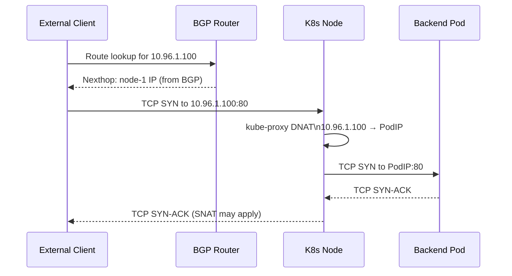

# How to Validate Service IP Advertisement with Calico

Author: [nawazdhandala](https://github.com/nawazdhandala)

Tags: Calico, Kubernetes, BGP, Service Advertisement, Validation

Description: Validate that Calico is correctly advertising Kubernetes service IPs via BGP by verifying route presence, traffic forwarding, and service health from external networks.

---

## Introduction

Validating Calico service IP advertisement ensures that Kubernetes services are correctly reachable from external networks via BGP-advertised routes. Unlike pod IP validation, service IP validation must account for kube-proxy or eBPF service handling on nodes, which performs DNAT to redirect traffic from service IPs to backend pods.

A successfully advertised service IP route on an external router does not guarantee service reachability — you also need to verify that the node receiving the traffic correctly forwards it to a healthy backend pod and that return traffic can reach the original client. This validation flow requires checking both the BGP control plane and the service forwarding data plane.

## Prerequisites

- Calico configured with service ClusterIP or LoadBalancer IP advertisement
- Services deployed with backends
- External BGP peer with routing capability

## Check Service IP Routes in BGP Table

```bash
# Check what service CIDRs are being advertised
NODE_POD=$(kubectl get pod -n calico-system -l k8s-app=calico-node -o name | head -1)
kubectl exec -n calico-system ${NODE_POD} -- birdcl show route | grep "10.96"

# Verify from each node
for node in $(kubectl get nodes -o name | cut -d/ -f2); do
  POD=$(kubectl get pod -n calico-system -l k8s-app=calico-node \
    --field-selector spec.nodeName=${node} -o name | head -1)
  echo "=== $node ==="
  kubectl exec -n calico-system ${POD} -- birdcl show route | grep "10.96"
done
```

## Validate External Route Reachability

From an external host with the BGP route:

```bash
# Check route presence
ip route | grep "10.96"

# Test service connectivity
SVC_IP=$(kubectl get svc my-service -o jsonpath='{.spec.clusterIP}')
curl -v http://${SVC_IP}:80/

# Test with timeout
curl --connect-timeout 5 http://${SVC_IP}:80/
```

## Validate LoadBalancer IP

For LoadBalancer IP advertisement:

```bash
LB_IP=$(kubectl get svc my-service -o jsonpath='{.status.loadBalancer.ingress[0].ip}')
curl -v http://${LB_IP}:80/
```

## Verify Endpoint Availability

Confirm service has healthy endpoints before testing:

```bash
kubectl get endpoints my-service
kubectl describe svc my-service
```

## Validation Sequence



## Check kube-proxy Rules

Verify kube-proxy has rules for the service IP:

```bash
# On a cluster node
iptables -t nat -L KUBE-SERVICES -n | grep <service-ip>

# Or with eBPF mode
kubectl exec -n calico-system ${NODE_POD} -- calico-bpf -d service list
```

## Conclusion

Validating service IP advertisement in Calico requires checking multiple layers: BGP route advertisements on each node, route presence on external routers, kube-proxy DNAT rules for service forwarding, and actual end-to-end connectivity from external clients. A complete validation confirms not just that routes are advertised, but that the full service forwarding chain is functioning correctly.
