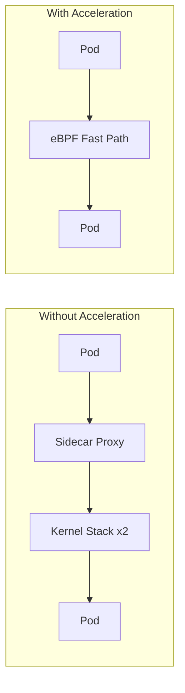

# How to Validate Sidecar Acceleration in Calico

Author: [nawazdhandala](https://github.com/nawazdhandala)

Tags: Calico, Kubernetes, eBPF, Sidecar, Service Mesh

Description: Validate that Calico sidecar acceleration is correctly reducing latency for service mesh traffic through eBPF optimization.

---

## Introduction

Calico's sidecar acceleration feature uses eBPF SOCKMAP to optimize traffic flows between an Istio Envoy sidecar and the application container in the same pod. When pods use sidecar proxies like Envoy, network traffic traverses extra kernel networking layers. Calico can bypass several of those layers so data flows between sockets more directly.

This optimization can reduce service mesh overhead for high-frequency inter-service calls, but Calico documents it as experimental and recommends using it only in test environments until the technology is hardened for production security.

## Prerequisites

- Calico eBPF dataplane enabled
- Calico application layer policy enabled
- Istio with Envoy sidecar injection
- Linux kernel 4.19 or newer on Calico nodes
- kubectl and calicoctl access

## Configure and Verify

```bash
# Verify eBPF and sidecar acceleration are enabled
calicoctl get felixconfiguration default -o yaml | grep bpfEnabled
calicoctl get felixconfiguration default -o yaml | grep sidecarAccelerationEnabled

# Enable sidecar acceleration if needed
kubectl patch felixconfiguration default --type merge \
  --patch '{"spec":{"sidecarAccelerationEnabled": true}}'

# Verify the BPF dataplane is running on a Calico node
kubectl logs -n calico-system ds/calico-node | grep "BPF enabled"
```

## Benchmark Acceleration

```bash
# Compare latency with and without acceleration
# Without acceleration, run a baseline before enabling sidecarAccelerationEnabled:
kubectl exec client-pod -- grpc_bench -n 10000 server:50051

# With acceleration enabled, start new connections and run the same benchmark:
kubectl exec client-pod -- grpc_bench -n 10000 server:50051
```

## Monitoring

```bash
# Enable BPF profiling to collect execution counts
kubectl patch felixconfiguration default --type merge \
  --patch '{"spec":{"bpfProfiling":"Enabled"}}'

# Check eBPF program execution counts on a Calico node
kubectl exec -n calico-system <calico-node-pod> -- \
  calico-node -bpf profiling e2e
```

## Acceleration Flow



## Conclusion

How to Validate Sidecar Acceleration in Calico requires enabling Calico eBPF mode and the experimental `sidecarAccelerationEnabled` Felix setting, then verifying that new Istio sidecar connections are being processed through the optimized eBPF path. Monitor latency metrics before and after enabling acceleration to quantify the performance improvement in your specific workload profile.
