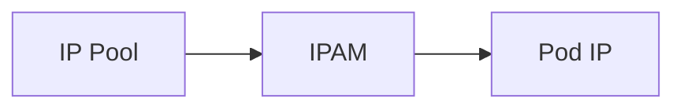

# How to Validate Specific IP Assignment with Calico IPAM

Author: [nawazdhandala](https://github.com/nawazdhandala)

Tags: Calico, Kubernetes, IPAM, Static IP, Networking

Description: Validate that pods with specific IP annotations receive the requested addresses from Calico IPAM.

---

## Introduction

Specific IP Assignment with Calico IPAM provides important IP address management capabilities in Calico. This feature allows for fine-grained control over how IP addresses are assigned to pods in your Kubernetes cluster.

## Prerequisites

- Calico installed with Calico IPAM enabled
- kubectl and calicoctl access
- IP pools configured

## Configuration

```bash
calicoctl get ippools -o yaml
calicoctl ipam show --show-blocks
```

## Example

```yaml
apiVersion: v1
kind: Pod
metadata:
  name: static-ip-demo
  annotations:
    cni.projectcalico.org/ipAddrs: '["10.48.0.10"]'
spec:
  containers:
    - name: nginx
      image: nginx:1.25
```

## Verification

```bash
calicoctl ipam check -o ipam-report.json
kubectl get pods -A -o wide
```

## Architecture



## Conclusion

How to Validate Specific IP Assignment with Calico IPAM helps ensure your Calico deployment handles IP addressing correctly for your specific workload requirements.
