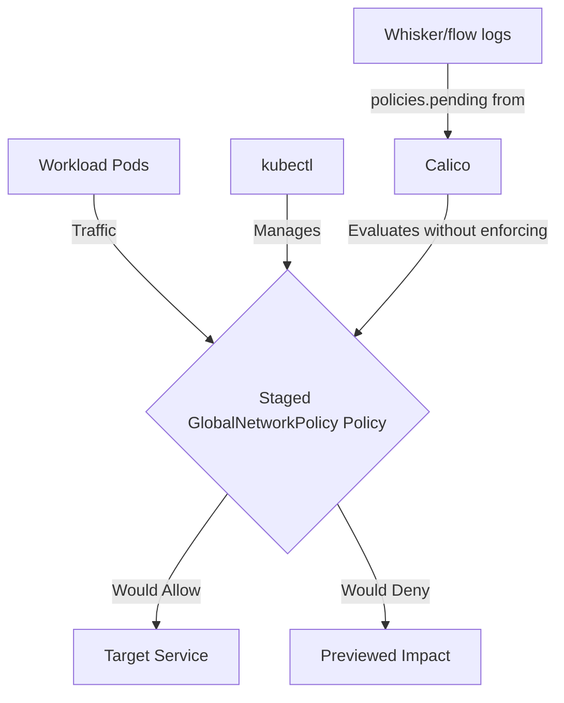

# How to Validate Staged GlobalNetworkPolicy in Calico Before Production

Author: [nawazdhandala](https://github.com/nawazdhandala)

Tags: Calico, Kubernetes, Network Policy, Staged Policies, Global Policy

Description: Build a validation framework for Staged GlobalNetworkPolicy in Calico before production deployment.

---

## Introduction

Staged GlobalNetworkPolicy is an advanced Calico feature that lets you preview fine-grained network security controls using the `projectcalico.org/v3` API. This guide covers how to validate Staged GlobalNetworkPolicy effectively in your Kubernetes cluster.

Calico's `projectcalico.org/v3` API provides rich support for staged policy through its `StagedGlobalNetworkPolicy`, `StagedNetworkPolicy`, and `StagedKubernetesNetworkPolicy` resources. Proper configuration of Staged GlobalNetworkPolicy is essential for maintaining a secure, well-controlled network fabric.

This guide provides production-tested patterns for validate Staged GlobalNetworkPolicy, including YAML examples, CLI commands, and troubleshooting techniques.

## Prerequisites

- Kubernetes cluster with Calico v3.30+
- `kubectl` installed
- Basic understanding of Calico network policy concepts
- Calico API server enabled for `projectcalico.org/v3` resources

## Core Configuration

The following YAML demonstrates the key pattern for Staged GlobalNetworkPolicy:

```yaml
apiVersion: projectcalico.org/v3
kind: StagedGlobalNetworkPolicy
metadata:
  name: validate-staged-globalnetworkpolicy
spec:
  order: 100
  namespaceSelector: projectcalico.org/name == 'production'
  selector: all()
  ingress:
    - action: Allow
      protocol: TCP
      source:
        selector: app == 'authorized-source'
      destination:
        ports: [8080, 443]
  egress:
    - action: Allow
      protocol: UDP
      destination:
        ports: [53]
    - action: Allow
      destination:
        selector: app == 'authorized-destination'
  types:
    - Ingress
    - Egress
```

## Implementation Steps

```bash
# 1. Apply the policy

kubectl apply -f validate-staged-globalnetworkpolicy.yaml

# 2. Verify the staged policy exists
kubectl get stagedglobalnetworkpolicy validate-staged-globalnetworkpolicy -o yaml

# 3. Test connectivity; staged policies preview impact and do not enforce traffic
kubectl exec -n production test-pod -- curl -s --max-time 5 http://target:8080
echo "Exit code: $?"

# 4. Preview staged policy impact in Calico flow logs/Whisker policies.pending output
```

## Operational Commands

```bash
# List all relevant policies
kubectl get stagedglobalnetworkpolicies
kubectl get globalnetworkpolicies

# View policy details
kubectl get stagedglobalnetworkpolicy validate-staged-globalnetworkpolicy -o yaml

# Delete a policy if needed
kubectl delete stagedglobalnetworkpolicy validate-staged-globalnetworkpolicy
```

## Architecture



## Common Issues

1. **Policy not applying**: Verify API version is `projectcalico.org/v3`, kind is `StagedGlobalNetworkPolicy`, and run `kubectl apply --dry-run=server -f validate-staged-globalnetworkpolicy.yaml` first
2. **Selector not matching**: Use `kubectl get pods -l your-selector` to verify label matches
3. **Order conflicts**: Run `kubectl get stagedglobalnetworkpolicies -o wide` and compare the order field
4. **DNS failures**: Always ensure egress to port 53 is allowed when restricting egress

## Conclusion

Validating Staged GlobalNetworkPolicy in Calico requires careful attention to policy ordering, selector syntax, and bidirectional traffic rules. Use the patterns in this guide as a starting point, adapt them to your specific requirements, and always validate changes in a staging environment before creating the equivalent enforcing `GlobalNetworkPolicy` in production. Consistent logging and monitoring will help you detect and resolve issues quickly when they occur.
