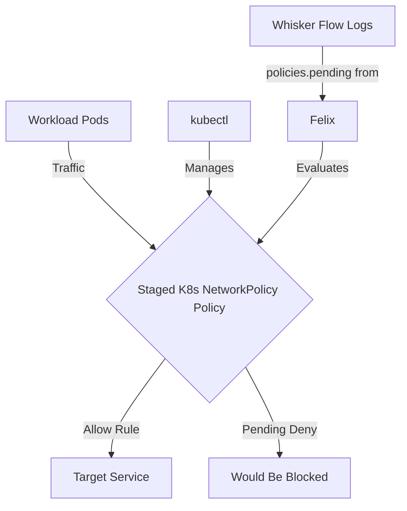

# How to Validate Staged Kubernetes NetworkPolicy in Calico Before Production

Author: [nawazdhandala](https://github.com/nawazdhandala)

Tags: Calico, Kubernetes, Network Policy, Staged Policies

Description: Build a validation framework for Staged Kubernetes NetworkPolicy in Calico before production deployment.

---

## Introduction

Staged Kubernetes NetworkPolicy is an advanced Calico feature that lets you preview Kubernetes NetworkPolicy behavior using the `projectcalico.org/v3` API before enforcing it. This guide covers how to validate Staged K8s NetworkPolicy effectively in your Kubernetes cluster.

Calico's `projectcalico.org/v3` API provides rich support for staged policy resources, including `StagedGlobalNetworkPolicy`, `StagedNetworkPolicy`, and `StagedKubernetesNetworkPolicy`. Proper validation of Staged K8s NetworkPolicy is essential for maintaining a secure, well-controlled network fabric.

This guide provides production-tested patterns for validate Staged K8s NetworkPolicy, including YAML examples, CLI commands, and troubleshooting techniques.

## Prerequisites

- Kubernetes cluster with Calico v3.30+ and the `StagedKubernetesNetworkPolicy` CRD installed
- `kubectl` installed
- Basic understanding of Calico network policy concepts
- Whisker or flow logs enabled to preview staged policy impact

## Core Configuration

The following YAML demonstrates the key pattern for Staged K8s NetworkPolicy:

```yaml
apiVersion: projectcalico.org/v3
kind: StagedKubernetesNetworkPolicy
metadata:
  name: validate-staged-k8s-networkpolicy
  namespace: production
spec:
  podSelector:
    matchLabels:
      app: target
  policyTypes:
    - Ingress
    - Egress
  ingress:
    - from:
        - podSelector:
            matchLabels:
              app: authorized-source
      ports:
        - protocol: TCP
          port: 8080
        - protocol: TCP
          port: 443
  egress:
    - ports:
        - protocol: UDP
          port: 53
    - to:
        - podSelector:
            matchLabels:
              app: authorized-destination
```

## Implementation Steps

```bash
# 1. Validate the manifest with the Kubernetes API server
kubectl apply --dry-run=server -f validate-staged-k8s-networkpolicy.yaml

# 2. Apply the staged policy
kubectl apply -f validate-staged-k8s-networkpolicy.yaml

# 3. Verify the staged policy exists
kubectl get stagedkubernetesnetworkpolicy.p -n production

# 4. Generate traffic to evaluate in flow logs
kubectl exec -n production test-pod -- curl -s --max-time 5 http://target:8080
echo "Exit code: $?"

# 5. Review the policies.pending field in Whisker flow logs
```

## Operational Commands

```bash
# List all relevant policies
kubectl get stagedkubernetesnetworkpolicy.p --all-namespaces
kubectl get stagednetworkpolicy.p --all-namespaces
kubectl get stagedglobalnetworkpolicy.p

# View policy details
kubectl get stagedkubernetesnetworkpolicy.p validate-staged-k8s-networkpolicy -n production -o yaml

# Delete a policy if needed
kubectl delete stagedkubernetesnetworkpolicy.p validate-staged-k8s-networkpolicy -n production
```

## Architecture



## Common Issues

1. **Policy not applying**: Verify API version is `projectcalico.org/v3`, kind is `StagedKubernetesNetworkPolicy`, and run `kubectl apply --dry-run=server` first
2. **Selector not matching**: Use `kubectl get pods -l your-selector` to verify label matches
3. **Wrong policy syntax**: Use Kubernetes NetworkPolicy fields such as `podSelector`, `policyTypes`, `from`, `to`, and `ports`; Calico `selector`, `order`, and `action` fields belong to Calico policy resources, not Staged Kubernetes NetworkPolicy
4. **DNS failures**: Always ensure egress to port 53 is allowed when restricting egress

## Conclusion

Validate Staged K8s NetworkPolicy in Calico requires careful attention to Kubernetes NetworkPolicy selector syntax and bidirectional traffic rules. Use the patterns in this guide as a starting point, adapt them to your specific requirements, and always validate changes in a staging environment before applying to production. Consistent logging and monitoring will help you detect and resolve issues quickly when they occur.
