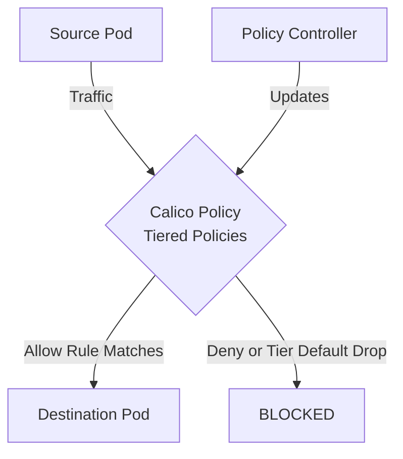

# How to Validate Calico Tiered Policies Before Production in Calico

Author: [nawazdhandala](https://github.com/nawazdhandala)

Tags: Calico, Kubernetes, Network Policy, Policy Tiers, Security

Description: Build a validation framework for Calico Tiered Policies in Calico before production deployment.

---

## Introduction

Calico Tiered Policies in Calico provides fine-grained network security controls using the `projectcalico.org/v3` API. This guide covers how to validate Tiered Policies effectively.

Calico's extensible policy model supports Tiered Policies through `Tier`, `GlobalNetworkPolicy`, and `NetworkPolicy` resources, giving you cluster-wide and namespace-scoped control over traffic that matches your Tiered Policies criteria.

This guide provides practical techniques for validate Tiered Policies in your Kubernetes cluster, following security best practices and production-tested patterns.

## Prerequisites

- Kubernetes cluster with Calico v3.26+
- `calicoctl` and `kubectl` installed
- Basic understanding of Calico network policy concepts

## Step 1: Schema Validation

```bash
for f in policies/*.yaml; do
  calicoctl validate -f "$f" && echo "PASS: $f" || echo "FAIL: $f"
done
```

## Step 2: Selector Validation

```bash
python3 << 'EOF'
import re
import subprocess
import yaml

# Load policies

with open('policies/production-policies.yaml') as f:
    policies = list(yaml.safe_load_all(f))

errors = []
warnings = []
for p in policies:
    if p is None: continue
    sel = p.get('spec', {}).get('selector', '')
    if sel and sel != 'all()':
        match = re.fullmatch(r'\s*([\w./-]+)\s*==\s*[\'"]([^\'"]+)[\'"]\s*', sel)
        if not match:
            warnings.append(f"Skipping non-simple Calico selector: {sel}")
            continue
        label_key, label_value = match.groups()
        result = subprocess.run(
            ['kubectl', 'get', 'pods', '--all-namespaces', '-l', f'{label_key}={label_value}', '-o', 'name'],
            capture_output=True, text=True
        )
        if result.returncode != 0:
            errors.append(f"kubectl failed for selector {sel}: {result.stderr.strip()}")
        elif not result.stdout.strip():
            errors.append(f"No pods match selector: {sel}")
for w in warnings:
    print(f"WARN: {w}")
if errors:
    for e in errors: print(f"WARN: {e}")
else:
    print("Simple pod label selectors validated")
EOF
```

## Step 3: Traffic Tests in Staging

```bash
./test-tiered-policies-policies.sh
echo "Exit code: $?"
```

## Step 4: CI/CD Integration

```yaml
# .github/workflows/validate-calico.yaml
name: Validate Calico Policies
on: [pull_request]
jobs:
  validate:
    runs-on: ubuntu-latest
    env:
      CALICO_VERSION: v3.26.0
    steps:
      - uses: actions/checkout@v6
      - name: Install calicoctl
        run: |
          curl -L "https://github.com/projectcalico/calico/releases/download/${CALICO_VERSION}/calicoctl-linux-amd64" -o calicoctl
          chmod +x ./calicoctl
          sudo mv ./calicoctl /usr/local/bin/calicoctl
      - name: Validate
        run: |
          for f in policies/*.yaml; do
            yamllint "$f"
            calicoctl validate -f "$f"
          done
```

## Architecture



## Conclusion

Validate Tiered Policies policies in Calico requires attention to policy ordering, selector accuracy, and bidirectional rule coverage. Follow the patterns in this guide to ensure your Tiered Policies policies are correctly configured, tested, and monitored. Always validate in staging before applying to production, and maintain comprehensive logging for visibility into policy decisions.
