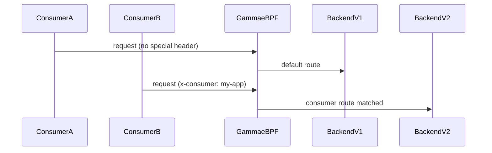

# How to Validate Types of GAMMA Configuration in the Cilium Gateway API

Author: [nawazdhandala](https://github.com/nawazdhandala)

Tags: Cilium, Kubernetes, GAMMA, Gateway API, Validation

Description: Validate producer, consumer, and mixed GAMMA configuration types in Cilium by checking route acceptance, backend resolution, and actual traffic behavior.

---

## Introduction

Validating GAMMA configuration types ensures that the intended ownership model—whether producer-controlled, consumer-controlled, or mixed—is correctly enforced in the eBPF datapath. Each type requires slightly different validation steps.

For producer routes, validation confirms that traffic to the Service is routed according to the producer's rules regardless of which consumer sends it. For consumer routes, validation confirms that only the intended consumer's traffic is affected by the routing policy.

## Prerequisites

- Cilium GAMMA enabled with producer and consumer HTTPRoutes deployed
- ReferenceGrants configured for cross-namespace routes
- `kubectl` and `hubble` CLIs

## Validate Producer Route

```bash
kubectl get httproute <producer-route> -n <producer-ns> \
  -o jsonpath='{.status.parents[0].conditions[?(@.type=="Accepted")].status}'
# Expected: True
```

Send traffic from multiple consumer namespaces and verify all are affected:

```bash
for ns in consumer-1 consumer-2 consumer-3; do
  kubectl run test --image=curlimages/curl --rm --restart=Never -n $ns \
    -- curl -s http://<service>:<port>/version
done
```

## Validate Consumer Route

Confirm only the specified consumer's traffic is affected:

```bash
kubectl run test-consumer --image=curlimages/curl --rm --restart=Never \
  -n consumer-ns -- curl -H "x-consumer: my-app" http://<service>:<port>/
```

Traffic from other consumers should not match the consumer route's headers.

## Architecture



## Validate ReferenceGrant Coverage

```bash
kubectl get referencegrant -A -o json | \
  jq '.items[] | {name: .metadata.name, from: .spec.from, to: .spec.to}'
```

Ensure each cross-namespace HTTPRoute has a corresponding ReferenceGrant.

## Use Hubble to Confirm Routing

```bash
hubble observe --namespace <producer-ns> --protocol http --follow \
  | grep -E "FORWARDED|DROPPED"
```

## Conclusion

Validating GAMMA configuration types involves testing route conditions, confirming routing behavior per consumer, and using Hubble to verify the eBPF datapath enforces the intended rules. These checks ensure your GAMMA deployment behaves according to the chosen ownership model.
