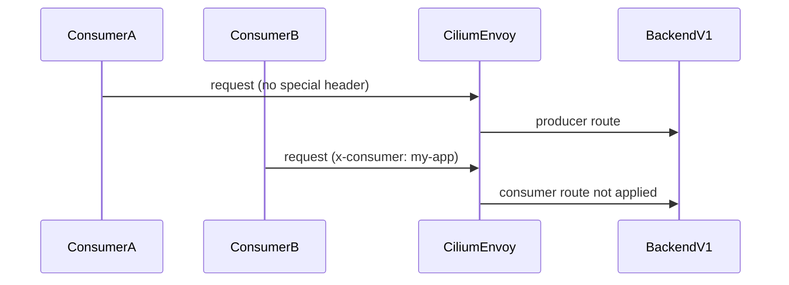

# How to Validate Types of GAMMA Configuration in the Cilium Gateway API

Author: [nawazdhandala](https://github.com/nawazdhandala)

Tags: Cilium, Kubernetes, GAMMA, Gateway API, Validation

Description: Validate producer, consumer, and mixed GAMMA configuration types in Cilium by checking route acceptance, backend resolution, and actual traffic behavior.

---

## Introduction

Validating GAMMA configuration types ensures that the intended ownership model-whether producer-controlled, consumer-controlled, or mixed-is correctly handled by Cilium's Gateway API controller and Envoy datapath. Each type requires slightly different validation steps.

For producer routes, validation confirms that traffic to the Service is routed according to the producer's rules regardless of which consumer sends it. Cilium currently supports producer HTTPRoutes only, so consumer or mixed-route validation should confirm that unsupported consumer HTTPRoutes are not applied.

## Prerequisites

- Cilium GAMMA enabled with producer HTTPRoutes deployed
- Optional consumer HTTPRoutes deployed if you want to confirm unsupported routes are not applied
- ReferenceGrants configured for any cross-namespace backend references
- `kubectl` and `hubble` CLIs

## Validate Producer Route

```bash
kubectl get httproute <producer-route> -n <producer-ns> \
  -o jsonpath='{.status.parents[0].conditions[?(@.type=="Accepted")].status}'
# Expected: True

```

Send traffic from multiple consumer namespaces and verify all are affected:

```bash
for ns in consumer-1 consumer-2 consumer-3; do
  kubectl run test --image=curlimages/curl --rm --restart=Never -n $ns \
    -- curl -s http://<service>:<port>/version
done
```

## Validate Consumer Route

Confirm that a consumer HTTPRoute is not accepted by Cilium:

```bash
kubectl get httproute <consumer-route> -n <consumer-ns> \
  -o jsonpath='{.status.parents[0].conditions[?(@.type=="Accepted")].status}'
# Expected: False
```

Confirm that the unsupported consumer route does not change traffic:

```bash
kubectl run test-consumer --image=curlimages/curl --rm --restart=Never \
  -n consumer-ns -- curl -H "x-consumer: my-app" http://<service>:<port>/
```

Traffic from other consumers should follow the accepted producer route or the Service's normal routing behavior.

## Architecture


```mermaid
sequenceDiagram
    participant ConsumerA
    participant ConsumerB
    participant CiliumEnvoy
    participant BackendV1

    ConsumerA->>CiliumEnvoy: request (no special header)
    CiliumEnvoy->>BackendV1: producer route
    ConsumerB->>CiliumEnvoy: request (x-consumer: my-app)
    CiliumEnvoy->>BackendV1: consumer route not applied
```

## Validate ReferenceGrant Coverage

```bash
kubectl get referencegrant -A -o json | \
  jq '.items[] | {name: .metadata.name, from: .spec.from, to: .spec.to}'
```

Ensure each cross-namespace backend reference has a corresponding ReferenceGrant in the referenced backend namespace.

## Use Hubble to Confirm Routing

```bash
hubble observe --namespace <producer-ns> --protocol http --follow \
  | grep -E "FORWARDED|DROPPED"
```

## Conclusion

Validating GAMMA configuration types involves testing route conditions, confirming producer-route behavior across consumers, confirming unsupported consumer routes are not applied, and using Hubble to verify Cilium forwards the intended traffic. These checks ensure your GAMMA deployment behaves according to Cilium's supported ownership model.
