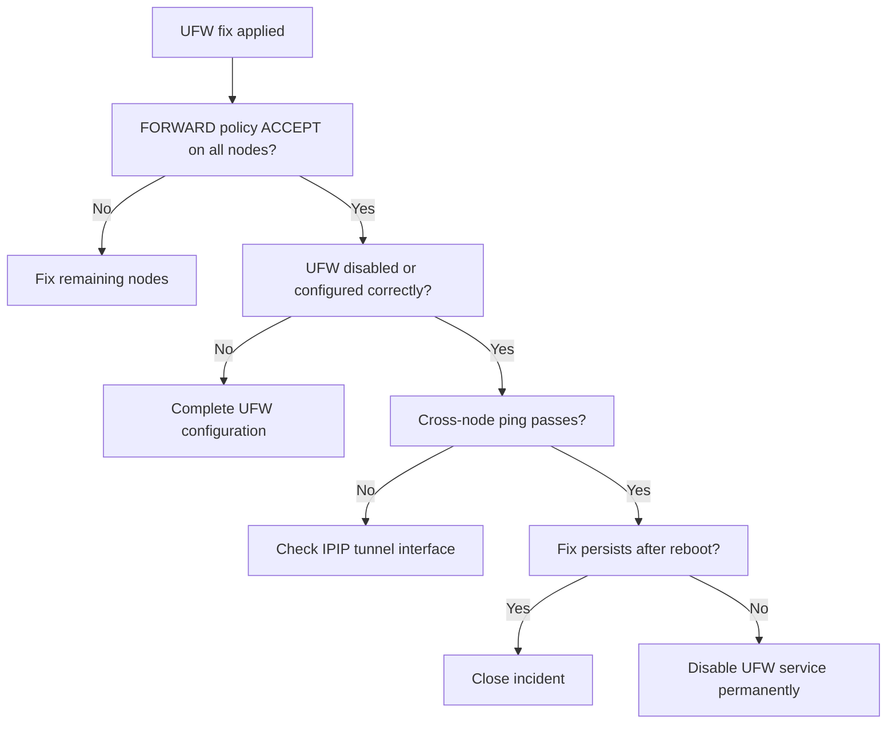

# How to Validate Resolution of UFW Blocking Kubernetes with Calico

Author: [nawazdhandala](https://github.com/nawazdhandala)

Tags: Calico, Kubernetes, Networking, Troubleshooting

Description: Validation steps to confirm UFW is no longer blocking Calico Kubernetes networking including iptables FORWARD policy checks and cross-node connectivity tests.

---

## Introduction

Validating UFW-Calico conflict resolution requires confirming that the iptables FORWARD policy is no longer DROP, that Calico's encapsulation traffic is flowing, and that cross-node pod connectivity is fully restored. Because UFW changes take effect at the kernel iptables level, validation should be done at both the iptables layer and the application layer.

A thorough validation also checks that the fix is persistent across node reboots - a common oversight where the iptables change is applied but UFW re-enables at boot with the DROP policy.

## Symptoms

- Fix applied but connectivity still fails on reboot
- iptables FORWARD shows ACCEPT but specific IPIP traffic still blocked
- Some nodes fixed but others with UFW still affected

## Root Causes

- UFW disabled temporarily but will re-enable at boot (service not disabled)
- UFW config updated but not reloaded
- Only one of multiple affected nodes was fixed

## Diagnosis Steps

```bash
# Check all nodes
for NODE in $(kubectl get nodes -o jsonpath='{.items[*].metadata.name}'); do
  echo -n "$NODE FORWARD: "
  ssh $NODE "sudo iptables -L FORWARD -n | head -1" 2>/dev/null
done
```

## Solution

**Validation Step 1: Confirm FORWARD policy on all nodes**

```bash
for NODE in $(kubectl get nodes -o jsonpath='{.items[*].metadata.name}'); do
  POLICY=$(ssh $NODE "sudo iptables -L FORWARD -n | head -1" 2>/dev/null)
  echo "$NODE: $POLICY"
  # Expected: "Chain FORWARD (policy ACCEPT)" or chain includes ACCEPT jump
done
```

**Validation Step 2: Confirm UFW disabled or configured correctly**

```bash
ssh $AFFECTED_NODE "sudo ufw status"
# Expected: Status: inactive (if disabled)
# OR: Status: active with DEFAULT_FORWARD_POLICY: ACCEPT

# Also verify service is disabled to prevent re-enable at boot
ssh $AFFECTED_NODE "sudo systemctl is-enabled ufw"
# Expected: disabled (if chosen to disable)
```

**Validation Step 3: Test cross-node IPIP traffic**

```bash
# Check Calico tunnel interface
ssh $AFFECTED_NODE "ip link show tunl0 || ip link show vxlan.calico"
ssh $AFFECTED_NODE "ip addr show tunl0 2>/dev/null || ip addr show vxlan.calico 2>/dev/null"
```

**Validation Step 4: Cross-node pod ping test**

```bash
kubectl run val-src --image=busybox --restart=Never \
  --overrides="{\"spec\":{\"nodeName\":\"$AFFECTED_NODE\"}}" -- sleep 120
kubectl run val-dst --image=busybox --restart=Never \
  --overrides="{\"spec\":{\"nodeName\":\"<other-node>\"}}" -- sleep 120

kubectl wait pod/val-src pod/val-dst --for=condition=Ready --timeout=60s

DST_IP=$(kubectl get pod val-dst -o jsonpath='{.status.podIP}')
kubectl exec val-src -- ping -c 5 $DST_IP && echo "PASS" || echo "FAIL"

kubectl delete pod val-src val-dst
```

**Validation Step 5: Reboot test (if possible in maintenance window)**

```bash
# Confirm fix persists through reboot
ssh $AFFECTED_NODE "sudo reboot"
# Wait for node to come back
kubectl wait node $AFFECTED_NODE --for=condition=Ready --timeout=300s

# Re-test cross-node connectivity
# (repeat Step 4)
```



## Prevention

- Add FORWARD policy check to weekly node health report
- Test node networking after every OS maintenance window
- Include UFW state in cluster admission checks for new nodes

## Conclusion

Validating UFW-Calico conflict resolution requires checking the iptables FORWARD policy on all nodes, confirming cross-node pod connectivity, and verifying the fix persists through node reboots. The reboot test is critical - UFW may re-enable with DROP forward policy if the service was not properly disabled.
