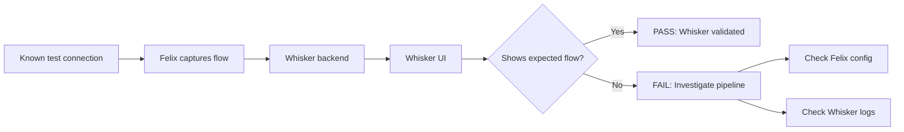

# How to Validate Whisker in Calico in Production

Author: [nawazdhandala](https://github.com/nawazdhandala)

Tags: Calico, Kubernetes, Networking, Observability

Description: Validate that Calico Whisker is correctly displaying network flow data in production by cross-checking Whisker's traffic views against known application connection patterns.

---

## Introduction

Validating Whisker in production requires confirming that it accurately represents actual traffic flows: connections you know exist should appear as allowed flows, and traffic blocked by network policies should appear as denied flows. Cross-checking Whisker against application-level connectivity tests validates the observability pipeline end-to-end. A Whisker that shows no traffic in a busy cluster is not providing accurate observability.

## Step 1: Verify Whisker Backend Is Receiving Data

```bash
# Check Whisker pods are running and healthy
kubectl get pods -n calico-system -l app=whisker
kubectl logs -n calico-system -l app=whisker | grep -i "error\|warn" | tail -10

# Verify flow log configuration
kubectl get felixconfiguration default \
  -o jsonpath='{.spec.flowLogsFlushInterval}'
# Should be set (e.g., 10s) - if not set, flows may not be collected
```

## Step 2: Generate Known Traffic and Verify in Whisker

```bash
# Generate a known connection
kubectl run test-client --image=nicolaka/netshoot \
  --restart=Never -- curl -s http://<service-ip>:80

# Wait 15-30 seconds for flow flush

# Then verify in Whisker UI:
# http://localhost:8080 (after port-forward)
# Filter: source=test-client
# Expected: connection appears as "Allowed" or "Denied" depending on policy
```

## Step 3: Verify Denied Traffic Appears

```bash
# Deploy a pod that will be denied by policy
kubectl run policy-test --image=nicolaka/netshoot \
  -n restricted-namespace --restart=Never -- \
  curl -s http://protected-service:80

# Wait 15-30 seconds
# In Whisker UI: filter action=Deny
# Expected: policy-test connection appears in denied view
```

## Validation Architecture



## Step 4: Cross-Check Flow Count Against Expectations

```bash
# A busy production cluster should show hundreds of flows per minute
# If Whisker shows 0 flows in a production cluster: pipeline failure

# Check flow log file on a node (if file logging enabled)
kubectl debug node/<node> --image=alpine -- \
  ls -la /var/log/calico/flowlogs/ 2>/dev/null

# Check Felix flow log metrics
kubectl exec -n calico-system <calico-node-pod> -c calico-node -- \
  wget -qO- http://localhost:9091/metrics | grep flow
```

## Conclusion

Whisker validation requires active testing: generate known traffic patterns and verify they appear correctly in the Whisker UI. A silent Whisker showing no flows in a production cluster is a broken observability pipeline, not a sign of no traffic. The most common validation failure is a FelixConfiguration that doesn't have flow logging configured, causing Whisker to have no data source. Validate Whisker after any FelixConfiguration change and after Calico upgrades.
