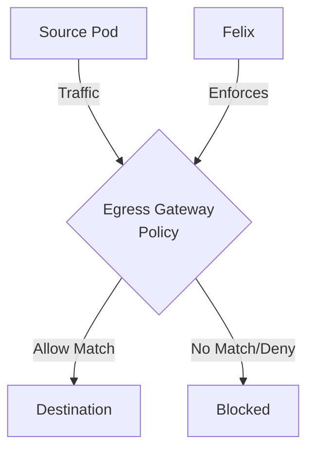

# Zero Trust Egress Control with Calico Egress Gateway Policies

Author: [nawazdhandala](https://github.com/nawazdhandala)

Tags: Calico, Kubernetes, Network Policy, Egress Gateway, Security

Description: Zero Trust Calico egress gateway policies to control and secure outbound traffic leaving your Kubernetes cluster.

---

## Introduction

Calico Egress Gateway Policies in Calico provides comprehensive network traffic controls using the `projectcalico.org/v3` API. This guide covers zero trust Egress Gateway with production-ready configurations.

## Prerequisites

- Kubernetes cluster with Calico v3.26+
- `calicoctl` and `kubectl` installed

## Core Configuration

```yaml
apiVersion: projectcalico.org/v3
kind: GlobalNetworkPolicy
metadata:
  name: zero-trust-egress-gateway
spec:
  order: 100
  selector: all()
  ingress:
    - action: Allow
      source:
        selector: app == 'authorized'
  egress:
    - action: Allow
      protocol: UDP
      destination:
        ports: [53]
    - action: Allow
      destination:
        selector: app == 'permitted-destination'
  types:
    - Ingress
    - Egress
```

## Implementation

```bash
# Apply policy
calicoctl apply -f zero-trust-egress-gateway.yaml

# Verify policy is active
calicoctl get globalnetworkpolicies -o wide

# Test connectivity
kubectl exec -n test test-pod -- curl -s --max-time 5 http://target:8080
echo "Result: $?"
```

## Verification

```bash
# Check policy hit counters
curl -s http://localhost:9091/metrics | grep felix_denied

# Review flow logs
tail -f /var/log/calico/flow-logs/flows.log | grep "DENY"
```

## Architecture



## Conclusion

Zero Trust Egress Gateway in Calico ensures your network policies are properly configured, tested, and monitored. Follow the patterns in this guide, validate in staging first, and maintain comprehensive logging for security visibility. Regular policy audits help you keep your cluster's security posture aligned with evolving requirements.
