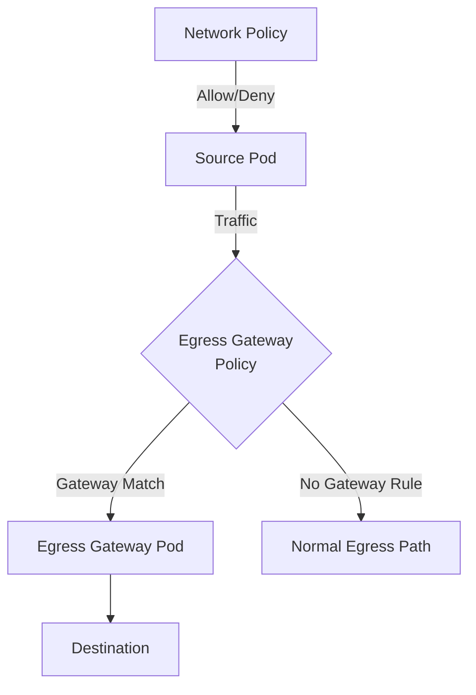

# Zero Trust Egress Control with Calico Egress Gateway Policies

Author: [nawazdhandala](https://github.com/nawazdhandala)

Tags: Calico, Kubernetes, Network Policy, Egress Gateway, Security

Description: Zero Trust Calico egress gateway policies to control and secure outbound traffic leaving your Kubernetes cluster.

---

## Introduction

Calico Egress Gateway Policies in Calico Enterprise and Calico Cloud provide destination-based egress gateway selection using the `projectcalico.org/v3` API. This guide covers zero trust Egress Gateway routing with network policy controls and example configurations.

## Prerequisites

- Kubernetes cluster with Calico Enterprise or Calico Cloud and Calico CNI
- Egress gateway support enabled with `egressIPSupport: EnabledPerNamespaceOrPerPod`
- `calicoctl` and `kubectl` installed

## Core Configuration

```yaml
apiVersion: projectcalico.org/v3
kind: GlobalNetworkPolicy
metadata:
  name: zero-trust-egress-control
spec:
  order: 100
  selector: all()
  egress:
    - action: Allow
      protocol: UDP
      destination:
        ports: [53]
    - action: Allow
      protocol: TCP
      destination:
        ports: [53]
    - action: Allow
      destination:
        selector: app == 'permitted-destination'
  types:
    - Egress
---
apiVersion: projectcalico.org/v3
kind: EgressGatewayPolicy
metadata:
  name: zero-trust-egress-gateway
spec:
  rules:
    - destination:
        cidr: 10.0.0.0/8
      description: "Local traffic: no gateway"
    - destination:
        cidr: 0.0.0.0/0
      description: "Default egress gateway"
      gateway:
        namespaceSelector: "projectcalico.org/name == 'default'"
        selector: "egress-code == 'red'"
      gatewayPreference: PreferNodeLocal
```

## Implementation

```bash
# Apply policy

calicoctl apply -f zero-trust-egress-gateway.yaml
kubectl annotate namespace test egress.projectcalico.org/egressGatewayPolicy=zero-trust-egress-gateway --overwrite

# Verify policy is active
calicoctl get globalnetworkpolicy zero-trust-egress-control -o wide
calicoctl get egressgatewaypolicy zero-trust-egress-gateway -o yaml

# Test connectivity
kubectl exec -n test test-pod -- curl -s --max-time 5 http://target:8080
echo "Result: $?"
```

## Verification

```bash
# Check policy hit counters
curl -s http://<node-IP>:9081/metrics | grep calico_denied_packets

# Review flow logs
kubectl logs -n calico-system -l k8s-app=calico-node --tail=100 | grep -i "deny"
```

## Architecture


```mermaid
flowchart TD
    A[Source Pod] -->|Traffic| B{Egress Gateway\nPolicy}
    B -->|Gateway Match| C[Egress Gateway Pod]
    B -->|No Gateway Rule| D[Normal Egress Path]
    C --> E[Destination]
    F[Network Policy] -->|Allow/Deny| A
```

## Conclusion

Zero Trust Egress Gateway in Calico helps ensure your egress routing and network policies are properly configured, tested, and monitored. Follow the patterns in this guide, validate in staging first, and maintain comprehensive logging for security visibility. Regular policy audits help you keep your cluster's security posture aligned with evolving requirements.
