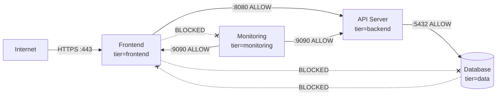

# Zero Trust Microsegmentation with Calico Label-Based Network Policies

Author: [nawazdhandala](https://github.com/nawazdhandala)

Tags: Calico, Kubernetes, Network Policy, Labels, Zero Trust, Microsegmentation

Description: Implement zero trust microsegmentation in Kubernetes using Calico label-based network policies to enforce identity-driven traffic controls.

---

## Introduction

Zero trust microsegmentation means every workload communicates only with the workloads it needs to reach, and those relationships are defined by explicit, auditable policy rules. Labels are the identity mechanism in Kubernetes — they define what a workload is, and Calico uses those labels to enforce what it can talk to.

In a zero trust model, the label on a pod is essentially its cryptographic identity within the cluster (though Calico Enterprise with Istio integration provides cryptographic identity through mTLS). Without zero trust, a compromised pod can reach any other pod in the cluster. With label-based microsegmentation, a compromised pod is contained to only its explicitly allowed communication paths.

This guide shows you how to implement zero trust microsegmentation using Calico label-based policies, covering the full application architecture from frontend to database with minimal-privilege traffic rules.

## Prerequisites

- Kubernetes cluster with Calico v3.26+
- Comprehensive, consistent labeling of all workloads
- `calicoctl` and `kubectl` installed
- A default deny `GlobalNetworkPolicy` already applied

## Step 1: Define Identity Labels for Each Tier

```yaml
# Three-tier application labels
# Frontend:  app=web, tier=frontend, env=prod
# API:       app=api, tier=backend, env=prod
# Database:  app=db, tier=data, env=prod
# Monitoring: app=prometheus, tier=monitoring, env=prod
```

## Step 2: Create Explicit Allow Rules for Each Communication Path

```yaml
apiVersion: projectcalico.org/v3
kind: NetworkPolicy
metadata:
  name: zt-allow-frontend-to-api
  namespace: production
spec:
  order: 100
  selector: tier == 'backend'
  ingress:
    - action: Allow
      source:
        selector: tier == 'frontend'
      destination:
        ports: [8080]
  types:
    - Ingress
---
apiVersion: projectcalico.org/v3
kind: NetworkPolicy
metadata:
  name: zt-allow-api-to-db
  namespace: production
spec:
  order: 100
  selector: tier == 'data'
  ingress:
    - action: Allow
      source:
        selector: tier == 'backend'
      destination:
        ports: [5432]
  types:
    - Ingress
---
apiVersion: projectcalico.org/v3
kind: NetworkPolicy
metadata:
  name: zt-allow-monitoring-scrape
  namespace: production
spec:
  order: 100
  selector: all()
  ingress:
    - action: Allow
      source:
        selector: tier == 'monitoring'
      destination:
        ports: [9090, 9091, 8080]
  types:
    - Ingress
```

## Step 3: Verify No Lateral Movement Is Possible

```bash
# Frontend should NOT be able to reach database directly
FRONTEND_POD=$(kubectl get pod -n production -l tier=frontend -o jsonpath='{.items[0].metadata.name}')
DB_IP=$(kubectl get pod -n production -l tier=data -o jsonpath='{.items[0].status.podIP}')

kubectl exec -n production $FRONTEND_POD -- nc -zv $DB_IP 5432
# Should timeout - frontend-to-database lateral movement blocked
```

## Zero Trust Communication Graph



## Conclusion

Label-based microsegmentation with Calico is the practical path to zero trust in Kubernetes. By assigning identity labels to every workload and writing explicit allow rules for each required communication path, you constrain every pod to its minimum required network access. This prevents lateral movement in the event of a compromise and creates a self-documenting security architecture where the policies themselves describe the intended communication graph.
