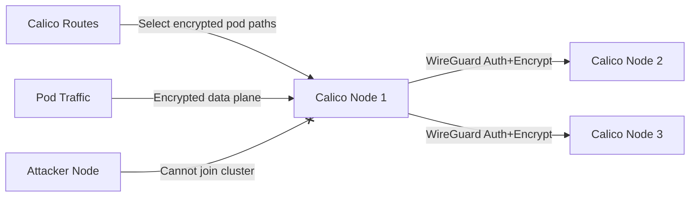

# Zero Trust with Crypto Authentication for Calico Node Traffic

Author: [nawazdhandala](https://github.com/nawazdhandala)

Tags: Calico, Kubernetes, Network Policy, Encryption, WireGuard, Node Security

Description: Zero Trust WireGuard-based crypto authentication for Calico node traffic to secure inter-node communication.

---

## Introduction

Crypto authentication for Calico node traffic uses WireGuard to authenticate and encrypt inter-node pod traffic between Calico nodes. This protects pod traffic from interception and spoofing on the host-to-host portion of the path, even on untrusted networks.

Calico's `projectcalico.org/v3` FelixConfiguration resource controls WireGuard settings, enabling you to turn on node-level pod traffic encryption with a single configuration change. WireGuard peer authentication ensures that only nodes with the expected keys can exchange encrypted pod traffic.

This guide covers zero trust crypto authentication for Calico node traffic, focusing on inter-node pod data plane encryption.

## Prerequisites

- Kubernetes cluster with Calico v3.26+
- Linux kernel 5.6+ on all nodes (for WireGuard)
- `calicoctl` and `kubectl` installed

## Enable Crypto Authentication

```yaml
apiVersion: projectcalico.org/v3
kind: FelixConfiguration
metadata:
  name: default
spec:
  wireguardEnabled: true
  wireguardMTU: 1440
  wireguardListeningPort: 51820
```

```bash
# Apply configuration

calicoctl apply -f wireguard-config.yaml

# Verify on each node
calicoctl get node <NODE-NAME> -o yaml
```

## Verify Node Authentication

```bash
# Check WireGuard peers (all Calico nodes should be listed)
kubectl exec -n calico-system <calico-node-pod> -- wg show

# Verify peer connections
kubectl exec -n calico-system <calico-node-pod> -- wg show wireguard.cali peers

# Check that traffic between nodes is encrypted
kubectl debug node/node1 -it --image=nicolaka/netshoot --profile=netadmin -- tcpdump -i eth0 -n udp port 51820 -c 10
```

## Architecture



## Conclusion

Crypto authentication for Calico node traffic provides mutual authentication and encryption for inter-node pod traffic. Enable WireGuard in FelixConfiguration to protect pod traffic from interception and injection. If you need host-to-host traffic protection, review Calico's `wireguardHostEncryptionEnabled` support and platform requirements. Monitor WireGuard peer connections and transfer statistics to ensure encryption is active across all nodes and detect any nodes that have lost their crypto authentication.
