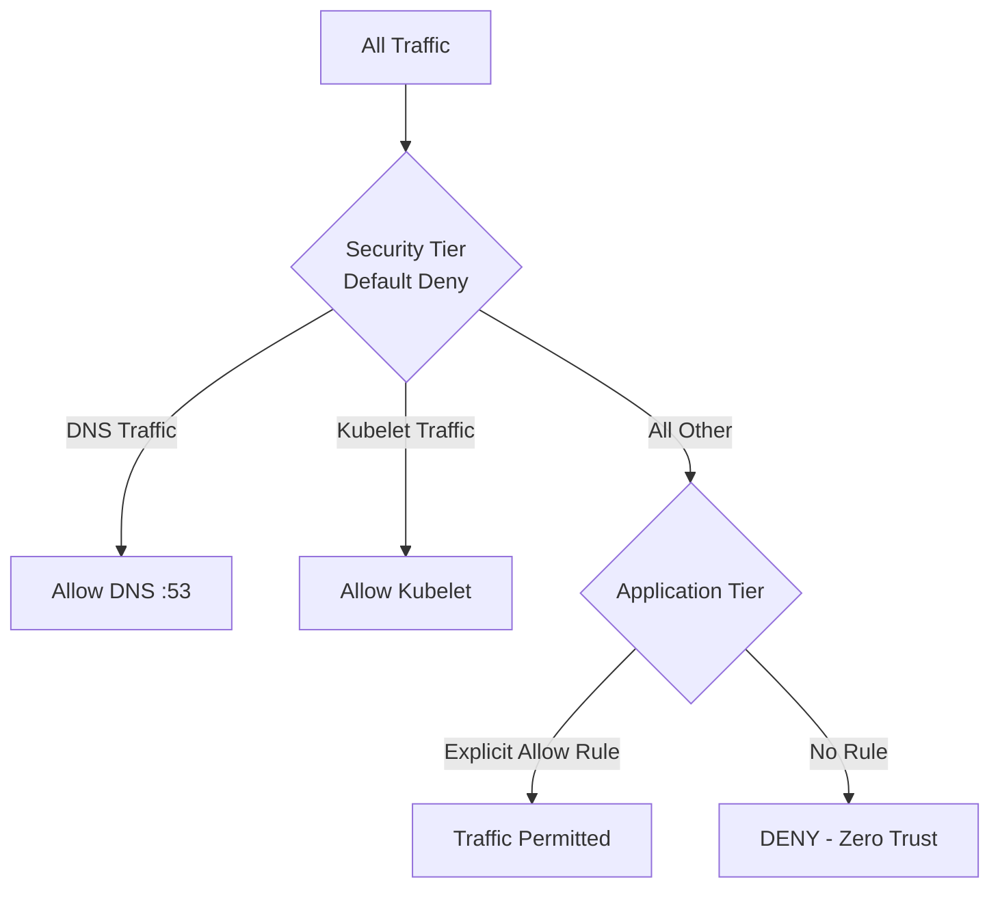

# Zero Trust Security with Calico Default Deny Policies

Author: [nawazdhandala](https://github.com/nawazdhandala)

Tags: Calico, Kubernetes, Network Policy, Zero Trust, Security

Description: Implement a true zero-trust network model in Kubernetes using Calico default deny policies that ensure no traffic is trusted by default.

---

## Introduction

Zero trust security is built on a simple principle: never trust, always verify. In Kubernetes, the default permissive networking model is the opposite of zero trust. Every pod can reach every other pod unless explicitly prevented. Calico default deny policies flip this model, making denial the default and requiring explicit authorization for every traffic flow.

Calico's `GlobalNetworkPolicy` resource is the foundation of zero trust in Kubernetes. Combined with namespace isolation, pod-level selectors, and service account-based policies, you can build a network model where every connection is authenticated, authorized, and audited. This is not just a security best practice — for regulated industries like finance and healthcare, it may be a compliance requirement.

This guide explains how to design and implement a complete zero-trust network architecture using Calico default deny policies, covering the full control plane from cluster-wide defaults to per-workload allow rules.

## Prerequisites

- Kubernetes cluster with Calico v3.26+
- `calicoctl` and `kubectl` installed
- Understanding of your application's communication graph
- Labels applied consistently to all workloads

## Step 1: Define Your Zero Trust Tiers

Calico policy tiers let you organize policies by security domain:

```yaml
apiVersion: projectcalico.org/v3
kind: Tier
metadata:
  name: security
spec:
  order: 100
---
apiVersion: projectcalico.org/v3
kind: Tier
metadata:
  name: application
spec:
  order: 200
```

## Step 2: Apply Zero Trust Default Deny in the Security Tier

```yaml
apiVersion: projectcalico.org/v3
kind: GlobalNetworkPolicy
metadata:
  name: security.default-deny
spec:
  tier: security
  order: 1000
  selector: all()
  ingress:
    - action: Deny
  egress:
    - action: Deny
  types:
    - Ingress
    - Egress
```

## Step 3: Allow Only Cluster-Critical Traffic

```yaml
apiVersion: projectcalico.org/v3
kind: GlobalNetworkPolicy
metadata:
  name: security.allow-dns
spec:
  tier: security
  order: 100
  selector: all()
  egress:
    - action: Allow
      protocol: UDP
      destination:
        ports: [53]
    - action: Allow
      protocol: TCP
      destination:
        ports: [53]
  types:
    - Egress
---
apiVersion: projectcalico.org/v3
kind: GlobalNetworkPolicy
metadata:
  name: security.allow-kubelet
spec:
  tier: security
  order: 101
  selector: all()
  ingress:
    - action: Allow
      source:
        nets:
          - 10.0.0.0/8  # Node CIDR
      destination:
        ports: [10250]
  types:
    - Ingress
```

## Step 4: Implement Per-Workload Microsegmentation

```yaml
apiVersion: projectcalico.org/v3
kind: NetworkPolicy
metadata:
  name: application.frontend-to-backend
  namespace: production
spec:
  tier: application
  order: 100
  selector: app == 'backend'
  ingress:
    - action: Allow
      source:
        selector: app == 'frontend'
      destination:
        ports: [8080]
  types:
    - Ingress
```

## Zero Trust Architecture



## Conclusion

Calico default deny policies, organized into tiers, give you the building blocks for a true zero-trust network in Kubernetes. Every traffic flow is denied until explicitly permitted, every permission is scoped to specific workloads, and every decision is logged. Start with the security tier for cluster-wide controls, then layer application-specific permissions on top. Zero trust is a journey — start with default deny and build up from there.
