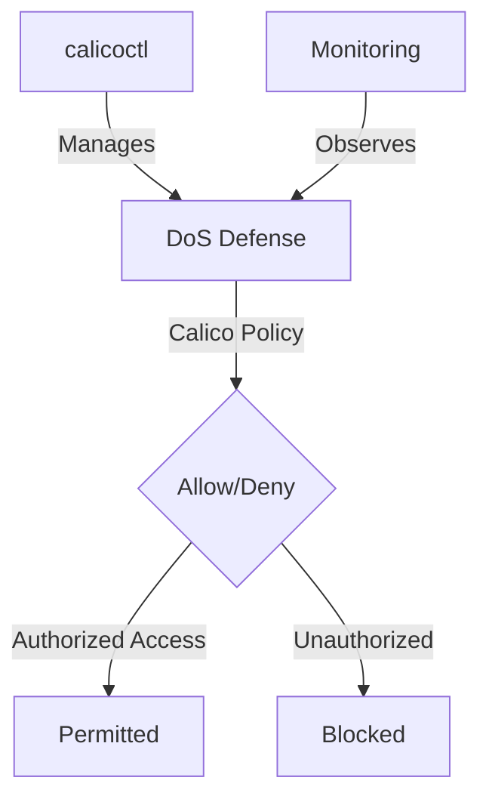

# Zero Trust DoS Defense with Calico Network Policies

Author: [nawazdhandala](https://github.com/nawazdhandala)

Tags: Calico, Kubernetes, Network Policy, DoS Defense, Security

Description: Zero Trust Calico network policies for DoS defense to protect cluster workloads from denial of service attacks.

---

## Introduction

DoS Defense with Calico Policies is an important security consideration for production Calico deployments. The `projectcalico.org/v3` API provides the tools needed to zero trust DoS Defense effectively, combining Calico's network policy with proper access controls and monitoring.

This guide covers zero trust DoS Defense in Calico with practical configurations and operational best practices.

## Prerequisites

- Kubernetes cluster with Calico v3.26+
- `calicoctl` and `kubectl` installed
- Understanding of Calico's monitoring and security architecture

## Core Configuration

```yaml
apiVersion: projectcalico.org/v3
kind: GlobalNetworkSet
metadata:
  name: dos-deny-list
  labels:
    dos-deny-list: 'true'
spec:
  nets:
    - 198.51.100.0/24  # Example deny-list source
    - 203.0.113.0/24
---
apiVersion: projectcalico.org/v3
kind: HostEndpoint
metadata:
  name: production-edge
  labels:
    apply-dos-mitigation: 'true'
spec:
  interfaceName: eth0
  node: worker-1
  expectedIPs: ['10.0.0.1']
---
apiVersion: projectcalico.org/v3
kind: GlobalNetworkPolicy
metadata:
  name: dos-deny-list
spec:
  order: 10
  selector: apply-dos-mitigation == 'true'
  doNotTrack: true
  applyOnForward: true
  ingress:
    - action: Deny
      source:
        selector: dos-deny-list == 'true'
  types:
    - Ingress
---
apiVersion: projectcalico.org/v3
kind: GlobalNetworkPolicy
metadata:
  name: allow-web-frontend
spec:
  order: 50
  selector: app == 'web-frontend'
  ingress:
    - action: Allow
      protocol: TCP
      source:
        nets:
          - 0.0.0.0/0
      destination:
        ports: [80, 443]
  types:
    - Ingress
```

## Implementation

```bash
# Apply DoS defense policies
calicoctl apply -f dos-defense.yaml

# Check that Felix is exposing Prometheus metrics
curl -s http://node-ip:9091/metrics | grep felix_active_local_policies

# Watch active policy metrics in real-time
watch -n1 'curl -s http://localhost:9091/metrics | grep felix_active_local_policies'
```

## QoS Rate Limiting (Calico workload controls)

```yaml
apiVersion: v1
kind: Pod
metadata:
  name: web-frontend
  labels:
    app: web-frontend
  annotations:
    qos.projectcalico.org/ingressPacketRate: "1000"
    qos.projectcalico.org/ingressPacketBurst: "2000"
spec:
  containers:
    - name: nginx
      image: nginx:1.27
      ports:
        - containerPort: 80
```

## Architecture



## Conclusion

Zero Trust DoS Defense in Calico requires a combination of proper policy configuration, regular monitoring, and proactive testing. Use the patterns in this guide as a foundation and adapt them to your specific security requirements. Always validate changes in staging before production and maintain comprehensive logging for security visibility.
