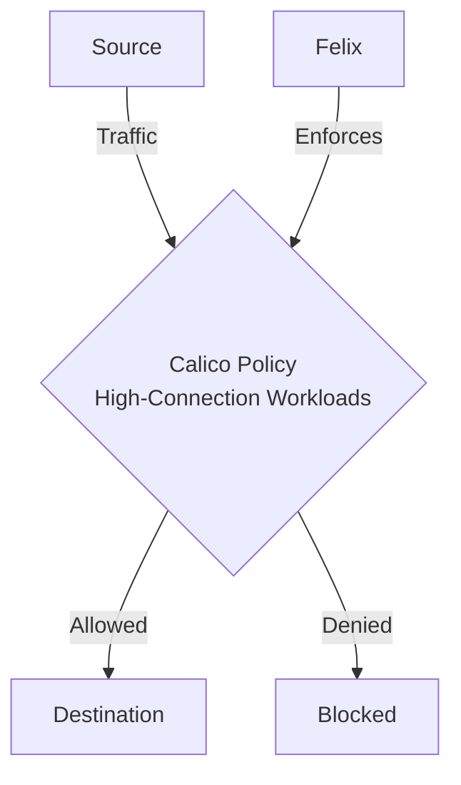

# Zero Trust Security for High-Connection Workloads with Calico

Author: [nawazdhandala](https://github.com/nawazdhandala)

Tags: Calico, Kubernetes, Network Policy, Performance, Security

Description: Zero Trust Calico network policies for high-connection workloads while maintaining performance and security.

---

## Introduction

Zero Trust Security for High-Connection Workloads with Calico requires careful policy design in Calico to balance security with performance and availability. The `projectcalico.org/v3` API provides the flexibility needed to handle high-connection workloads while maintaining strict access controls. For workloads that can exceed Linux conntrack capacity, Calico can apply untracked policy to selected host endpoint traffic.

This guide covers zero trust High-Connection Workloads in Calico with production-ready configurations.

## Prerequisites

- Kubernetes cluster with Calico v3.26+
- `calicoctl` and `kubectl` installed
- A host endpoint for the node interface that receives the high-connection traffic

## Core Configuration

```yaml
# Bypass conntrack for a high-connection service running on a host endpoint

apiVersion: projectcalico.org/v3
kind: HostEndpoint
metadata:
  name: high-throughput-node-eth0
  labels:
    app: high-throughput-service
spec:
  interfaceName: eth0
  node: high-throughput-node
  expectedIPs:
    - 10.0.0.10
---
apiVersion: projectcalico.org/v3
kind: GlobalNetworkPolicy
metadata:
  name: allow-high-connection-workload
spec:
  doNotTrack: true
  applyOnForward: true
  order: 100
  selector: app == 'high-throughput-service'
  ingress:
    - action: Allow
      protocol: TCP
      source:
        selector: tier == 'client'
      destination:
        ports: [9999]
  egress:
    - action: Allow
      protocol: TCP
      source:
        ports: [9999]
      destination:
        selector: tier == 'client'
  types:
    - Ingress
    - Egress
```

## Performance Tuning

```bash
# Enable Felix metrics for monitoring policy and dataplane behavior
kubectl patch felixconfiguration default --type=merge -p '{
  "spec": {
    "prometheusMetricsEnabled": true
  }
}'

# Monitor connection tracking table
kubectl exec -n kube-system <calico-node-pod> -c calico-node -- conntrack -S
```

## Architecture



## Conclusion

Zero Trust High-Connection Workloads in Calico requires balancing security controls with operational requirements. Use the patterns in this guide as a starting point, test thoroughly in staging, and monitor policy impact after deployment. Regular review of your policies ensures they remain appropriate as your workload requirements evolve.
