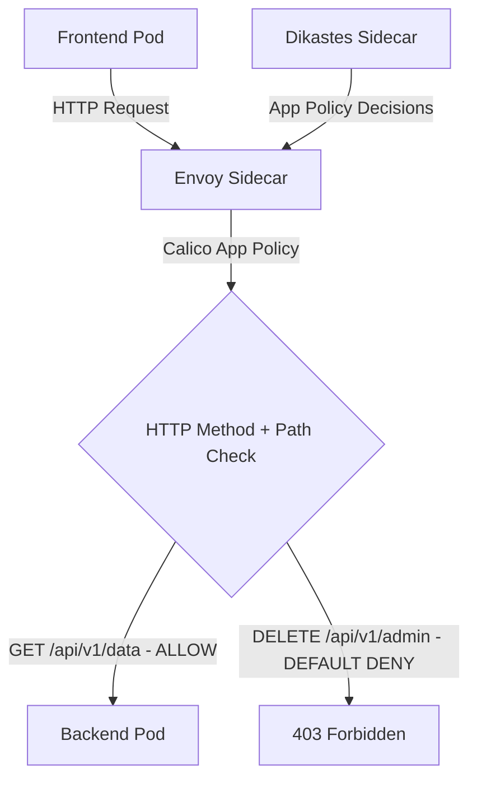

# Zero Trust HTTP Method Access Control with Calico and Istio

Author: [nawazdhandala](https://github.com/nawazdhandala)

Tags: Calico, Kubernetes, Network Policy, Istio, HTTP Methods, Security

Description: Zero Trust Calico HTTP method-based network policies using Istio to control access by HTTP verb (GET, POST, DELETE, etc.).

---

## Introduction

HTTP Method Policies with Calico and Istio combines Calico's network-layer enforcement with Istio's application-layer visibility. This powerful combination lets you write policies that reference HTTP attributes - methods and paths - in addition to network-level properties like IP addresses and ports.

Calico's `projectcalico.org/v3` NetworkPolicy and GlobalNetworkPolicy resources support HTTP match criteria when application layer policy is enabled with Istio integration. These rules are evaluated through Istio's Envoy sidecar proxies and the Calico Dikastes sidecar rather than only at the network layer. This enables fine-grained control like "allow GET requests to /api/health while other methods and paths are rejected by the default-deny posture."

This guide covers zero trust HTTP Method Policies using Calico and Istio together.

## Prerequisites

- Kubernetes cluster with Calico application layer policy enabled
- Kubernetes v1.29+ and Istio v1.22+ with Kubernetes native sidecar support
- Calico-Istio integration configured with the Dikastes injection template
- `kubectl` and `istioctl` installed
- Workloads with Istio sidecar injection enabled and the Dikastes template annotation configured

## Core Configuration

```yaml
apiVersion: projectcalico.org/v3
kind: NetworkPolicy
metadata:
  name: zero-trust-http-method-policies
  namespace: production
spec:
  order: 100
  selector: app == 'backend-api'
  ingress:
    - action: Allow
      source:
        selector: app == 'frontend'
      http:
        methods:
          - GET
          - POST
        paths:
          - exact: /api/v1/data
          - prefix: /api/v1/public
  types:
    - Ingress
```

Calico application layer policy supports HTTP match criteria on ingress allow rules. Requests from the frontend that do not match the allowed methods and paths are rejected by the default-deny behavior.

## Istio + Calico Setup

```bash
# Verify Calico-Istio integration

kubectl get configmap -n istio-system istio-sidecar-injector -o yaml | grep "dikastes:" -A 5
kubectl get pods -n calico-system -l k8s-app=csi-node-driver

# Enable sidecar injection for namespace
kubectl label namespace production istio-injection=enabled

# Verify a workload has the Envoy and Dikastes sidecars after it is redeployed
kubectl get pod -l app=backend-api -n production -o jsonpath='{.items[0].spec.containers[*].name}'
kubectl logs -n production -l app=backend-api -c dikastes
```

## Test Application-Layer Policy

```bash
# Test allowed method
kubectl exec -n production frontend-pod -- curl -X GET http://backend-api:8080/api/v1/data
echo "GET /api/v1/data (should pass): $?"

# Test denied method/path by default-deny
kubectl exec -n production frontend-pod -- curl -X DELETE http://backend-api:8080/api/v1/admin
echo "DELETE /api/v1/admin (should be denied): $?"
```

## Architecture



## Conclusion

HTTP Method Policies with Calico and Istio provide fine-grained network security in Kubernetes, combining network-layer enforcement with application-layer policy evaluation. By filtering on HTTP methods and paths, you can implement access controls that are impossible with pure network-layer policies. Ensure your Calico-Istio integration is properly configured and test both allowed and denied request patterns to verify your application-layer policies are working correctly.
