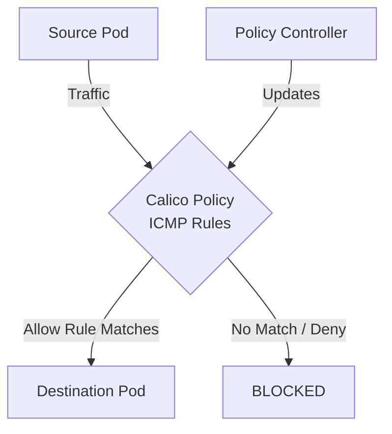

# Zero Trust with ICMP and Ping Rules in Calico

Author: [nawazdhandala](https://github.com/nawazdhandala)

Tags: Calico, Kubernetes, Network Policy, ICMP, Security, Network

Description: Implement zero trust security using ICMP and Ping Rules in Calico.

---

## Introduction

ICMP and Ping Rules in Calico provides fine-grained network security controls using the `projectcalico.org/v3` API. This guide covers how to zero trust ICMP Rules effectively.

Calico's extensible policy model supports ICMP Rules through its `GlobalNetworkPolicy` and `NetworkPolicy` resources, giving you cluster-wide and namespace-scoped control over traffic that matches your ICMP Rules criteria.

This guide provides practical techniques for zero trust ICMP Rules in your Kubernetes cluster, following security best practices and production-tested patterns.

## Prerequisites

- Kubernetes cluster with Calico v3.26+
- `calicoctl` and `kubectl` installed
- Basic understanding of Calico network policy concepts

## Step 1: Apply Default Deny First

```yaml
apiVersion: projectcalico.org/v3
kind: GlobalNetworkPolicy
metadata:
  name: zt-default-deny
spec:
  order: 1000
  selector: all()
  types:
    - Ingress
    - Egress
```

## Step 2: Define Zero Trust ICMP Rules Rules

```yaml
apiVersion: projectcalico.org/v3
kind: NetworkPolicy
metadata:
  name: zt-icmp-rules
  namespace: production
spec:
  order: 100
  selector: all()
  ingress:
    - action: Allow
      source:
        selector: trust == 'verified'
  egress:
    - action: Allow
      destination:
        ports: [53]
      protocol: UDP
  types:
    - Ingress
    - Egress
```

## Step 3: Verify No Implicit Trust

```bash
# Verify unauthorized access is blocked
kubectl exec -n production unauthorized-pod -- curl -s --max-time 5 http://protected-service:8080
echo "Should be DENIED: $?"
```

## Architecture



## Conclusion

Zero Trust ICMP Rules policies in Calico requires attention to policy ordering, selector accuracy, and bidirectional rule coverage. Follow the patterns in this guide to ensure your ICMP Rules policies are correctly configured, tested, and monitored. Always validate in staging before applying to production, and maintain comprehensive logging for visibility into policy decisions.
