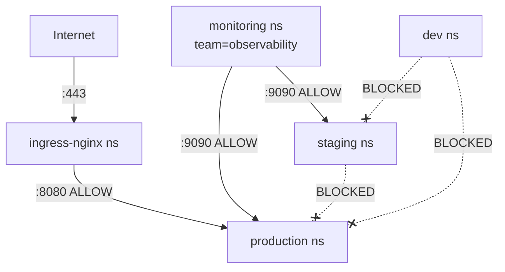

# Zero Trust Namespace Isolation with Calico Network Policies

Author: [nawazdhandala](https://github.com/nawazdhandala)

Tags: Calico, Kubernetes, Network Policy, Namespace, Zero Trust

Description: Implement zero trust namespace isolation using Calico network policies to ensure no cross-namespace traffic is permitted without explicit authorization.

---

## Introduction

Zero trust namespace isolation means that every namespace is isolated from every other namespace by default, and cross-namespace communication is only permitted where explicitly authorized and documented. This prevents namespace breaches from becoming cluster-wide incidents.

Calico's `namespaceSelector` in `projectcalico.org/v3` policies makes zero trust namespace isolation practical. By combining a global default deny with explicit allow rules for each required cross-namespace path, you create a communication map that is both enforced at the network level and self-documenting.

This guide shows you how to implement a complete zero trust namespace model in Calico, including how to handle common cross-namespace patterns like monitoring, ingress, and shared services.

## Prerequisites

- Kubernetes cluster with Calico v3.26+
- Namespaces labeled with appropriate metadata
- `calicoctl` and `kubectl` installed
- A documented cross-namespace communication map

## Step 1: Apply Zero Trust Default Deny

```yaml
apiVersion: projectcalico.org/v3
kind: GlobalNetworkPolicy
metadata:
  name: zt-namespace-default-deny
spec:
  order: 1000
  selector: all()
  types:
    - Ingress
    - Egress
```

## Step 2: Allow Only Required System Traffic

```yaml
apiVersion: projectcalico.org/v3
kind: GlobalNetworkPolicy
metadata:
  name: zt-allow-dns-and-kubelet
spec:
  order: 10
  selector: all()
  egress:
    - action: Allow
      protocol: UDP
      destination:
        ports: [53]
    - action: Allow
      protocol: TCP
      destination:
        ports: [53]
  ingress:
    - action: Allow
      source:
        nets: ["10.0.0.0/8"]
      destination:
        ports: [10250]
  types:
    - Ingress
    - Egress
```

## Step 3: Explicit Cross-Namespace Allow Rules

```yaml
# Allow monitoring to scrape all namespaces
apiVersion: projectcalico.org/v3
kind: GlobalNetworkPolicy
metadata:
  name: zt-allow-monitoring
spec:
  order: 200
  selector: all()
  ingress:
    - action: Allow
      source:
        namespaceSelector: team == 'observability'
      destination:
        ports: [9090, 9091, 8080]
  types:
    - Ingress
---
# Allow ingress controller to reach app namespaces
apiVersion: projectcalico.org/v3
kind: GlobalNetworkPolicy
metadata:
  name: zt-allow-ingress-controller
spec:
  order: 200
  selector: all()
  ingress:
    - action: Allow
      source:
        namespaceSelector: kubernetes.io/metadata.name == 'ingress-nginx'
      destination:
        ports: [8080, 8443]
  types:
    - Ingress
```

## Step 4: Verify Isolation

```bash
# From staging, try to reach production
kubectl exec -n staging test-pod -- curl -s --max-time 5 http://production-service.production.svc.cluster.local
# Should timeout - zero trust isolation working
```

## Zero Trust Namespace Map



## Conclusion

Zero trust namespace isolation with Calico gives you the assurance that namespace breaches cannot spread to other namespaces without explicit authorization. By combining global default deny with precisely scoped allow rules for monitoring, ingress, and shared services, you achieve complete namespace-level micro-segmentation. Document your cross-namespace allow rules in version control so the policy code becomes the canonical reference for your cluster's communication architecture.
