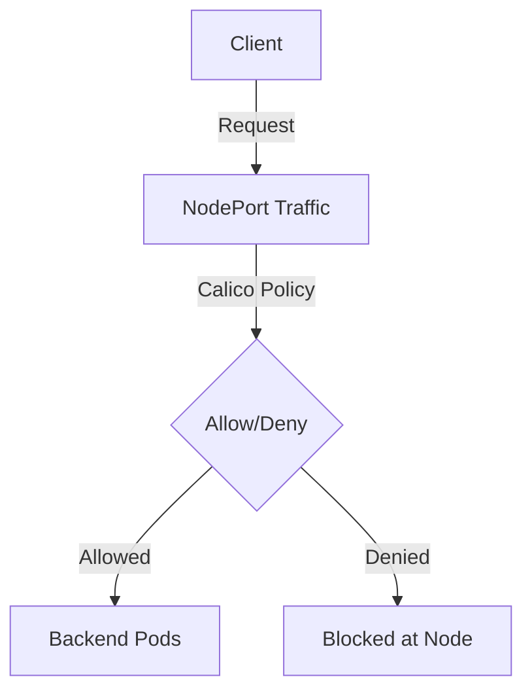

# Zero Trust NodePort Traffic Control with Calico Policies

Author: [nawazdhandala](https://github.com/nawazdhandala)

Tags: Calico, Kubernetes, Network Policy, NodePort, Security

Description: Zero Trust Calico NodePort traffic policies to secure Kubernetes NodePort service access.

---

## Introduction

Pre-DNAT GlobalNetworkPolicy in Calico gives you control over how traffic flows through Kubernetes NodePort service networking. The `projectcalico.org/v3` API provides the tools needed to secure NodePort traffic effectively while maintaining service availability.

Proper NodePort traffic policy configuration is essential for clusters that expose services to external traffic. Without it, any source with network reachability to your nodes can reach exposed NodePort services, creating significant attack surface.

This guide covers zero trust NodePort traffic policies in Calico with practical, production-tested configurations.

## Prerequisites

- Kubernetes cluster with Calico v3.26+
- `calicoctl` and `kubectl` installed
- Calico host endpoints created for Kubernetes nodes, or automatic host endpoints enabled
- Understanding of Kubernetes service networking

## Core Configuration

```yaml
apiVersion: projectcalico.org/v3
kind: GlobalNetworkPolicy
metadata:
  name: secure-nodeport-traffic
spec:
  order: 100
  preDNAT: true
  applyOnForward: true
  selector: has(kubernetes.io/hostname)
  ingress:
    - action: Allow
      protocol: TCP
      source:
        nets:
          - 10.0.0.0/8
          - 172.16.0.0/12
      destination:
        ports: ["30000:32767"]
    - action: Allow
      protocol: UDP
      source:
        nets:
          - 10.0.0.0/8
          - 172.16.0.0/12
      destination:
        ports: ["30000:32767"]
    - action: Deny
      protocol: TCP
      destination:
        ports: ["30000:32767"]
    - action: Deny
      protocol: UDP
      destination:
        ports: ["30000:32767"]
  types:
    - Ingress
```


## Verification

```bash
# Apply the policy

calicoctl apply -f zero-trust-nodeport-traffic.yaml

# Verify NodePort traffic behavior from a host in an allowed CIDR
NODE_IP=$(kubectl get nodes -o jsonpath='{.items[0].status.addresses[?(@.type=="InternalIP")].address}')
NODE_PORT=$(kubectl get svc -n test service-name -o jsonpath='{.spec.ports[0].nodePort}')
curl -s --max-time 5 "http://${NODE_IP}:${NODE_PORT}"
echo "Result: $?"
```

## Architecture



## Conclusion

Pre-DNAT policies in Calico provide essential security controls for Kubernetes NodePort service traffic. Configure them carefully, test bidirectional traffic flows, and use staged policies to preview impact before enforcement. Regular monitoring of denial rates helps you detect misconfigurations and unauthorized access attempts before they impact service availability.
