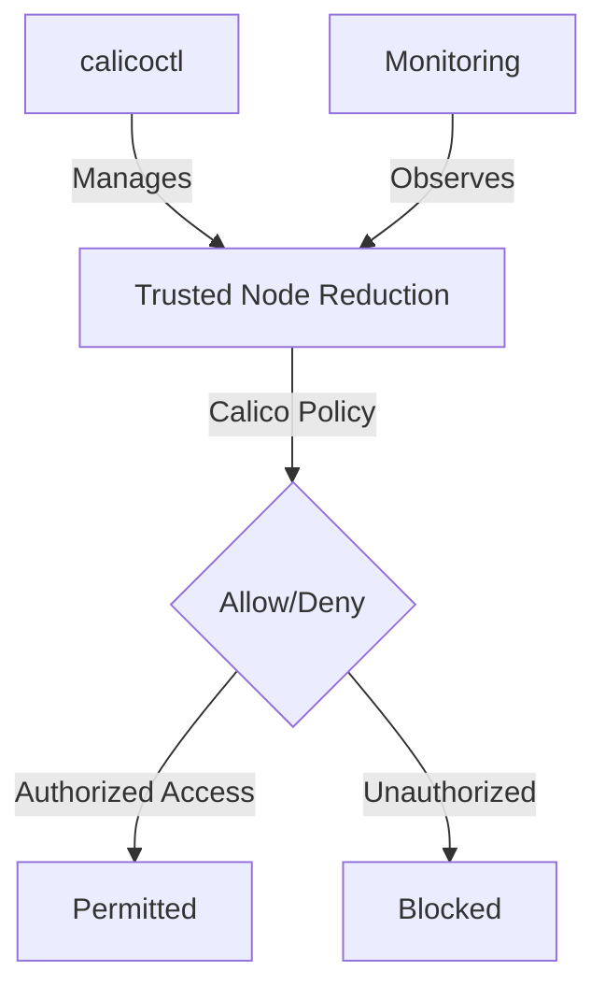

# Zero Trust Node Policies with Calico for Reducing Trusted Nodes

Author: [nawazdhandala](https://github.com/nawazdhandala)

Tags: Calico, Kubernetes, Network Policy, Node Security, Zero Trust

Description: Zero Trust Calico policies for reducing the number of trusted nodes to minimize attack surface.

---

## Introduction

Reducing Trusted Nodes with Calico is an important security consideration for production Calico deployments. The `projectcalico.org/v3` API provides the tools needed to zero trust Trusted Node Reduction effectively, combining Calico's network policy with proper access controls and monitoring.

This guide covers zero trust Trusted Node Reduction in Calico with practical configurations and operational best practices.

## Prerequisites

- Kubernetes cluster with Calico v3.26+
- `calicoctl` and `kubectl` installed
- Understanding of Calico's monitoring and security architecture

## Core Configuration

```yaml
# Restrict cross-node trust - only allow specific node-to-node traffic
apiVersion: projectcalico.org/v3
kind: GlobalNetworkPolicy
metadata:
  name: reduce-trusted-nodes
spec:
  order: 100
  selector: has(kubernetes.io/hostname)
  ingress:
    - action: Allow
      source:
        selector: kubernetes.io/hostname == 'trusted-node-01'
      destination:
        ports: [2380, 2379]  # etcd
    - action: Allow
      source:
        nets:
          - 10.0.0.0/24  # Management subnet only
      destination:
        ports: [22, 6443]  # SSH and k8s API
    - action: Deny
      destination:
        ports: [22, 2379, 2380, 6443]
  types:
    - Ingress
```

## Implementation

```bash
# Apply trusted node policy
calicoctl apply -f reduce-trusted-nodes.yaml

# Test that restricted ports are blocked from untrusted IPs
# From an untrusted node:
nc -zv node-ip 2379
echo "etcd access from untrusted node (should fail): $?"

# From a trusted node:
nc -zv node-ip 2379
echo "etcd access from trusted node (should work): $?"
```

## Architecture



## Conclusion

Zero Trust Trusted Node Reduction in Calico requires a combination of proper policy configuration, regular monitoring, and proactive testing. Use the patterns in this guide as a foundation and adapt them to your specific security requirements. Always validate changes in staging before production and maintain comprehensive logging for security visibility.
