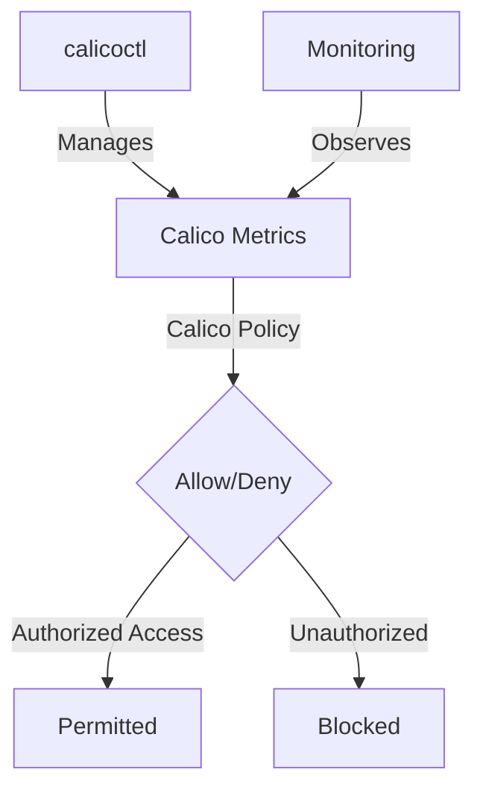

# Zero Trust Security for Calico Metrics Endpoints

Author: [nawazdhandala](https://github.com/nawazdhandala)

Tags: Calico, Kubernetes, Metric, Security, Prometheus

Description: Zero Trust security for Calico metrics endpoints to restrict access to authorized monitoring systems only.

---

## Introduction

Securing Calico Metrics Endpoints is an important security consideration for production Calico deployments. The `projectcalico.org/v3` API provides the tools needed to zero trust Calico Metrics effectively, combining Calico's network policy with proper access controls and monitoring.

This guide covers zero trust Calico Metrics in Calico with practical configurations and operational best practices.

## Prerequisites

- Kubernetes cluster with Calico v3.26+
- `calicoctl` and `kubectl` installed
- Understanding of Calico's monitoring and security architecture

## Core Configuration

```yaml
# Create one HostEndpoint per node/interface that exposes Felix metrics.
apiVersion: projectcalico.org/v3
kind: HostEndpoint
metadata:
  name: worker-1-metrics
  labels:
    metrics: calico-felix
spec:
  node: worker-1
  interfaceName: eth0
  expectedIPs:
    - 10.0.0.10
  profiles:
    - projectcalico-default-allow
---
# Restrict access to Calico Felix metrics (port 9091)

apiVersion: projectcalico.org/v3
kind: GlobalNetworkPolicy
metadata:
  name: secure-calico-metrics
spec:
  order: 100
  selector: metrics == 'calico-felix'
  ingress:
    - action: Allow
      protocol: TCP
      source:
        namespaceSelector: projectcalico.org/name == 'monitoring'
        selector: app == 'prometheus'
      destination:
        ports: [9091]
    - action: Deny
      protocol: TCP
      destination:
        ports: [9091]
  types:
    - Ingress
```

## Implementation Steps

```bash
# Apply metrics security policy
calicoctl apply -f secure-calico-metrics.yaml

# Verify only authorized access works
kubectl exec -n monitoring deploy/prometheus-server -- \
  sh -c 'curl -fsS http://<node-ip>:9091/metrics | head -5'
echo "Prometheus access (should work): $?"

# Verify unauthorized access is blocked
if kubectl exec -n default test-pod -- \
  curl -fsS --max-time 5 http://<node-ip>:9091/metrics; then
  echo "Unauthorized access unexpectedly succeeded"
else
  echo "Unauthorized access blocked"
fi
```

## Verify Metrics Security

```bash
# Check that the host endpoint is present
calicoctl get hostendpoints -o wide

# Check active global policy for metrics host endpoints
calicoctl get globalnetworkpolicies | grep secure-calico-metrics
```

## Architecture



## Conclusion

Zero Trust Calico Metrics in Calico requires a combination of proper policy configuration, regular monitoring, and proactive testing. Use the patterns in this guide as a foundation and adapt them to your specific security requirements. Always validate changes in staging before production and maintain comprehensive logging for security visibility.
