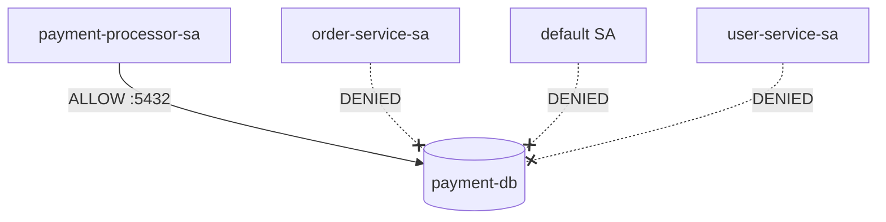

# Zero Trust Identity with Calico Service Account Network Policies

Author: [nawazdhandala](https://github.com/nawazdhandala)

Tags: Calico, Kubernetes, Network Policy, Service Account, Zero Trust

Description: Implement zero trust workload identity using Calico service account-based network policies for cryptographically-verified traffic controls.

---

## Introduction

Service accounts are Kubernetes' built-in workload identity system. Using them as the basis for network policy creates a zero-trust model where network access is granted based on RBAC-controlled identity rather than mutable metadata. An attacker who compromises a pod cannot gain additional network access by modifying labels — they would need to change the pod's service account, which requires RBAC privileges.

Calico's `serviceAccountSelector` in `projectcalico.org/v3` ties network policy enforcement directly to the Kubernetes identity plane. When combined with Istio or SPIFFE/SPIRE for cryptographic service account verification, you get true zero-trust identity for network traffic.

## Prerequisites

- Kubernetes cluster with Calico v3.26+
- RBAC properly configured for service accounts
- `calicoctl` and `kubectl` installed
- Default service account permissions restricted

## Step 1: Restrict the Default Service Account

```yaml
# Prevent pods from using the default service account for network access
apiVersion: projectcalico.org/v3
kind: GlobalNetworkPolicy
metadata:
  name: zt-restrict-default-sa
spec:
  order: 500
  serviceAccountSelector: name == 'default'
  egress:
    - action: Allow
      destination:
        ports: [53]
      protocol: UDP
    - action: Deny
  types:
    - Egress
```

## Step 2: Create Least-Privilege Service Accounts

```bash
# Create dedicated SA for each workload
kubectl create serviceaccount payment-processor-sa -n production
kubectl create serviceaccount order-service-sa -n production
kubectl create serviceaccount user-service-sa -n production

# Apply RBAC annotations for documentation
kubectl annotate serviceaccount payment-processor-sa -n production \
  description="Payment processing workload - can access payment-db only"
```

## Step 3: Apply Zero Trust SA-Based Policies

```yaml
apiVersion: projectcalico.org/v3
kind: NetworkPolicy
metadata:
  name: zt-payment-db-access
  namespace: production
spec:
  order: 100
  serviceAccountSelector: name == 'payment-db-sa'
  ingress:
    - action: Allow
      source:
        serviceAccountSelector: name == 'payment-processor-sa'
      destination:
        ports: [5432]
    - action: Deny
  types:
    - Ingress
```

## Step 4: Verify Zero Trust Enforcement

```bash
# Try to access payment DB from order-service (should be denied)
ORDER_POD=$(kubectl get pod -n production -l app=order-service -o jsonpath='{.items[0].metadata.name}')
DB_IP=$(kubectl get pod -n production -l app=payment-db -o jsonpath='{.items[0].status.podIP}')

kubectl exec -n production $ORDER_POD -- nc -zv $DB_IP 5432
echo "Should be DENIED: $?"
```

## Zero Trust Identity Model



## Conclusion

Service account-based zero trust policies in Calico create a network access model that is directly tied to Kubernetes RBAC identity. Unlike label-based policies, service account policies cannot be bypassed by modifying pod labels. For maximum security, restrict the default service account, create dedicated service accounts for each workload, and use `serviceAccountSelector` as the primary identity mechanism in your most sensitive network policies.
