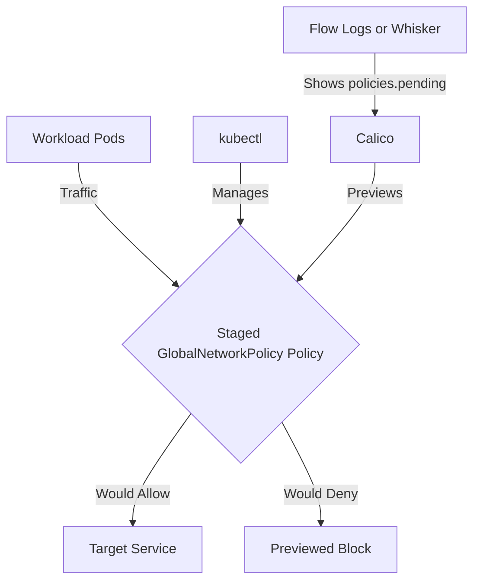

# Zero Trust with Staged GlobalNetworkPolicy in Calico

Author: [nawazdhandala](https://github.com/nawazdhandala)

Tags: Calico, Kubernetes, Network Policy, Staged Policies, Global Policy

Description: Implement zero trust security using Staged GlobalNetworkPolicy in Calico.

---

## Introduction

Staged GlobalNetworkPolicy is an advanced Calico feature that previews fine-grained network security controls using the `projectcalico.org/v3` API. This guide covers how to stage zero trust GlobalNetworkPolicy effectively in your Kubernetes cluster.

Calico's `projectcalico.org/v3` API provides rich support for Staged GlobalNetworkPolicy through its `StagedGlobalNetworkPolicy`, `GlobalNetworkPolicy`, and related resources. Proper configuration of Staged GlobalNetworkPolicy is essential for previewing a secure, well-controlled network fabric before enforcement.

This guide provides production-tested patterns for zero trust Staged GlobalNetworkPolicy, including YAML examples, CLI commands, and troubleshooting techniques.

## Prerequisites

- Kubernetes cluster with Calico StagedGlobalNetworkPolicy CRDs installed
- `kubectl` installed
- Basic understanding of Calico network policy concepts
- Calico flow logs or Whisker enabled if you want to preview staged policy impact from observed traffic

## Core Configuration

The following YAML demonstrates the key pattern for Staged GlobalNetworkPolicy:

```yaml
apiVersion: projectcalico.org/v3
kind: StagedGlobalNetworkPolicy
metadata:
  name: zero-trust-staged-globalnetworkpolicy
spec:
  order: 100
  namespaceSelector: projectcalico.org/name == 'production'
  selector: all()
  ingress:
    - action: Allow
      source:
        selector: app == 'authorized-source'
      destination:
        ports: [8080, 443]
  egress:
    - action: Allow
      protocol: UDP
      destination:
        ports: [53]
    - action: Allow
      destination:
        selector: app == 'authorized-destination'
  types:
    - Ingress
    - Egress
```

## Implementation Steps

```bash
# 1. Apply the policy

kubectl apply -f zero-trust-staged-globalnetworkpolicy.yaml

# 2. Verify it's staged
kubectl get stagedglobalnetworkpolicy zero-trust-staged-globalnetworkpolicy -o yaml

# 3. Generate sample traffic. Staged policies preview impact but do not enforce traffic.
kubectl exec -n production test-pod -- curl -s --max-time 5 http://target:8080
echo "Exit code: $?"

# 4. Preview policy impact in Calico flow logs or Whisker, if enabled
# Check the policies.pending field to see what the staged policy would do.
```

## Operational Commands

```bash
# List all relevant policies
kubectl get stagedglobalnetworkpolicies.projectcalico.org
kubectl get globalnetworkpolicies.projectcalico.org

# View policy details
kubectl get stagedglobalnetworkpolicy zero-trust-staged-globalnetworkpolicy -o yaml

# Delete a policy if needed
kubectl delete stagedglobalnetworkpolicy zero-trust-staged-globalnetworkpolicy
```

## Architecture



## Common Issues

1. **Policy not applying**: Verify API version is `projectcalico.org/v3` and run `kubectl apply --dry-run=server -f zero-trust-staged-globalnetworkpolicy.yaml` first
2. **Selector not matching**: Use `kubectl get pods -l your-selector` to verify label matches
3. **Order conflicts**: Run `kubectl get stagedglobalnetworkpolicies.projectcalico.org -o yaml` and compare the order and tier fields
4. **DNS failures**: Always ensure egress to port 53 is allowed when restricting egress

## Conclusion

Zero Trust Staged GlobalNetworkPolicy in Calico requires careful attention to policy ordering, selector syntax, and bidirectional traffic rules. Use the patterns in this guide as a starting point, adapt them to your specific requirements, and always validate staged policy impact before creating an equivalent enforcing GlobalNetworkPolicy in production. Consistent logging and monitoring will help you detect and resolve issues quickly when they occur.
