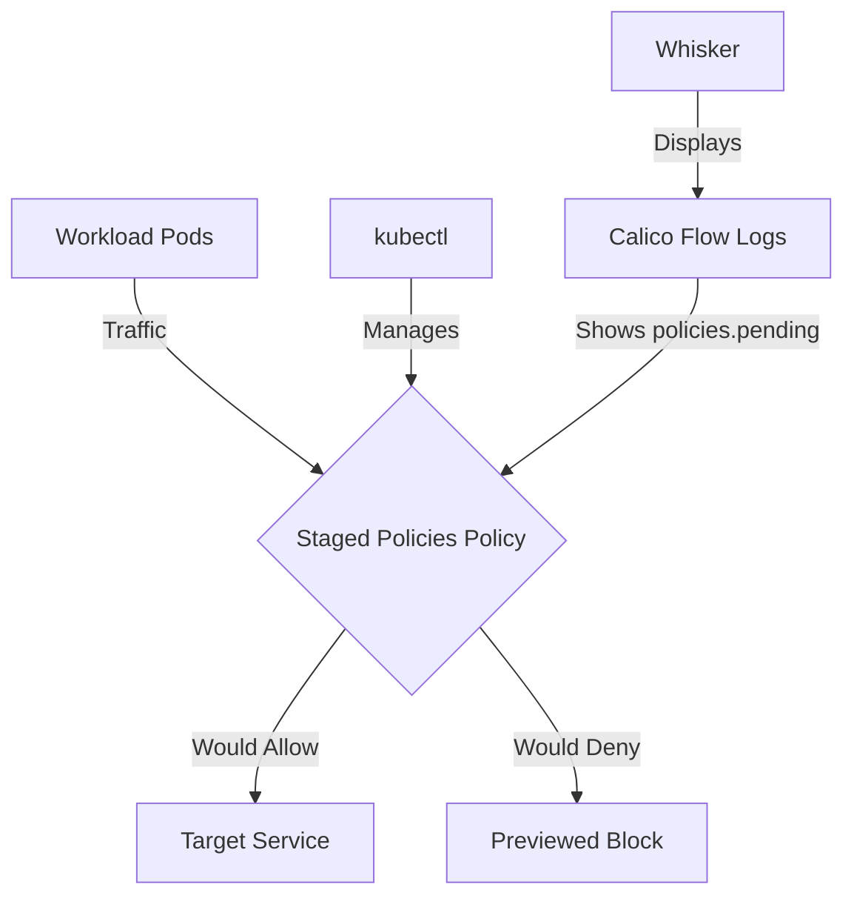

# Zero Trust with Staged Network Policies in Calico

Author: [nawazdhandala](https://github.com/nawazdhandala)

Tags: Calico, Kubernetes, Network Policy, Staged Policies, Security

Description: Implement zero trust security using Staged Network Policies in Calico.

---

## Introduction

Staged Network Policies is an advanced Calico feature that previews fine-grained network security controls using the `projectcalico.org/v3` API without changing actual traffic flow. This guide covers how to validate zero trust Staged Policies effectively in your Kubernetes cluster.

Calico's `projectcalico.org/v3` API provides rich support for Staged Policies through its `StagedGlobalNetworkPolicy`, `StagedNetworkPolicy`, `StagedKubernetesNetworkPolicy`, and related resources. Proper configuration of Staged Policies is essential for validating a secure, well-controlled network fabric before enforcement.

This guide provides production-tested patterns for zero trust Staged Policies, including YAML examples, CLI commands, and troubleshooting techniques.

## Prerequisites

- Kubernetes cluster with Calico staged policy CRDs installed
- `kubectl` installed
- Basic understanding of Calico network policy concepts
- Flow logs enabled when you want to preview staged policy impact on existing traffic

## Core Configuration

The following YAML demonstrates the key pattern for Staged Policies:

```yaml
apiVersion: projectcalico.org/v3
kind: StagedNetworkPolicy
metadata:
  name: zero-trust-staged-policies
  namespace: production
spec:
  order: 100
  selector: all()
  ingress:
    - action: Allow
      source:
        selector: app == 'authorized-source'
      destination:
        ports: [8080, 443]
  egress:
    - action: Allow
      protocol: UDP
      destination:
        ports: [53]
    - action: Allow
      destination:
        selector: app == 'authorized-destination'
  types:
    - Ingress
    - Egress
```

## Implementation Steps

```bash
# 1. Apply the staged policy

kubectl apply -f zero-trust-staged-policies.yaml

# 2. Verify it's staged
kubectl get stagednetworkpolicy.p -n production -o wide

# 3. Test connectivity. Staged policies do not enforce traffic.
kubectl exec -n production test-pod -- curl -s --max-time 5 http://target:8080
echo "Exit code: $?"

# 4. Preview the staged impact in Calico flow logs
# Check the policies.pending field in the Calico Whisker web console.
```

## Operational Commands

```bash
# List all relevant policies
kubectl get stagednetworkpolicy.p --all-namespaces
kubectl get stagedglobalnetworkpolicy.p

# View policy details
kubectl get stagednetworkpolicy.p zero-trust-staged-policies -n production -o yaml

# Delete a policy if needed
kubectl delete stagednetworkpolicy.p zero-trust-staged-policies -n production
```

## Architecture



## Common Issues

1. **Policy not applying**: Verify API version is `projectcalico.org/v3`, kind is `StagedNetworkPolicy`, and run `kubectl apply --dry-run=server -f zero-trust-staged-policies.yaml` first
2. **Selector not matching**: Use `kubectl get pods -l your-selector` to verify label matches
3. **Order conflicts**: Run `kubectl get stagedglobalnetworkpolicy.p -o wide` and sort by order field
4. **DNS failures**: Always ensure egress to port 53 is allowed when restricting egress

## Conclusion

Zero Trust Staged Policies in Calico requires careful attention to policy ordering, selector syntax, and bidirectional traffic rules. Use the patterns in this guide as a starting point, adapt them to your specific requirements, and always validate staged changes before creating the equivalent enforcing `NetworkPolicy` or `GlobalNetworkPolicy` in production. Consistent flow-log review and monitoring will help you detect and resolve issues quickly when they occur.
