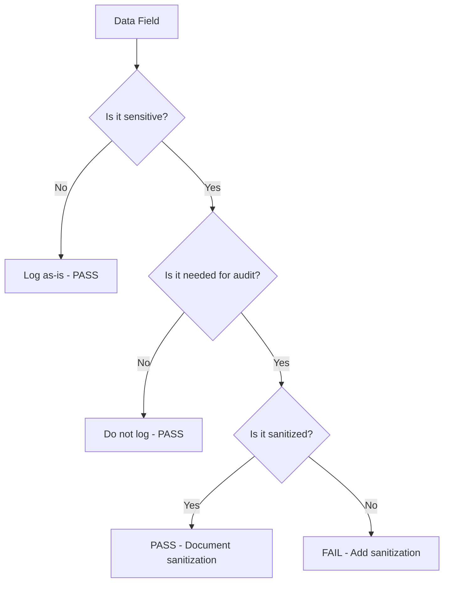

# Auditing Access Logging in Cilium Network Security

Author: [nawazdhandala](https://github.com/nawazdhandala)

Tags: Cilium, Network Security, Audit, Access Logging, Compliance

Description: A structured security audit of access logging implementation in Cilium L7 parsers, examining log completeness, sensitive data handling, tamper resistance, and compliance with organizational logging policies.

---

## Introduction

Access logging is both a security control and a potential liability. As a control, it provides the audit trail needed for incident response and compliance. As a liability, it can expose sensitive data, consume excessive resources, or create false confidence when logs are incomplete. A thorough audit evaluates both aspects.

This audit framework examines the access logging implementation in a Cilium L7 parser across five dimensions: completeness, data sensitivity, performance impact, integrity, and compliance alignment. Each dimension has specific audit checks with pass/fail criteria.

## Prerequisites

- Parser source code with logging implementation
- Organizational logging and compliance policies
- Go security analysis tools
- Access to log output (Hubble, Cilium monitor)
- Understanding of relevant regulations (GDPR, PCI-DSS, SOC 2, etc.)

## Audit Phase 1: Log Completeness

Verify that every policy decision generates a log entry:

```bash
# Map all OnData return paths to logging calls
grep -n "return proxylib\." proxylib/myprotocol/*.go | grep -v test

# For each return path, check if logAccess is called above it
grep -B10 "return proxylib\.DROP\|return proxylib\.PASS" proxylib/myprotocol/*.go | grep "logAccess\|Log("
```

Create a completeness matrix:

| Return Path | Line | Verdict | Log Call Present | Audit Verdict |
|------------|------|---------|------------------|---------------|
| PASS (policy allowed) | 85 | Forwarded | Yes | PASS |
| DROP (policy denied) | 92 | Denied | ? | |
| DROP (malformed input) | 67 | Error | ? | |
| DROP (error state) | 48 | Error | ? | |
| MORE (need data) | 55 | N/A | N/A | N/A |

```go
// AUDIT FINDING: FAIL — denied requests not logged
if !p.matchesPolicy(command) {
    return proxylib.DROP, 0  // No log entry for denied request
}

// REQUIRED FIX:
if !p.matchesPolicy(command) {
    p.logAccess(reply, command, requestID, accesslog.VerdictDenied)
    return proxylib.DROP, 0
}
```

## Audit Phase 2: Sensitive Data Handling

Review all data that flows into log entries:

```bash
# Find all fields added to log entries
grep -A 30 "LogRecord{" proxylib/myprotocol/*.go | grep -v test

# Find all L7 field assignments
grep "L7\[" proxylib/myprotocol/*.go | grep -v test

# Check for sanitization calls
grep "sanitize\|redact\|filter" proxylib/myprotocol/*.go | grep -v test
```

Sensitive data audit checklist:

| Data Category | Logged? | Sanitized? | Justification | Verdict |
|---------------|---------|------------|---------------|---------|
| Command type | Yes | N/A (enum) | Protocol metadata | PASS |
| Request ID | Yes | N/A (numeric) | Correlation | PASS |
| Request body/payload | ? | ? | | REVIEW |
| Authentication tokens | ? | ? | | CRITICAL |
| User identifiers | ? | ? | | REVIEW |
| Source/dest IPs | Yes | N/A | Network metadata | PASS |



## Audit Phase 3: Performance Impact

Assess logging overhead:

```bash
# Benchmark with and without logging
go test ./proxylib/myprotocol/... -bench=BenchmarkOnData -benchmem

# Check for synchronous I/O in the logging path
grep -n "os\.\|file\.\|Write\|Flush" proxylib/myprotocol/*.go | grep -v test | grep -v "import"
```

Performance audit checks:

| Check | Requirement | Verdict |
|-------|-------------|---------|
| No synchronous file I/O in hot path | Logging must not block parsing | |
| Log entry allocation bounded | No unbounded string concatenation | |
| Buffered/async delivery | Log calls return immediately | |
| Graceful degradation under pressure | Drops logs rather than blocking | |

## Audit Phase 4: Log Integrity

Check that logs cannot be tampered with or silently lost:

```bash
# Check for error handling on log writes
grep -A 3 "accesslog\.Log\|\.Log(" proxylib/myprotocol/*.go | grep "err\|error" | grep -v test
```

Integrity checks:

```go
// AUDIT: Are log delivery errors handled?
accesslog.Log(entry)  // Is the return value checked?

// AUDIT: Can log buffer overflow cause silent data loss?
// Check the buffer size and overflow handling

// AUDIT: Are log entries immutable after creation?
// Check that the entry is not modified after being sent to the log pipeline
```

## Audit Phase 5: Compliance Alignment

Verify logging meets organizational and regulatory requirements:

| Requirement | Source | Met? | Notes |
|-------------|--------|------|-------|
| Log all access denials | SOC 2 | | |
| Include timestamp in UTC | Internal policy | | |
| Retain logs for 90 days | Compliance | N/A (storage config) | |
| No PII in logs | GDPR | | |
| Log source identity | Internal policy | | |
| Include request correlation ID | Internal policy | | |

## Verification

Generate audit evidence:

```bash
# Run all logging tests
go test ./proxylib/myprotocol/... -v -run "TestLog\|TestAccess" -race

# Coverage of logging code paths
go test ./proxylib/myprotocol/... -coverprofile=log-audit.out
go tool cover -func=log-audit.out | grep -i "log"

# Static analysis
gosec ./proxylib/myprotocol/...
```

## Troubleshooting

**Problem: Audit finds logging gaps in error handling paths**
Add log entries to all error handling paths. Even if the message is unparseable, log the fact that an unparseable message was received along with available metadata.

**Problem: Sensitive data appears in L7 fields**
Ensure the `sanitizeForLogging` function is called on all user-controlled data before adding it to the L7 map. Add a pre-commit test that scans for unsanitized log field assignments.

**Problem: Cannot determine log delivery guarantees**
Review the accesslog package source code. If delivery is best-effort, document this limitation and implement additional logging through Cilium's standard logging for critical events.

**Problem: Compliance requirements conflict with performance needs**
Log all events but implement sampling for metrics. Ensure 100% logging of denied requests (security-critical) and sample allowed requests at a rate that meets performance targets.

## Conclusion

Auditing access logging in Cilium L7 parsers evaluates whether the logging implementation fulfills its dual purpose as a security control and compliance mechanism without becoming a liability through sensitive data exposure or performance degradation. The five-phase audit — completeness, sensitivity, performance, integrity, and compliance — provides comprehensive coverage of logging risks. Address all findings by severity before considering the parser production-ready.
