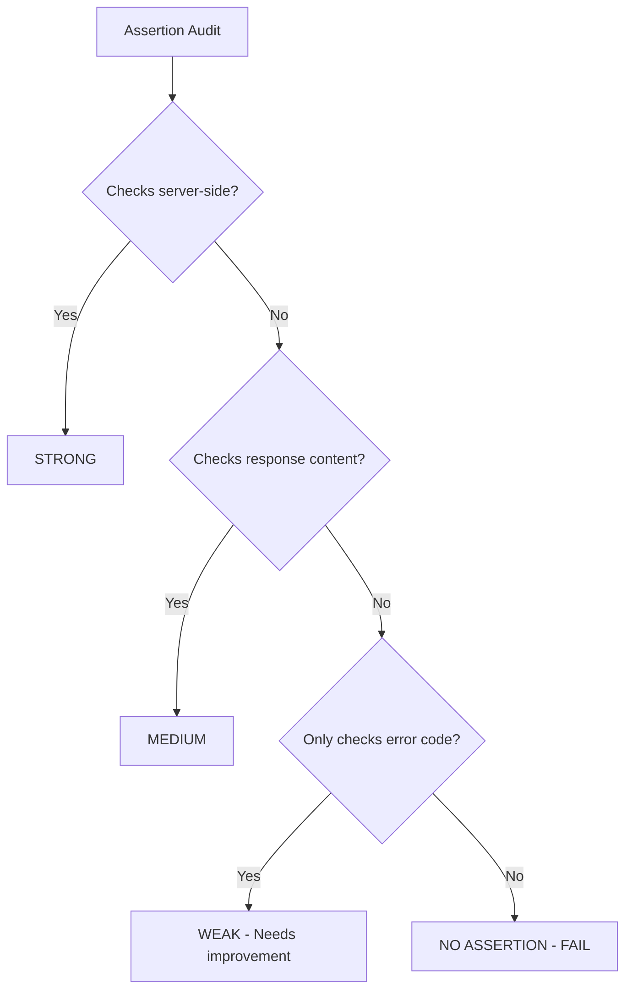

# Auditing Runtime Tests for Cilium Network Security

Author: [nawazdhandala](https://github.com/nawazdhandala)

Tags: Cilium, Network Security, Audit, Runtime Tests, Quality Assurance

Description: A structured audit framework for evaluating the effectiveness, security coverage, and reliability of runtime integration tests for Cilium L7 parsers in Kubernetes environments.

---

## Introduction

Runtime tests represent the final automated validation before a Cilium L7 parser reaches production. Auditing these tests ensures they exercise the complete security stack and provide reliable pass/fail signals. An audit of runtime tests differs from auditing unit tests because it must also evaluate infrastructure dependencies, timing assumptions, and cluster-level security properties.

This guide provides a comprehensive audit framework for runtime test suites associated with Cilium L7 parsers.

## Prerequisites

- Access to the runtime test source code
- Test execution history (CI/CD logs)
- Understanding of the test infrastructure (Kind, GKE, etc.)
- Cilium configuration used during tests
- Knowledge of the parser's security requirements

## Audit Area 1: Test Scope

Verify the test suite covers all integration points:

```bash
# List all runtime test functions
grep -n "func test\|func Test" proxylib/myprotocol/*_runtime_test.go

# Map to integration points
echo "=== Integration Point Coverage ==="
echo "1. BPF proxy redirect: ___"
echo "2. Envoy L7 filter: ___"
echo "3. Policy engine: ___"
echo "4. Access logging pipeline: ___"
echo "5. Hubble flow export: ___"
echo "6. Error response injection: ___"
echo "7. Policy update handling: ___"
echo "8. Connection lifecycle: ___"
```

| Integration Point | Test Function | Assertions | Audit Verdict |
|-------------------|---------------|------------|---------------|
| BPF proxy redirect | testAllowedTraffic | Checks traffic flows | |
| Policy enforcement | testDeniedTraffic | Checks server logs | |
| Error injection | testErrorInjection | Checks client error | |
| Access logging | testAccessLogging | Checks Hubble flows | |
| Policy updates | testPolicyUpdate | Checks enforcement change | |

## Audit Area 2: Assertion Strength

Evaluate whether assertions catch real security issues:

```go
// AUDIT: Rate each assertion
// Strong: Verifies server-side behavior (server never received denied request)
// Medium: Verifies client-side behavior (client got error response)
// Weak: Only checks return code (err != nil)

// Example audit annotations:
// Line 45: "if err != nil" — WEAK assertion (any error matches)
// Line 52: "if containsSuccess(output)" — MEDIUM assertion
// Line 60: "if containsDeleteRequest(serverLogs)" — STRONG assertion
// Line 68: "if containsMyProtocolDenial(flows)" — STRONG assertion
```



## Audit Area 3: Timing Robustness

Check for timing-dependent test patterns:

```bash
# Find all sleep calls
grep -n "time\.Sleep\|Sleep(" proxylib/myprotocol/*_runtime_test.go

# Find all timeout values
grep -n "Timeout\|timeout\|time\.Second\|time\.Minute" proxylib/myprotocol/*_runtime_test.go

# Check for polling patterns (preferred over sleep)
grep -n "for.*Before\|poll\|retry\|wait" proxylib/myprotocol/*_runtime_test.go
```

Timing audit checklist:

| Pattern | Found | Count | Risk | Verdict |
|---------|-------|-------|------|---------|
| Fixed sleep < 5s | | | High flake risk | |
| Fixed sleep >= 5s | | | Medium flake risk | |
| Polling with timeout | | | Low risk | PREFERRED |
| No wait at all | | | Very high risk | |

## Audit Area 4: Test Environment Requirements

Document and verify all environment assumptions:

```bash
# Check required Cilium configuration
grep -n "cilium config\|ConfigMap\|helm" proxylib/myprotocol/*_runtime_test.go

# Check Kubernetes version requirements
grep -n "version\|apiVersion" proxylib/myprotocol/testdata/*.yaml
```

| Requirement | Documented | Verified at Test Start | Verdict |
|-------------|------------|------------------------|---------|
| Cilium version | | | |
| Kubernetes version | | | |
| Hubble enabled | | | |
| L7 proxy enabled | | | |
| Test namespace exists | | | |
| Test images available | | | |

## Audit Area 5: Reliability Metrics

Review historical test execution data:

```bash
# Analyze CI pipeline history (example with GitHub Actions)
gh run list --workflow=runtime-tests --limit=20 --json conclusion | \
    jq -r '.[].conclusion' | sort | uniq -c

# Calculate reliability
TOTAL=20
PASSES=$(gh run list --workflow=runtime-tests --limit=20 --json conclusion | \
    jq '[.[] | select(.conclusion=="success")] | length')
echo "Reliability: $PASSES/$TOTAL = $(echo "scale=1; $PASSES*100/$TOTAL" | bc)%"
```

Reliability thresholds:

| Metric | Threshold | Actual | Verdict |
|--------|-----------|--------|---------|
| Overall pass rate | > 95% | | |
| No single test < 90% | Per-test | | |
| Average execution time | < 10 min | | |
| No infrastructure-only failures | 0 | | |

## Verification

Run the audit verification:

```bash
# Execute the test suite
go test -tags=integration ./proxylib/myprotocol/... -v -timeout 15m

# Check cleanup
kubectl get all,cnp -n cilium-test

# Generate audit summary
echo "=== Runtime Test Audit Summary ==="
echo "Test count: $(grep -c 'func test' proxylib/myprotocol/*_runtime_test.go)"
echo "Integration points covered: _/8"
echo "Strong assertions: _"
echo "Timing issues: _"
echo "Reliability: __%"
echo "Audit verdict: PASS/FAIL"
```

## Troubleshooting

**Problem: Audit finds insufficient server-side assertions**
Add assertions that verify the backend server's perspective. Check server logs for denied requests that should never have arrived.

**Problem: Reliability below 95% threshold**
Identify the flaky tests and fix timing issues. If infrastructure instability is the cause, add retry logic or use more stable test infrastructure.

**Problem: Missing integration point coverage**
Add new test functions for each uncovered integration point. Each test should be focused on one specific integration point.

**Problem: Tests rely on undocumented configuration**
Add a setup verification function that checks all required configuration before running tests. Fail fast with a clear message if prerequisites are not met.

## Conclusion

Auditing runtime tests for Cilium L7 parsers ensures they provide a reliable final gate before production deployment. By examining test scope, assertion strength, timing robustness, environment requirements, and reliability metrics, you identify weaknesses that could allow bugs or security issues to reach production. Address all audit findings before considering the parser ready for deployment.
