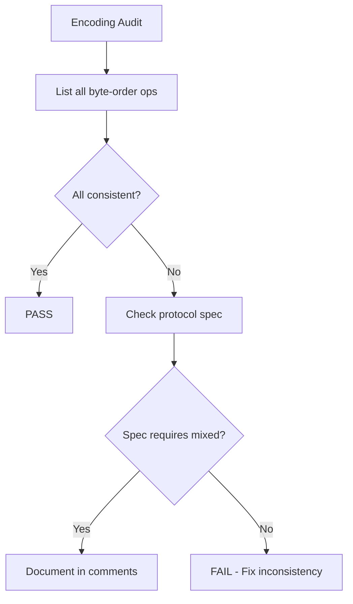

# Auditing Advanced Parsing in Cilium Network Security

Author: [nawazdhandala](https://github.com/nawazdhandala)

Tags: Cilium, Network Security, Audit, Advanced Parsing, Security Review

Description: A security audit framework for advanced parsing logic in Cilium L7 parsers, covering recursion safety, encoding correctness, resource accounting, and attack surface analysis for complex protocol...

---

## Introduction

Advanced parsing logic significantly expands the attack surface of a Cilium L7 parser. Nested structures, variable-length encodings, command dispatch tables, and state tracking across messages each introduce vulnerability classes that simple message framing does not face. A focused audit of these advanced features is essential before the parser processes production traffic.

This audit examines recursion depth controls, encoding consistency, resource accounting, command dispatch safety, and state tracking integrity. Each area has specific checks that target known vulnerability patterns in protocol parsers.

This guide provides a structured audit methodology with concrete checks and automated verification where possible.

## Prerequisites

- Complete parser source code with advanced features
- Protocol specification document
- Go security analysis tools (gosec, staticcheck)
- Understanding of common parser vulnerability classes
- Access to previous audit findings (if any)

## Auditing Recursion and Nesting Controls

Recursive parsing functions are the highest-risk component of advanced parsers:

```bash
# Find all recursive functions
grep -rn "func.*parse\|func.*read\|func.*decode" proxylib/myprotocol/*.go | grep -v test

# Check for depth parameters
grep -n "depth" proxylib/myprotocol/*.go | grep -v test

# Find the maximum depth constant
grep -n "maxNesting\|maxDepth\|MaxDepth" proxylib/myprotocol/*.go
```

Audit checklist for recursion:

| Check | Requirement | Verdict |
|-------|-------------|---------|
| Depth parameter exists | Every recursive function takes a depth parameter | |
| Depth incremented on each call | `depth + 1` passed to recursive calls | |
| Maximum depth enforced | Check at function entry, not exit | |
| Maximum depth is reasonable | Typically 10 or less for network protocols | |
| Non-recursive alternative exists | For protocols allowing very deep nesting | |

```go
// AUDIT FINDING: FAIL — depth not checked at entry
func parseValue(data []byte, offset int, depth int) (interface{}, int, error) {
    typeByte := data[offset] // Could recurse infinitely before checking depth
    if typeByte == 0x03 {
        // Array: recurse
        return parseValue(data, offset+5, depth+1) // depth checked nowhere
    }
    // ...
}

// AUDIT FINDING: PASS — depth checked at entry
func parseValue(data []byte, offset int, depth int) (interface{}, int, error) {
    if depth > maxNestingDepth {
        return nil, 0, fmt.Errorf("nesting depth exceeded")
    }
    // Now safe to proceed
    // ...
}
```

## Auditing Encoding Safety

Check that all encoding operations are consistent and correct:

```bash
# Find all byte-order operations
grep -n "<<\|>>" proxylib/myprotocol/*.go | grep -v test | grep -v "//"

# Check for mixed endianness
grep -B2 -A2 "<<24\|<<16\|<<8" proxylib/myprotocol/*.go | grep -v test
```

Verify encoding consistency:

```go
// AUDIT: Are all length fields read with the same byte order?
// File: myprotocolparser.go

// Line 45: Big-endian (correct)
msgLen := int(data[0])<<24 | int(data[1])<<16 | int(data[2])<<8 | int(data[3])

// Line 78: Also big-endian (consistent) — PASS
strLen := int(data[offset])<<8 | int(data[offset+1])

// Line 102: Little-endian (INCONSISTENT) — FAIL
fieldLen := int(data[offset+1])<<8 | int(data[offset])  // Byte order reversed!
```



## Auditing Command Dispatch

Review the command dispatch table for completeness and safety:

```bash
# List all registered command handlers
grep -n "commandRegistry\[" proxylib/myprotocol/*.go | grep -v test

# Check for default/unknown command handling
grep -n "default\|unknown\|unrecognized" proxylib/myprotocol/*.go
```

Audit the dispatch mechanism:

```go
// AUDIT: Is the command registry complete?
var commandRegistry = map[byte]commandHandler{
    0x01: handleGet,
    0x02: handleSet,
    0x03: handleDelete,
    // AUDIT QUESTION: Does the protocol spec define other commands?
    // If so, they must either be handled or explicitly rejected.
}

// AUDIT: Is the default case secure?
func dispatchCommand(command byte, ...) {
    handler, exists := commandRegistry[command]
    if !exists {
        // AUDIT FINDING: PASS — unknown commands are dropped
        return proxylib.DROP, 0
    }
    // ...
}
```

## Auditing Resource Accounting

Verify that all per-connection resources are bounded:

```bash
# Find all make() calls that allocate based on parsed values
grep -n "make(" proxylib/myprotocol/*.go | grep -v test

# Find all map operations
grep -n "map\[" proxylib/myprotocol/*.go | grep -v test

# Check for growth limiters
grep -n "maxPending\|maxEntries\|maxSize\|capacity" proxylib/myprotocol/*.go
```

```go
// AUDIT: Resource allocation checklist

// 1. Slice allocations from parsed lengths
result := make([]interface{}, 0, arrayLen)
// AUDIT: Is arrayLen bounded by maxArrayLen? Check line above.

// 2. Map growth
rt.pendingRequests[requestID] = info
// AUDIT: Is map size bounded by maxPending? Check insertion guard.

// 3. String accumulation
allKeys = append(allKeys, key)
// AUDIT: Is allKeys bounded? Could grow indefinitely per connection.
```

## Auditing State Tracking Integrity

Check that multi-message state cannot be corrupted:

```go
// AUDIT: Request tracker safety checks

// 1. Can duplicate request IDs corrupt state?
func (rt *requestTracker) trackRequest(id uint32, cmd byte) error {
    // AUDIT: Does this check for existing entry with same ID?
    if _, exists := rt.pendingRequests[id]; exists {
        // AUDIT FINDING: PASS if handled, FAIL if overwritten silently
        return fmt.Errorf("duplicate request ID %d", id)
    }
    rt.pendingRequests[id] = requestInfo{command: cmd}
    return nil
}

// 2. Can stale entries accumulate?
// AUDIT: Is there a cleanup mechanism for requests that never get responses?
// If not: FAIL — memory leak under connection loss scenarios.

// 3. Can response matching be confused?
// AUDIT: Is the response matched to the correct request using a unique ID?
// If the protocol reuses IDs: the parser must handle ID reuse correctly.
```

## Verification

Run automated audit checks:

```bash
# Static analysis
go vet ./proxylib/myprotocol/...
staticcheck ./proxylib/myprotocol/...
gosec ./proxylib/myprotocol/...

# Run all tests with race detection
go test ./proxylib/myprotocol/... -race -v -count=1

# Fuzz to validate audit findings
go test ./proxylib/myprotocol/... -fuzz=FuzzParseValue -fuzztime=60s

# Check coverage of error handling paths
go test ./proxylib/myprotocol/... -coverprofile=audit.out
go tool cover -html=audit.out -o audit-coverage.html
```

## Troubleshooting

**Problem: Audit finds recursion without depth limits**
This is a critical finding. Add depth parameters to all recursive functions immediately. Set conservative limits (5-10) unless the protocol specification requires more.

**Problem: Mixed endianness detected**
Cross-reference with the protocol specification. Some protocols legitimately use different byte orders for different field types. Document any intentional differences.

**Problem: Unbounded map growth in state tracker**
Add a maximum size check before every map insertion, and implement periodic cleanup of stale entries based on timestamps.

**Problem: Command dispatch table is incomplete**
Review the protocol specification for all defined command types. Either add handlers or add explicit entries that return DROP for unsupported commands.

## Conclusion

Auditing advanced parsing requires focused attention on the vulnerability classes unique to complex protocol handling: recursion depth, encoding consistency, resource accounting, command dispatch completeness, and state tracking integrity. Each area has specific, verifiable requirements that can be checked systematically. The audit findings should be prioritized by severity and resolved before the parser processes untrusted traffic in production.
