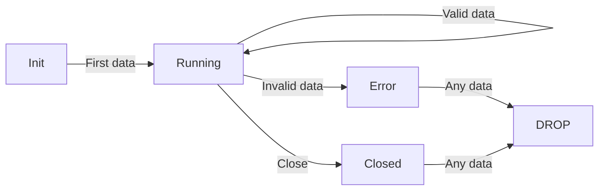

# Auditing a New Proxy Skeleton in Cilium Network Security

Author: [nawazdhandala](https://github.com/nawazdhandala)

Tags: Cilium, Network Security, Proxy, Audit, Code Review

Description: A comprehensive guide to auditing a newly created proxy skeleton in Cilium's proxylib framework, covering security checks, code quality standards, and compliance with Cilium's architecture patterns.

---

## Introduction

After creating a new proxy skeleton for a Layer 7 protocol in Cilium, a thorough audit ensures the code meets security standards before any complex parsing logic is added. Auditing at the skeleton stage is far more efficient than discovering fundamental design flaws after hundreds of lines of parsing code have been built on top.

The audit process examines several dimensions: memory safety, interface compliance, error handling, state management, and alignment with Cilium's existing patterns. Each dimension has specific checks that can be partially automated and partially require human review.

This guide provides a structured audit checklist and tooling for reviewing a new proxy skeleton in Cilium's proxylib. Whether you are reviewing your own code or someone else's contribution, these steps will help catch issues early.

## Prerequisites

- Access to the Cilium source code with the new proxy skeleton
- Go 1.21 or later with `golangci-lint` installed
- Familiarity with Cilium's proxylib Parser and ParserFactory interfaces
- `staticcheck` and `go vet` tools available
- Understanding of common Go security pitfalls

## Running Static Analysis Tools

Start with automated analysis to catch low-hanging issues:

```bash
cd cilium

# Run go vet on the new parser package
go vet ./proxylib/myprotocol/...

# Run staticcheck for deeper analysis
staticcheck ./proxylib/myprotocol/...

# Run golangci-lint with Cilium's configuration
golangci-lint run ./proxylib/myprotocol/...

# Check for potential security issues with gosec
gosec ./proxylib/myprotocol/...
```

Review the output and categorize findings by severity. Any issues flagged by `gosec` should be treated as high priority.

## Auditing the Factory Registration

The parser factory is the entry point for the entire parser. Verify these critical aspects:

```bash
# Verify the init() function exists and registers correctly
grep -n "func init()" proxylib/myprotocol/*.go

# Verify the parser name is unique across all parsers
grep -rn "RegisterParserFactory" proxylib/ --include="*.go"

# Check that the factory Create method validates its input
grep -A 20 "func.*Create" proxylib/myprotocol/*.go
```

Audit checklist for the factory:

| Check | Pass/Fail | Notes |
|-------|-----------|-------|
| Factory registered in init() | | Must use RegisterParserFactory |
| Parser name is unique | | No conflicts with existing parsers |
| Create() validates connection param | | Should handle nil connection |
| Create() logs connection metadata | | For debugging and tracing |
| No global mutable state | | Factories must be thread-safe |

```go
// GOOD: Factory with proper validation
func (f *ParserFactory) Create(connection *proxylib.Connection) interface{} {
    if connection == nil {
        log.Error("nil connection passed to MyProtocol factory")
        return nil
    }
    return &Parser{
        connection: connection,
        state:      stateInit,
    }
}

// BAD: Factory without validation
func (f *ParserFactory) Create(connection *proxylib.Connection) interface{} {
    return &Parser{connection: connection}  // No nil check, no state init
}
```

## Auditing the Parser State Machine

A well-designed state machine prevents invalid transitions and ensures connections are properly handled:



Verify the state machine with these checks:

```bash
# Find all state constants
grep -n "state" proxylib/myprotocol/*.go | grep -i "const\|iota"

# Find all state transitions
grep -n "\.state =" proxylib/myprotocol/*.go

# Verify error states are terminal (no transition back to running)
grep -B5 -A5 "stateError\|stateClosed" proxylib/myprotocol/*.go
```

Critical state machine audit points:

1. **Every state is reachable** - No dead states that waste code
2. **Error states are terminal** - Once in error, the parser should never return to processing
3. **All transitions are explicit** - No implicit state changes through side effects
4. **State is not shared between connections** - Each Parser instance has its own state

## Auditing Resource Management

Resource exhaustion is one of the most common vulnerabilities in protocol parsers:

```bash
# Check for bounded allocations
grep -n "make\(\|append\(" proxylib/myprotocol/*.go

# Check for maximum size constants
grep -n "max\|Max\|limit\|Limit" proxylib/myprotocol/*.go

# Check for proper cleanup
grep -n "Close\|Reset\|cleanup" proxylib/myprotocol/*.go
```

Write a focused audit test:

```go
// proxylib/myprotocol/myprotocolparser_audit_test.go
package myprotocol

import (
    "testing"
)

func TestParserRejectsOversizedInput(t *testing.T) {
    // Verify the parser has a maximum message size defined
    if maxMessageSize <= 0 {
        t.Fatal("maxMessageSize must be positive")
    }
    if maxMessageSize > 10<<20 { // 10 MB
        t.Errorf("maxMessageSize %d seems too large for an L7 parser", maxMessageSize)
    }
}

func TestParserStateTransitions(t *testing.T) {
    p := &Parser{state: stateInit}

    // Error state should be terminal
    p.state = stateError
    if p.state != stateError {
        t.Fatal("Error state must be terminal")
    }

    // Closed state should be terminal
    p.state = stateClosed
    if p.state != stateClosed {
        t.Fatal("Closed state must be terminal")
    }
}

func TestParserConstants(t *testing.T) {
    // Verify parser name is not empty
    if ParserName == "" {
        t.Fatal("ParserName must not be empty")
    }
}
```

## Comparing Against Existing Parsers

Cross-reference the new skeleton against established parsers to verify pattern compliance:

```bash
# Compare structure with Cassandra parser
diff <(grep "func " proxylib/cassandra/cassandraparser.go | sort) \
     <(grep "func " proxylib/myprotocol/myprotocolparser.go | sort)

# Check that the same interfaces are implemented
grep "interface" proxylib/cassandra/cassandraparser.go
grep "interface" proxylib/myprotocol/myprotocolparser.go

# Verify logging patterns match
grep "log\." proxylib/cassandra/cassandraparser.go | head -5
grep "log\." proxylib/myprotocol/myprotocolparser.go | head -5
```

## Verification

Run the complete audit suite:

```bash
# Full test suite with race detection
go test ./proxylib/myprotocol/... -race -v -count=1

# Generate coverage report
go test ./proxylib/myprotocol/... -coverprofile=coverage.out
go tool cover -func=coverage.out

# Ensure minimum coverage threshold (aim for >80% on skeleton)
COVERAGE=$(go tool cover -func=coverage.out | grep total | awk '{print $3}' | tr -d '%')
echo "Coverage: ${COVERAGE}%"
```

## Troubleshooting

**Problem: golangci-lint reports false positives on interface compliance**
Some linters may not recognize proxylib's dynamic interface pattern. Add specific nolint comments with justification: `//nolint:unused // implements proxylib.Parser interface`.

**Problem: Race detector flags the state field**
If multiple goroutines access the parser state, you need synchronization. However, in Cilium's proxylib model, parsers are called sequentially per connection, so this typically indicates a test issue rather than a production bug.

**Problem: Audit finds no maximum size constant**
This is a critical finding. Every parser must define and enforce maximum message sizes to prevent memory exhaustion attacks. Add constants before proceeding with further development.

**Problem: Factory registration conflicts with existing parser**
Parser names must be globally unique. Check all `RegisterParserFactory` calls across the codebase and choose a name that does not conflict.

## Conclusion

Auditing a proxy skeleton before building on it saves significant effort down the line. By running static analysis, checking factory registration, validating the state machine, verifying resource bounds, and comparing against existing parsers, you establish confidence that the foundation is solid. The audit tests created during this process also serve as regression tests that protect against future changes undermining the skeleton's security properties. Make this audit a required step in your development workflow for any new Cilium parser.
