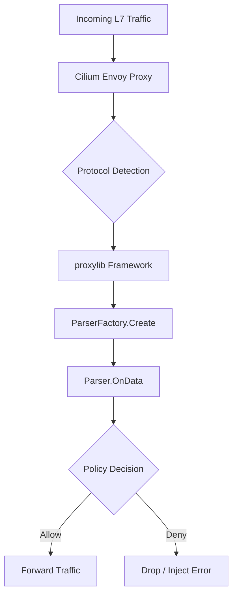

# Auditing Existing Parser Code and Libraries in Cilium Network Security

Author: [nawazdhandala](https://github.com/nawazdhandala)

Tags: Cilium, Network Security, Parser, Audit, L7 Proxy

Description: Learn how to audit existing parser code and libraries within Cilium's codebase to understand protocol handling, identify reusable components, and ensure secure Layer 7 policy enforcement.

---

## Introduction

When building or extending Layer 7 protocol support in Cilium, one of the most important early steps is auditing the existing parser code and libraries already present in the codebase. Cilium ships with parsers for several protocols including HTTP, Kafka, and DNS, each of which demonstrates patterns and conventions that any new parser should follow.

Auditing existing parsers helps you understand how Cilium's Envoy-based proxy architecture processes traffic, how protocol-specific logic is wired into the policy engine, and where shared utilities can be reused. This prevents duplicating effort and ensures consistency across the codebase.

In this guide, we will walk through a systematic approach to finding, reading, and evaluating parser code within the Cilium repository. By the end, you will have a clear picture of the parser landscape and be ready to plan your own protocol parser or modify an existing one.

## Prerequisites

- A cloned copy of the Cilium repository (https://github.com/cilium/cilium)
- Go 1.21 or later installed
- Familiarity with Go interfaces and struct embedding
- Basic understanding of Cilium's L7 proxy architecture
- Access to a Kubernetes cluster with Cilium installed (for runtime verification)

## Locating Parser Code in the Cilium Repository

Cilium's L7 parsers live in well-defined locations within the source tree. Start by identifying these directories.

```bash
# Clone the Cilium repository if you haven't already
git clone https://github.com/cilium/cilium.git
cd cilium

# Find all parser-related directories under the proxylib package
find proxylib/ -type d | sort
```

The primary location for Go-based L7 parsers is `proxylib/`. Each protocol has its own subdirectory:

```
proxylib/
├── accesslog/
├── cassandra/
├── memcached/
├── proxylib/
├── r2d2/
├── test/
└── testparsers/
```

For Envoy-based parsers (HTTP, Kafka, DNS), the relevant configuration lives in the `envoy/` directory and the policy definitions in `pkg/policy/`:

```bash
# Find Envoy filter configurations
find envoy/ -name "*.go" | head -20

# Find L7 policy rule definitions
find pkg/policy/ -name "*l7*" -o -name "*parser*" | sort
```

## Analyzing Parser Interfaces and Contracts

Every Cilium Go-based parser implements a common interface. Understanding this contract is essential before writing or modifying any parser.

```bash
# Examine the core parser interface
grep -rn "type Parser interface" proxylib/
```

The key interface typically looks like this in the proxylib framework:

```go
// Parser is the interface all L7 protocol parsers must implement
type Parser interface {
    // OnData is called when data is available on the connection.
    // The dataArray contains slices of byte data.
    // reply indicates if this is a reply (true) or request (false).
    // Returns an OpType indicating what action to take and how many bytes were consumed.
    OnData(reply bool, reader *Reader) (OpType, int)
}

// ParserFactory creates new parser instances for each connection
type ParserFactory interface {
    Create(connection *Connection) Parser
}
```

Review how existing parsers implement these interfaces:

```bash
# Check how the Cassandra parser implements OnData
grep -A 30 "func.*OnData" proxylib/cassandra/cassandraparser.go

# Check how the Memcached parser implements OnData
grep -A 30 "func.*OnData" proxylib/memcached/memcachedparser.go
```



## Evaluating Shared Libraries and Utilities

Cilium provides shared utilities that parsers should reuse rather than reimplement.

```bash
# List shared utility files in proxylib
ls -la proxylib/proxylib/

# Examine the Reader utility used for byte-level parsing
grep -n "type Reader" proxylib/proxylib/*.go

# Check access logging utilities
ls -la proxylib/accesslog/
```

Key shared components to audit include:

| Component | Location | Purpose |
|-----------|----------|---------|
| Reader | `proxylib/proxylib/reader.go` | Safe byte reading with bounds checking |
| Connection | `proxylib/proxylib/connection.go` | Connection state management |
| AccessLog | `proxylib/accesslog/` | Structured access logging |
| TestFramework | `proxylib/test/` | Test helpers for parser testing |

Review the test parsers for reference implementations:

```bash
# The test parsers show minimal but complete implementations
cat proxylib/testparsers/blockparser.go
```

## Conducting the Security Audit

When auditing existing parsers for security, check for these specific concerns:

```bash
# Check for unbounded reads or missing length validation
grep -rn "make\(\[\]byte" proxylib/ --include="*.go"

# Look for potential integer overflow in length calculations
grep -rn "int32\|int16\|uint16" proxylib/ --include="*.go"

# Check for proper error handling on parse failures
grep -rn "return ERROR\|return NOP\|return DROP" proxylib/ --include="*.go"
```

Create a checklist script to automate parts of the audit:

```bash
#!/bin/bash
# audit-parsers.sh - Audit Cilium parser code for common issues

PROXYLIB_DIR="proxylib"

echo "=== Checking for missing bounds checks ==="
grep -rn "\[.*:\]" "$PROXYLIB_DIR" --include="*.go" | grep -v "_test.go" | grep -v "vendor"

echo "=== Checking for panic-prone operations ==="
grep -rn "panic\|log.Fatal" "$PROXYLIB_DIR" --include="*.go" | grep -v "_test.go"

echo "=== Checking for proper connection cleanup ==="
grep -rn "Close\|Cleanup\|Reset" "$PROXYLIB_DIR" --include="*.go" | grep -v "_test.go"

echo "=== Verifying all parsers register themselves ==="
grep -rn "RegisterParserFactory" "$PROXYLIB_DIR" --include="*.go" | grep -v "_test.go"
```

## Verification

Verify your audit findings by running the existing parser test suites:

```bash
# Run all proxylib tests
cd cilium
go test ./proxylib/... -v

# Run tests with race detection enabled
go test ./proxylib/... -race -v

# Check test coverage to identify untested code paths
go test ./proxylib/... -coverprofile=coverage.out
go tool cover -html=coverage.out -o coverage.html
```

Confirm parser registrations are complete:

```bash
# Verify each parser registers its factory
grep -rn "func init()" proxylib/ --include="*.go" | grep -v test
```

## Troubleshooting

**Problem: Parser tests fail after updating Go version**
Ensure your Go version matches the one specified in the Cilium `go.mod` file. Run `go mod tidy` to resolve dependency issues.

**Problem: Cannot find parser code for HTTP/Kafka**
HTTP and Kafka are handled by Envoy natively, not through the Go proxylib framework. Check `envoy/` for their filter configurations and `pkg/proxy/` for the Go integration layer.

**Problem: Audit script reports false positives**
Some slice operations are protected by preceding length checks. Always review the surrounding context before flagging an issue. Look for guard clauses like `if len(data) < expectedLen` above the flagged line.

**Problem: Test coverage report shows 0% for some parsers**
Ensure you are running tests from the repository root and that all build tags are included: `go test -tags "privileged_tests" ./proxylib/...`

## Conclusion

Auditing existing parser code in Cilium is a foundational step before building or modifying L7 protocol support. By systematically examining the proxylib directory structure, understanding the Parser and ParserFactory interfaces, reviewing shared utilities, and checking for security concerns, you build the knowledge needed to contribute safely and effectively. Always run the existing test suites to validate your understanding and use coverage reports to identify areas that may need additional scrutiny.
