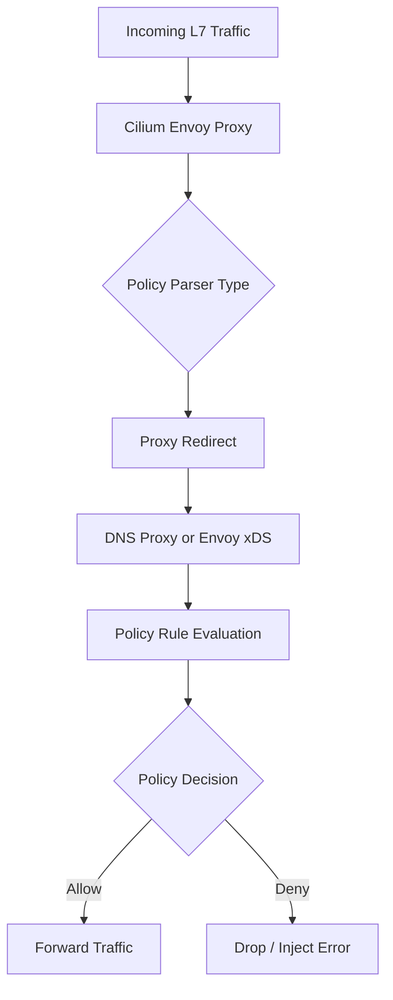

# Auditing Existing Parser Code and Libraries in Cilium Network Security

Author: [nawazdhandala](https://github.com/nawazdhandala)

Tags: Cilium, Network Security, Parser, Audit, L7 Proxy

Description: Learn how to audit existing parser code and libraries within Cilium's codebase to understand protocol handling, identify reusable components, and ensure secure Layer 7 policy enforcement.

---

## Introduction

When building or extending Layer 7 protocol support in Cilium, one of the most important early steps is auditing the existing proxy and policy code already present in the codebase. Current Cilium releases provide built-in Layer 7 policy handling for HTTP and DNS, while custom Envoy integrations are configured through CiliumEnvoyConfig resources. Kafka-aware policy support and the older Envoy Go Extensions (`proxylib`) framework were deprecated in Cilium 1.18 and have since been removed.

Auditing existing parsers helps you understand how Cilium's Envoy-based proxy architecture processes traffic, how protocol-specific logic is wired into the policy engine, and where shared utilities can be reused. This prevents duplicating effort and ensures consistency across the codebase.

In this guide, we will walk through a systematic approach to finding, reading, and evaluating parser code within the Cilium repository. By the end, you will have a clear picture of the parser landscape and be ready to plan your own protocol parser or modify an existing one.

## Prerequisites

- A cloned copy of the Cilium repository (https://github.com/cilium/cilium)
- The Go version specified in the Cilium repository's `go.mod` file
- Familiarity with Go interfaces and struct embedding
- Basic understanding of Cilium's L7 proxy architecture
- Access to a Kubernetes cluster with Cilium installed (for runtime verification)

## Locating Parser Code in the Cilium Repository

Cilium's L7 proxy and policy code lives in well-defined locations within the source tree. Start by identifying these directories.

```bash
# Clone the Cilium repository if you haven't already

git clone https://github.com/cilium/cilium.git
cd cilium

# Find the main L7 proxy and policy implementation files
find pkg/proxy pkg/envoy pkg/fqdn pkg/policy -type f -name "*.go" | sort
```

The primary locations for current L7 proxy integration are:

```text
pkg/
├── envoy/        # Envoy xDS integration and HTTP policy translation
├── fqdn/         # DNS proxy and FQDN policy support
├── policy/       # L7 parser type selection and policy data structures
└── proxy/        # Redirect lifecycle and proxy implementation selection
```

For Envoy-based HTTP policy handling and custom CiliumEnvoyConfig redirects, the relevant integration lives in `pkg/envoy/`, `pkg/proxy/`, and `pkg/policy/`. DNS policy enforcement is handled by Cilium's DNS proxy integration:

```bash
# Find Envoy integration code
find pkg/envoy/ -name "*.go" | head -20

# Find L7 policy rule definitions
find pkg/policy/ -name "*.go" | xargs grep -n "L7Parser\\|L7Rules\\|ParserType"

# Find DNS proxy integration code
find pkg/proxy pkg/fqdn -name "*.go" | xargs grep -n "DNS"
```

## Analyzing Parser Interfaces and Contracts

Cilium no longer uses the old Go `proxylib` parser interface. Current L7 handling is wired through proxy redirects, policy parser types, DNS proxy integration, and Envoy xDS resources. Understanding those contracts is essential before writing or modifying protocol support.

```bash
# Examine the proxy redirect interface
grep -rn "type RedirectImplementation interface" pkg/proxy/

# Examine the policy interface that selects the L7 parser type
grep -rn "type ProxyPolicy interface" pkg/policy/

# Examine Envoy listener management
grep -rn "type XDSServer interface" pkg/envoy/
```

The key interfaces currently look like this in the proxy and policy framework:

```go
// RedirectImplementation is the generic proxy redirect interface that each
// proxy redirect type must implement.
type RedirectImplementation interface {
    GetRedirect() *Redirect
    UpdateRules(rules policy.L7DataMap) (revert.RevertFunc, error)
    Close()
}

// ProxyPolicy is any type which encodes state needed to redirect to an L7 proxy.
type ProxyPolicy interface {
    GetPerSelectorPolicies() L7DataMap
    GetL7Parser() L7ParserType
    GetIngress() bool
    GetPort() uint16
    GetProtocol() u8proto.U8proto
    GetListener() string
}
```

Review how existing proxy implementations use these interfaces:

```bash
# Check how the DNS redirect updates L7 rules
grep -A 30 "func (dr \\*dnsRedirect) UpdateRules" pkg/proxy/dns.go

# Check how the Envoy redirect is created
grep -A 40 "func (p \\*envoyProxyIntegration) createRedirect" pkg/proxy/envoyproxy.go
```


```mermaid
graph TD
    A[Incoming L7 Traffic] --> B[Cilium Envoy Proxy]
    B --> C{Policy Parser Type}
    C --> D[Proxy Redirect]
    D --> E[DNS Proxy or Envoy xDS]
    E --> F[Policy Rule Evaluation]
    F --> G{Policy Decision}
    G -->|Allow| H[Forward Traffic]
    G -->|Deny| I[Drop / Inject Error]
```

## Evaluating Shared Libraries and Utilities

Cilium provides shared proxy, policy, and access logging utilities that protocol integrations should reuse rather than reimplement.

```bash
# List shared proxy files
ls -la pkg/proxy/

# Examine redirect and proxy policy contracts
grep -n "type RedirectImplementation" pkg/proxy/*.go
grep -n "type L7ParserType" pkg/policy/*.go

# Check access logging utilities
ls -la pkg/proxy/accesslog/
```

Key shared components to audit include:

| Component | Location | Purpose |
|-----------|----------|---------|
| RedirectImplementation | `pkg/proxy/redirect.go` | Common lifecycle for proxy redirects |
| L7ParserType | `pkg/policy/l4.go` | Parser type selection for HTTP, DNS, TLS, and CRD redirects |
| EnvoyL7RulesTranslator | `pkg/envoy/policy/` | Translation of Cilium HTTP rules into Envoy policy resources |
| DNS Proxy | `pkg/proxy/dns.go`, `pkg/fqdn/` | DNS policy enforcement and FQDN rule integration |
| AccessLog | `pkg/proxy/accesslog/` | Structured access logging |

Review the tests for reference behavior:

```bash
# Proxy, Envoy, DNS, and policy tests show expected behavior
find pkg/proxy pkg/envoy pkg/fqdn pkg/policy -name "*_test.go" | sort
```

## Conducting the Security Audit

When auditing existing parsers for security, check for these specific concerns:

```bash
# Check for unbounded reads or missing length validation
grep -rn "make\(\[\]byte" pkg/proxy pkg/envoy pkg/fqdn pkg/policy --include="*.go"

# Look for potential integer overflow in length calculations
grep -rn "int32\|int16\|uint16" pkg/proxy pkg/envoy pkg/fqdn pkg/policy --include="*.go"

# Check for proper error handling on parse failures
grep -rn "return .*error\|return nil,.*err\|denied\|DROPPED" pkg/proxy pkg/envoy pkg/fqdn pkg/policy --include="*.go"
```

Create a checklist script to automate parts of the audit:

```bash
#!/bin/bash
# audit-parsers.sh - Audit Cilium parser code for common issues

L7_DIRS="pkg/proxy pkg/envoy pkg/fqdn pkg/policy"

echo "=== Checking for missing bounds checks ==="
grep -rn "\[.*:\]" $L7_DIRS --include="*.go" | grep -v "_test.go" | grep -v "vendor"

echo "=== Checking for panic-prone operations ==="
grep -rn "panic\|log.Fatal" $L7_DIRS --include="*.go" | grep -v "_test.go"

echo "=== Checking for proper connection cleanup ==="
grep -rn "Close\|Cleanup\|Reset" $L7_DIRS --include="*.go" | grep -v "_test.go"

echo "=== Verifying L7 parser type handling ==="
grep -rn "ParserTypeHTTP\|ParserTypeDNS\|ParserTypeCRD\|ParserTypeTLS" pkg/policy pkg/proxy pkg/envoy --include="*.go" | grep -v "_test.go"
```

## Verification

Verify your audit findings by running the existing parser test suites:

```bash
# Run L7 proxy, Envoy, DNS, and policy tests
cd cilium
go test ./pkg/proxy/... ./pkg/envoy/... ./pkg/fqdn/... ./pkg/policy/... -v

# Run tests with race detection enabled
go test ./pkg/proxy/... ./pkg/envoy/... ./pkg/fqdn/... ./pkg/policy/... -race -v

# Check test coverage to identify untested code paths
go test ./pkg/proxy/... ./pkg/envoy/... ./pkg/fqdn/... ./pkg/policy/... -coverprofile=coverage.out
go tool cover -html=coverage.out -o coverage.html
```

Confirm parser type handling is complete:

```bash
# Verify known parser types and redirect implementations
grep -rn "ParserTypeHTTP\|ParserTypeDNS\|ParserTypeCRD\|ParserTypeTLS" pkg/policy pkg/proxy pkg/envoy --include="*.go" | grep -v "_test.go"
```

## Troubleshooting

**Problem: Parser tests fail after updating Go version**
Ensure your Go version matches the one specified in the Cilium `go.mod` file. Run `go mod tidy` to resolve dependency issues.

**Problem: Cannot find parser code for HTTP/Kafka**
HTTP policy enforcement is integrated through Envoy and the Go code under `pkg/envoy/`, `pkg/proxy/`, and `pkg/policy/`. Kafka-aware Cilium network policies were deprecated in Cilium 1.18 and removed afterward, so current Cilium trees do not contain a supported Kafka parser or policy implementation.

**Problem: Audit script reports false positives**
Some slice operations are protected by preceding length checks. Always review the surrounding context before flagging an issue. Look for guard clauses like `if len(data) < expectedLen` above the flagged line.

**Problem: Test coverage report shows 0% for some parsers**
Ensure you are running tests from the repository root and that you include the relevant packages. Some integration-heavy paths may require Cilium's documented test environment rather than a plain local `go test` run.

## Conclusion

Auditing existing parser and proxy code in Cilium is a foundational step before building or modifying L7 protocol support. By systematically examining the proxy, Envoy, DNS, and policy packages, understanding the redirect and policy interfaces, reviewing shared utilities, and checking for security concerns, you build the knowledge needed to contribute safely and effectively. Always run the existing test suites to validate your understanding and use coverage reports to identify areas that may need additional scrutiny.
