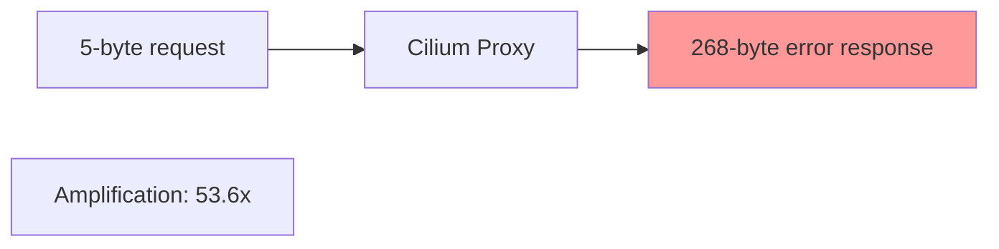

# Auditing Error Response Injection in Cilium Network Security

Author: [nawazdhandala](https://github.com/nawazdhandala)

Tags: Cilium, Network Security, Audit, Error Injection, Security Review

Description: A structured security audit of error response injection in Cilium L7 parsers, examining information leakage, amplification risks, format correctness, and injection timing for compliance with...

---

## Introduction

Error response injection is a sensitive operation in any L7 proxy because it generates network traffic on behalf of the security infrastructure. Unlike parsing, which processes incoming data, injection creates outgoing data that may be received by untrusted clients. An audit of the injection mechanism must verify that responses are safe, correct, and cannot be weaponized.

The audit examines four risk areas: information leakage through error messages, amplification potential, protocol format compliance, and injection timing. Each area has specific checks with clear pass/fail criteria.

This guide provides a repeatable audit framework for error response injection in Cilium L7 parsers.

## Prerequisites

- Complete parser source code with injection implementation
- Protocol specification for error response format
- Previous audit findings (if available)
- Go security analysis tools
- Understanding of OWASP information disclosure guidelines

## Audit Area 1: Information Leakage

Review every string that appears in error responses:

```bash
# Find all strings used in error responses
grep -n "buildErrorResponse\|Inject\|errorMessage\|errMsg" proxylib/myprotocol/*.go | grep -v test

# Find all format strings in injection paths
grep -n "fmt.Sprintf\|fmt.Fprintf" proxylib/myprotocol/*.go | grep -v test

# Check for dynamic content in error messages
grep -n "connection\.\|p\.\|SrcIdentity\|DstIdentity" proxylib/myprotocol/*.go | grep -v test | grep -v "log\."
```

Audit matrix for information leakage:

| Data Type | Present in Error Response? | Risk Level | Verdict |
|-----------|---------------------------|------------|---------|
| Source IP address | | Critical | |
| Destination IP | | Critical | |
| Identity numbers | | High | |
| Policy rule names | | High | |
| Internal hostnames | | Medium | |
| Parser version | | Low | |
| Error codes | | Acceptable | |

```go
// AUDIT: Trace all data that flows into error response construction

// Step 1: Find the buildErrorResponse function
// Step 2: Identify all parameters that become part of the response bytes
// Step 3: Verify each parameter is either:
//   - A static constant (PASS)
//   - A protocol-required echo field like request ID (PASS)
//   - Derived from untrusted input (REQUIRES REVIEW)
//   - Derived from internal state (FAIL unless justified)
```

## Audit Area 2: Amplification Analysis

Calculate the maximum amplification factor:

```go
// AUDIT: Compute worst-case amplification

// Minimum request that triggers injection:
// 4 bytes (length header) + 1 byte (command) = 5 bytes minimum
const minRequestSize = 5

// Maximum error response size:
// 4 (header) + 1 (error flag) + 1 (error code) + 4 (request ID) + 2 (msg len) + maxErrorMessageLen
const maxResponseSize = 4 + 1 + 1 + 4 + 2 + maxErrorMessageLen

// Amplification factor = maxResponseSize / minRequestSize
// If maxErrorMessageLen = 256: factor = 268/5 = 53.6x
// AUDIT FINDING: Factor > 10x is a concern. Recommend reducing maxErrorMessageLen.
```



## Audit Area 3: Format Correctness

Verify the response builder against the specification field by field:

```bash
# Extract the buildErrorResponse function for detailed review
grep -A 50 "func.*buildErrorResponse" proxylib/myprotocol/*.go | head -60
```

Field-by-field audit:

| Offset | Field | Spec Requirement | Implementation | Verdict |
|--------|-------|-----------------|----------------|---------|
| 0-3 | Length | Big-endian uint32, body length only | | |
| 4 | Error flag | 0xFF for errors | | |
| 5 | Error code | Valid error code from spec | | |
| 6-9 | Request ID | Echo from request, big-endian | | |
| 10-11 | Message length | Big-endian uint16 | | |
| 12+ | Message body | UTF-8 string | | |

## Audit Area 4: Injection Timing and Safety

Review when and how injection is triggered:

```bash
# Find all Inject calls
grep -n "\.Inject(" proxylib/myprotocol/*.go | grep -v test

# Check what happens after Inject
grep -A 5 "\.Inject(" proxylib/myprotocol/*.go | grep -v test
```

```go
// AUDIT: Injection timing checks

// Check 1: Is Inject called before or after the DROP return?
p.connection.Inject(true, errorResp) // Inject called
return proxylib.DROP, 0               // Then DROP
// AUDIT: PASS if framework guarantees injection is flushed before close

// Check 2: Can Inject be called multiple times for the same request?
// If OnData is called again with the same data, will it inject again?
// AUDIT: Verify idempotency or single-injection guard

// Check 3: Is Inject called on the correct direction?
p.connection.Inject(true, errorResp)  // true = reply direction
// AUDIT: PASS — error goes to client, not to server
```

## Generating the Audit Report

```bash
# Run automated checks
go vet ./proxylib/myprotocol/...
gosec ./proxylib/myprotocol/...

# Test the injection code specifically
go test ./proxylib/myprotocol/... -v -run "TestError\|TestInject" -race

# Coverage of injection paths
go test ./proxylib/myprotocol/... -coverprofile=inject-audit.out
go tool cover -func=inject-audit.out | grep -i "error\|inject\|build"
```

## Verification

Confirm audit findings are accurate through testing:

```bash
# Reproduce any information leakage findings
go test ./proxylib/myprotocol/... -v -run TestErrorResponseNoLeakage

# Verify amplification calculations
go test ./proxylib/myprotocol/... -v -run TestErrorResponseAmplification

# Validate format compliance
go test ./proxylib/myprotocol/... -v -run TestErrorResponseFormat

# Full suite
go test ./proxylib/myprotocol/... -race -v -count=1
```

## Troubleshooting

**Problem: Audit scope unclear for injection code**
The audit scope includes the `buildErrorResponse` function, all callers of `Inject`, and any helper functions that construct error message strings. Logging code that does not flow into the injection is out of scope.

**Problem: Amplification factor is too high**
Reduce `maxErrorMessageLen` or make the error message a fixed constant string rather than a variable. A fixed "request denied" message limits response size to a constant.

**Problem: Cannot determine injection timing guarantees**
Review the proxylib framework source to understand whether `Inject` data is flushed before connection teardown. If guarantees are unclear, add explicit tests.

**Problem: Multiple Inject calls detected for one request**
Add a boolean guard (`errorInjected`) to the parser state that prevents duplicate injections per connection or per request.

## Conclusion

Auditing error response injection ensures that the proxy does not become a source of information leakage or amplification attacks. By systematically checking each risk area — information content, amplification factor, format compliance, and injection timing — you verify that the injection mechanism is safe for production use. Track all findings with clear severity ratings and resolve critical issues before deploying the parser.
