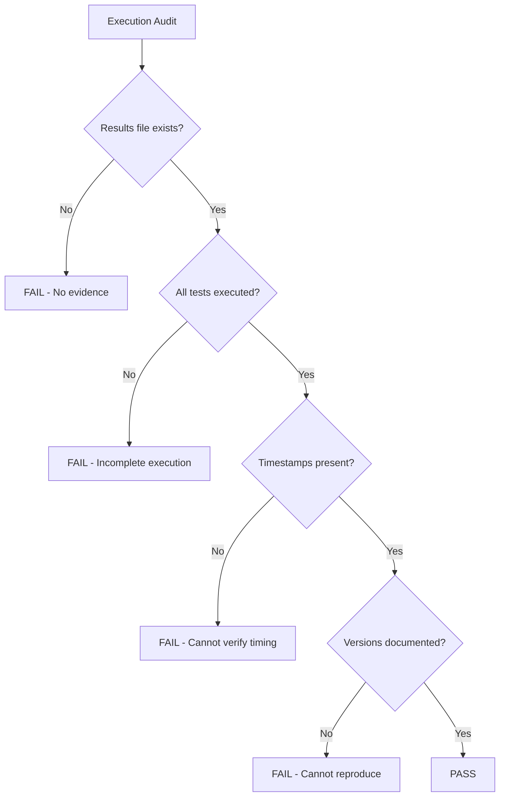

# Auditing Manual Testing Practices for Cilium Network Security

Author: [nawazdhandala](https://github.com/nawazdhandala)

Tags: Cilium, Network Security, Audit, Manual Testing, Quality Assurance

Description: Audit the manual testing practices for Cilium L7 parsers to ensure test plans are comprehensive, execution is documented, test environments are properly isolated, and results support security sign-off decisions.

---

## Introduction

An audit of manual testing practices evaluates whether the testing process itself meets quality and security standards. Even if individual test results pass, the testing may be insufficient if the test plan has gaps, the environment was not properly isolated, or results were not documented in a reviewable format.

This audit framework examines the test plan design, environment security, execution discipline, documentation quality, and coverage completeness. It is intended for security reviewers evaluating whether manual testing provides sufficient confidence for production deployment.

## Prerequisites

- Access to test plan documents and test results
- Test environment configuration files
- Cilium and Kubernetes cluster access for verification
- Understanding of the parser's intended behavior
- Organizational testing standards for reference

## Audit Area 1: Test Plan Design

Evaluate the test plan against known vulnerability classes:

```bash
# Review the test plan document
# Check for presence of required test categories

echo "=== Test Plan Audit Checklist ==="
echo "[ ] Positive tests (valid inputs accepted)"
echo "[ ] Negative tests (invalid inputs rejected)"
echo "[ ] Boundary tests (min/max values)"
echo "[ ] Security tests (malicious inputs)"
echo "[ ] Performance tests (load handling)"
echo "[ ] Recovery tests (error recovery)"
echo "[ ] Policy tests (all verdict types)"
echo "[ ] Observability tests (logging verified)"
echo "[ ] Multi-connection tests (concurrency)"
echo "[ ] Long-running tests (stability)"
```

| Test Category | Required Tests | Tests in Plan | Gap |
|---------------|---------------|---------------|-----|
| Valid requests per command type | 1 per command | | |
| Denied requests per command type | 1 per command | | |
| Oversized messages | 2+ | | |
| Malformed headers | 3+ | | |
| Connection flooding | 1+ | | |
| Slow-rate attacks | 1+ | | |
| Access log verification | 2+ | | |
| Error response verification | 2+ | | |

## Audit Area 2: Environment Security

Verify the test environment is properly isolated:

```bash
# Check namespace isolation
kubectl get ciliumnetworkpolicy -n cilium-parser-test -o yaml

# Verify no access to production namespaces
kubectl exec -n cilium-parser-test deploy/test-client -- \
    nc -zv production-service.production.svc.cluster.local 443 2>&1 || echo "Correctly blocked"

# Check that test pods do not use production credentials
kubectl get pods -n cilium-parser-test -o json | jq '.items[].spec.containers[].env[]?.name' | grep -i "prod\|secret\|key"

# Verify test images are not production images
kubectl get pods -n cilium-parser-test -o json | jq '.items[].spec.containers[].image'
```

Environment security checklist:

| Check | Requirement | Verified | Verdict |
|-------|-------------|----------|---------|
| Namespace isolation policy applied | No egress to production | | |
| Test credentials separate from production | Different secrets/tokens | | |
| Test data does not contain PII | Synthetic data only | | |
| Test images tagged as non-production | Clear naming convention | | |
| Cleanup procedure documented | All resources removable | | |

## Audit Area 3: Execution Documentation

Check that test execution is properly documented:

```bash
# Verify test results file exists and is complete
ls -la test-results-*.json

# Check that all planned tests have corresponding results
PLANNED=$(grep -c "test_" test-plan.md)
EXECUTED=$(jq '.tests | length' test-results.json)
echo "Planned: $PLANNED, Executed: $EXECUTED"

# Verify timestamps are present
jq '.tests[0].timestamp' test-results.json

# Check for missing verdicts
jq '.tests[] | select(.status == null) | .name' test-results.json
```



## Audit Area 4: Coverage Assessment

Evaluate whether testing covers the attack surface:

```go
// Map test coverage to parser code paths

// OnData return paths that must be manually tested:
// 1. MORE (partial data) — covered by: ___
// 2. PASS (allowed) — covered by: ___
// 3. DROP (denied by policy) — covered by: ___
// 4. DROP (malformed input) — covered by: ___
// 5. DROP (oversized) — covered by: ___
// 6. DROP (error state) — covered by: ___
// 7. Error injection path — covered by: ___
// 8. Access logging path — covered by: ___
```

## Audit Area 5: Result Analysis

Review whether test results were properly analyzed:

```bash
# Check for unresolved failures
FAILURES=$(jq '[.tests[] | select(.status == "FAIL")] | length' test-results.json)
echo "Unresolved failures: $FAILURES"

# Check for known issues documented
jq '.tests[] | select(.status == "FAIL") | {name, reason}' test-results.json

# Verify that pass criteria are defined
# Each test should have clear pass/fail criteria, not just "it worked"
```

## Verification

Run the audit verification:

```bash
# Generate audit summary
echo "=== Manual Testing Audit Summary ==="
echo "Date: $(date -u)"
echo ""
echo "Test Plan Coverage: _/10 categories"
echo "Environment Isolation: PASS/FAIL"
echo "Execution Documentation: PASS/FAIL"
echo "Code Path Coverage: _/8 paths"
echo "Result Analysis: PASS/FAIL"
echo ""
echo "Overall Audit Verdict: PASS/FAIL"
echo "Auditor: ___"
echo "Audit Date: $(date -u +%Y-%m-%d)"
```

## Troubleshooting

**Problem: Test plan has significant gaps**
Provide a gap analysis document listing missing tests with priority levels. The parser should not proceed to production until high-priority gaps are addressed.

**Problem: Environment isolation is incomplete**
This is a critical finding. Test environments with access to production can lead to data exposure or accidental production impact. Fix isolation before continuing testing.

**Problem: Test results lack timestamps or versions**
Results cannot be verified for timing or reproducibility. Re-execute tests with proper documentation tooling.

**Problem: Multiple unresolved test failures**
Each failure must have a documented root cause analysis and either a fix or a documented exception with justification.

## Conclusion

Auditing manual testing practices ensures that the testing process provides meaningful security assurance. A test plan with gaps, an unisolated environment, undocumented execution, or unanalyzed results all undermine the value of manual testing. By auditing each of these areas systematically, reviewers can make informed decisions about whether the parser is ready for production deployment.
