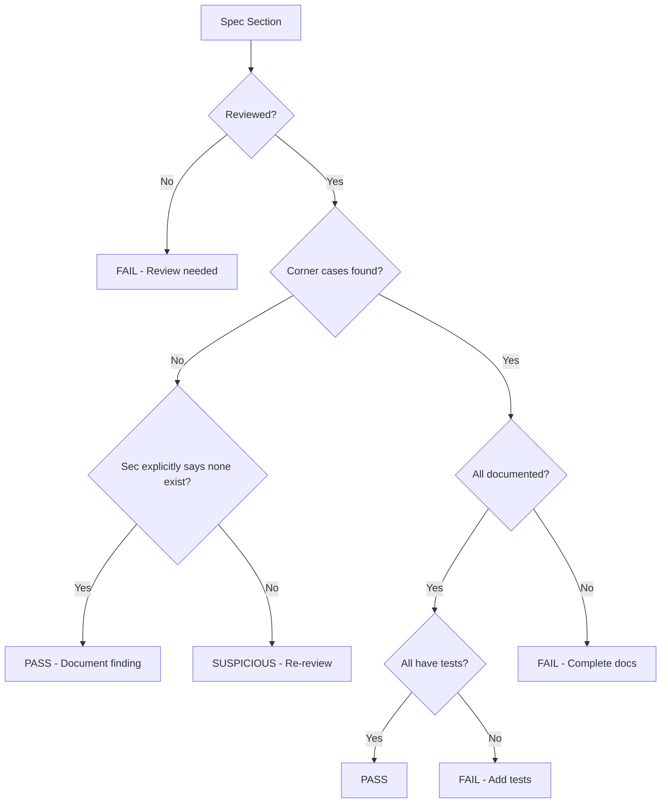

# Auditing Protocol Spec Corner Case Review in Cilium Network Security

Author: [nawazdhandala](https://github.com/nawazdhandala)

Tags: Cilium, Network Security, Audit, Protocol Specification, Corner Cases

Description: A structured audit of how protocol specification corner cases are identified, documented, and handled in Cilium L7 parsers, ensuring no ambiguity creates a security vulnerability.

---

## Introduction

An audit of corner case handling evaluates the thoroughness of the specification review process and the correctness of the decisions made for each ambiguity. Unlike other audits that examine code, this audit examines the decision-making process: were all relevant corner cases identified, were decisions well-reasoned, and are the decisions implemented correctly in code?

A gap in corner case coverage represents a latent vulnerability - the parser processes inputs for which no explicit decision was made, relying on whatever behavior the implementation happens to produce. This undirected behavior is the most dangerous kind in a security-critical parser.

## Prerequisites

- Corner case documentation from specification review
- Protocol specification for verification
- Parser source code
- Test suite for corner cases
- Understanding of the protocol's security model

## Audit Phase 1: Corner Case Identification Completeness

Verify that the review process covered all areas of the specification:

```bash
# Check that each spec section has been reviewed for corner cases
echo "=== Specification Section Coverage ==="
echo "Section 1 - Connection Setup: ___ corner cases documented"
echo "Section 2 - Message Format: ___ corner cases documented"
echo "Section 3 - Command Types: ___ corner cases documented"
echo "Section 4 - Error Handling: ___ corner cases documented"
echo "Section 5 - Authentication: ___ corner cases documented"
echo "Section 6 - Extensions: ___ corner cases documented"
```

Verify coverage using the specification:

| Spec Section | Reviewed | Corner Cases Found | Tests Written | Audit Verdict |
|-------------|----------|-------------------|---------------|---------------|
| Message framing | | | | |
| Length encoding | | | | |
| Command types | | | | |
| String encoding | | | | |
| Numeric fields | | | | |
| Optional features | | | | |
| Error responses | | | | |
| Version handling | | | | |
| Connection lifecycle | | | | |



## Audit Phase 2: Decision Quality

Evaluate each corner case decision for security soundness:

```go
// AUDIT: Review each decision against security principles

// Decision PASS: Restrictive choice with clear rationale
// CORNER_CASE_001: Zero-length body → REJECT
// Rationale: "No legitimate use case identified. Rejecting is safer."
// Audit: PASS - follows principle of least privilege

// Decision REVIEW: Permissive choice needs justification
// CORNER_CASE_003: Request ID 0 → ACCEPT
// Rationale: "Valid per spec"
// Audit: REVIEW - is there a security implication of ID 0?
//   Could ID 0 be confused with "no ID" in logging/tracking?

// Decision FAIL: No rationale documented
// CORNER_CASE_007: Multiple commands in one message → ???
// Rationale: (none documented)
// Audit: FAIL - undocumented decisions are security risks
```

Decision quality checklist:

| Criterion | Required | Verdict |
|-----------|----------|---------|
| Rationale documented for every decision | Yes | |
| Security implications considered | Yes | |
| Alternative interpretations noted | Recommended | |
| Spec reference cited | Yes | |
| Implementation matches decision | Yes | |

## Audit Phase 3: Implementation Correctness

Verify that code matches documented decisions:

```bash
# For each corner case, find the implementing code
# Example for CORNER_CASE_001 (zero-length body)
grep -n "length.*<=\s*0\|length.*==\s*0\|len.*body.*==\s*0" proxylib/myprotocol/*.go | grep -v test

# For CORNER_CASE_002 (unknown commands)
grep -n "unknown\|default\|commandRegistry" proxylib/myprotocol/*.go | grep -v test

# For CORNER_CASE_006 (negative length)
grep -n "< 0\|<= 0\|negative" proxylib/myprotocol/*.go | grep -v test
```

Cross-reference documentation with implementation:

| Corner Case ID | Decision | Code Location | Code Matches Decision | Test Exists |
|----------------|----------|---------------|----------------------|-------------|
| CC-001 | REJECT zero-length | line 67 | | |
| CC-002 | REJECT unknown cmd | line 89 | | |
| CC-003 | ACCEPT ID 0 | line 72 | | |
| CC-004 | ACCEPT max ID | line 72 | | |
| CC-005 | REJECT non-zero flags | line 95 | | |
| CC-006 | REJECT negative len | line 60 | | |

## Audit Phase 4: Test Coverage for Corner Cases

Verify that each corner case has dedicated tests:

```bash
# Count corner case tests
grep -c "CC-\|CornerCase\|corner.case" proxylib/myprotocol/*_test.go

# List corner case tests
grep "CC-\|CornerCase\|corner.case" proxylib/myprotocol/*_test.go

# Check that tests verify the correct behavior
grep -A 5 "CC-001\|zero.length" proxylib/myprotocol/*_test.go
```

Test coverage audit:

| Corner Case | Test Function | Assertion Type | Passes | Audit |
|-------------|---------------|----------------|--------|-------|
| CC-001 | TestCornerCases/CC-001 | Op + N check | Yes | PASS |
| CC-002 | TestCornerCases/CC-002 | Op check only | Yes | WEAK |
| CC-003 | TestCornerCases/CC-003 | Op + N check | Yes | PASS |
| CC-007 | (none) | - | - | FAIL |

## Audit Phase 5: Gap Analysis

Identify corner cases that may have been missed:

```bash
# Search for common corner case patterns not in the documentation
# 1. Null/nil handling
grep -n "nil\|null\|NULL" proxylib/myprotocol/*.go | grep -v test | grep -v import

# 2. Integer wrapping
grep -n "uint\|int32\|int16" proxylib/myprotocol/*.go | grep -v test | grep -v import

# 3. String termination
grep -n "string\|byte.*0x00\|null.byte" proxylib/myprotocol/*.go | grep -v test
```

## Verification

Run the audit verification:

```bash
# Execute all corner case tests
go test ./proxylib/myprotocol/... -v -run "TestCornerCase\|TestSpec" -race

# Check that no corner case is unimplemented
DOCUMENTED=$(grep -c "CORNER_CASE" proxylib/myprotocol/corner_cases.go 2>/dev/null || echo 0)
TESTED=$(grep -c "CC-" proxylib/myprotocol/*_test.go 2>/dev/null || echo 0)
echo "Documented: $DOCUMENTED, Tested: $TESTED"

# Fuzz to check for undocumented corner cases
go test ./proxylib/myprotocol/... -fuzz=FuzzCornerCaseDiscovery -fuzztime=60s
```

## Troubleshooting

**Problem: Many corner cases lack documentation**
This indicates the specification review was incomplete. Schedule a focused review session to go through the spec section by section.

**Problem: Decision quality is inconsistent**
Establish a decision template that requires rationale, spec reference, security analysis, and implementation notes for every corner case.

**Problem: Code does not match documented decisions**
Either the code or the documentation is wrong. Determine which by testing against the specification and reference implementations.

**Problem: Fuzzer finds corner cases not in the documentation**
Add each new finding to the corner case register, document the decision, and write a test. Update the specification review to cover the area where the gap was found.

## Conclusion

Auditing corner case handling ensures that the specification review was thorough, decisions are well-reasoned, implementations match decisions, and tests verify the correct behavior. Gaps in any of these areas represent latent vulnerabilities that could be exploited by traffic that falls into ambiguous protocol territory. Complete this audit before considering the parser production-ready, and re-audit after any significant specification update or parser modification.
