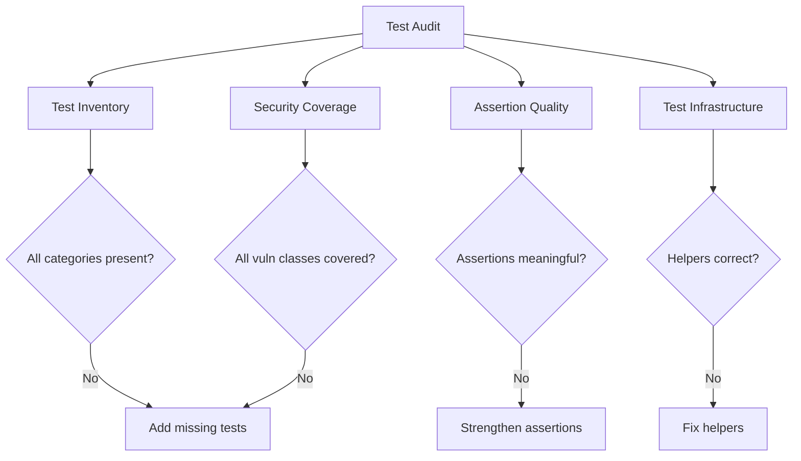

# Auditing Unit Test Practices for Cilium L7 Parser Development

Author: [nawazdhandala](https://github.com/nawazdhandala)

Tags: Cilium, Network Security, Unit Testing, Audit, Code Quality, Go

Description: A structured audit guide for evaluating unit test completeness, correctness, and security coverage in Cilium L7 parser test suites, with actionable checklists and automated verification scripts.

---

## Introduction

An audit of unit test practices goes beyond checking whether tests exist. It evaluates whether the test suite provides genuine security assurance for a Cilium L7 parser. A parser with 90% code coverage but no tests for malformed input offers a false sense of security that is worse than having no coverage metrics at all.

Test auditing examines the breadth of test scenarios, the quality of assertions, the handling of edge cases, and the alignment between tested scenarios and real-world threat models. It also evaluates test infrastructure - helpers, fixtures, and utilities - for correctness and maintainability.

This guide provides a systematic framework for auditing unit tests associated with Cilium parser development, suitable for security reviews and code quality assessments.

## Prerequisites

- Access to the parser source code and test files
- Go 1.21 or later
- Familiarity with Go testing conventions
- Understanding of the protocol being parsed
- Knowledge of common parser vulnerability classes

## Audit Phase 1: Test Inventory

Begin by cataloging all tests and their purposes:

```bash
# List all test functions
grep -n "^func Test" proxylib/myprotocol/*_test.go | sort

# Count tests by category
grep -c "^func Test" proxylib/myprotocol/*_test.go

# List all test helper functions
grep -n "^func [a-z]" proxylib/myprotocol/*_test.go | sort

# Check for benchmark tests
grep -n "^func Benchmark" proxylib/myprotocol/*_test.go

# Check for fuzz tests
grep -n "^func Fuzz" proxylib/myprotocol/*_test.go
```

Create a test inventory matrix:

| Test Category | Count | Required Minimum | Verdict |
|---------------|-------|-------------------|---------|
| Happy path (valid messages) | ? | 3+ | |
| Malformed input (invalid format) | ? | 5+ | |
| Boundary values (min/max lengths) | ? | 4+ | |
| State machine transitions | ? | 4+ | |
| Policy matching | ? | 3+ | |
| Multi-message streams | ? | 2+ | |
| Fuzz tests | ? | 1+ | |
| Benchmarks | ? | 1+ | |

## Audit Phase 2: Security Test Coverage

Check that tests cover all known vulnerability classes:

```bash
# Check for tests targeting oversized inputs
grep -n "oversize\|overflow\|maxMessage\|MaxMessage\|too.large\|exceed" proxylib/myprotocol/*_test.go

# Check for tests targeting negative values
grep -n "negative\|Negative\|-1\|0xFF.*0xFF" proxylib/myprotocol/*_test.go

# Check for tests targeting empty/zero inputs
grep -n "empty\|Empty\|zero\|Zero\|nil\|len.*0" proxylib/myprotocol/*_test.go

# Check for tests targeting state confusion
grep -n "stateError\|stateClosed\|stateInit" proxylib/myprotocol/*_test.go
```

Required security test checklist:

```go
// Each of these scenarios MUST have at least one test:

// 1. Zero-length message body
// 2. Negative length in header
// 3. Length exceeding maxMessageSize
// 4. Partial header (1, 2, 3 bytes)
// 5. Partial body (header valid, body truncated)
// 6. Data arriving on error-state parser
// 7. Data arriving on closed-state parser
// 8. Maximum valid message size (exactly maxMessageSize)
// 9. Policy-denied request
// 10. Reply (response) traffic handling
```



## Audit Phase 3: Assertion Quality

Evaluate whether assertions actually verify meaningful behavior:

```bash
# Count assertions per test function (rough metric)
awk '/^func Test/{name=$2; count=0} /t\.Error|t\.Fatal|t\.Fail|assert\./{count++} /^}/{if(name) print name, count; name=""}' proxylib/myprotocol/*_test.go
```

Flag tests with weak assertions:

```go
// AUDIT FINDING: FAIL - test with no assertions
func TestOnData_NoAssert(t *testing.T) {
    parser := &Parser{state: stateRunning}
    reader := proxylib.NewTestReader(data)
    parser.OnData(false, reader)
    // No assertion - test always passes
}

// AUDIT FINDING: FAIL - test only checks one of two return values
func TestOnData_PartialAssert(t *testing.T) {
    parser := &Parser{state: stateRunning}
    reader := proxylib.NewTestReader(data)
    op, _ := parser.OnData(false, reader)  // Ignores byte count
    if op != proxylib.PASS {
        t.Error("wrong op")
    }
    // Should also check the consumed byte count
}

// AUDIT FINDING: PASS - comprehensive assertions
func TestOnData_FullAssert(t *testing.T) {
    parser := &Parser{state: stateRunning}
    msg := makeValidMessage(0x01, payload)
    reader := proxylib.NewTestReader(msg)
    op, n := parser.OnData(false, reader)

    if op != proxylib.PASS {
        t.Errorf("Expected PASS, got %v", op)
    }
    if n != len(msg) {
        t.Errorf("Expected %d bytes consumed, got %d", len(msg), n)
    }
    if parser.state != stateRunning {
        t.Errorf("Expected running state, got %v", parser.state)
    }
}
```

## Audit Phase 4: Test Infrastructure Review

Audit test helpers and fixtures for correctness:

```bash
# Review all helper functions
grep -A 20 "^func make\|^func new\|^func create\|^func build" proxylib/myprotocol/*_test.go

# Check for hardcoded values that should be constants
grep -n "[0-9][0-9][0-9]" proxylib/myprotocol/*_test.go | grep -v "//\|0x\|test"
```

Verify that test helpers produce valid protocol data:

```go
// AUDIT: Verify makeMessage produces correct output
func TestMakeMessageHelper(t *testing.T) {
    h := &testHelper{t: t}
    msg := h.makeMessage(0x01, []byte{0x02, 0x03})

    // Verify header contains correct length
    expectedBodyLen := 3 // 1 command + 2 payload
    actualLen := int(msg[0])<<24 | int(msg[1])<<16 | int(msg[2])<<8 | int(msg[3])
    if actualLen != expectedBodyLen {
        t.Errorf("Header length: got %d, want %d", actualLen, expectedBodyLen)
    }

    // Verify command byte
    if msg[4] != 0x01 {
        t.Errorf("Command byte: got %x, want %x", msg[4], 0x01)
    }

    // Verify total message length
    if len(msg) != 4+expectedBodyLen {
        t.Errorf("Total length: got %d, want %d", len(msg), 4+expectedBodyLen)
    }
}
```

## Verification

Generate the audit report:

```bash
# Run all tests to establish baseline
go test ./proxylib/myprotocol/... -v -race -count=1

# Coverage report
go test ./proxylib/myprotocol/... -coverprofile=audit.out -covermode=atomic
go tool cover -func=audit.out

# Count test metrics
echo "Test functions: $(grep -c '^func Test' proxylib/myprotocol/*_test.go)"
echo "Fuzz functions: $(grep -c '^func Fuzz' proxylib/myprotocol/*_test.go)"
echo "Benchmark functions: $(grep -c '^func Benchmark' proxylib/myprotocol/*_test.go)"
echo "Assertions: $(grep -c 't\.Error\|t\.Fatal\|assert\.' proxylib/myprotocol/*_test.go)"
```

## Troubleshooting

**Problem: Audit reveals many missing security tests**
Prioritize by risk: buffer overflow tests first, then integer overflow, then state machine, then policy matching. Address them in order.

**Problem: Test helpers are themselves buggy**
Write tests for test helpers (meta-tests). This seems redundant but catches issues with test data generators that lead to false test results.

**Problem: Legacy tests do not follow current patterns**
Refactor incrementally. Update test naming conventions and assertion patterns as you touch each test, rather than attempting a bulk rewrite.

**Problem: Test count is high but quality is low**
Quality over quantity. It is better to have 20 well-asserted tests than 100 tests with weak or missing assertions. Consolidate weak tests into strong table-driven tests.

## Conclusion

Auditing unit test practices for Cilium L7 parsers ensures that the test suite provides genuine security and correctness guarantees. By systematically inventorying tests, checking security coverage, evaluating assertion quality, and reviewing test infrastructure, you identify gaps that could allow bugs to reach production. The audit findings should be tracked and resolved before the parser is considered ready for deployment.
