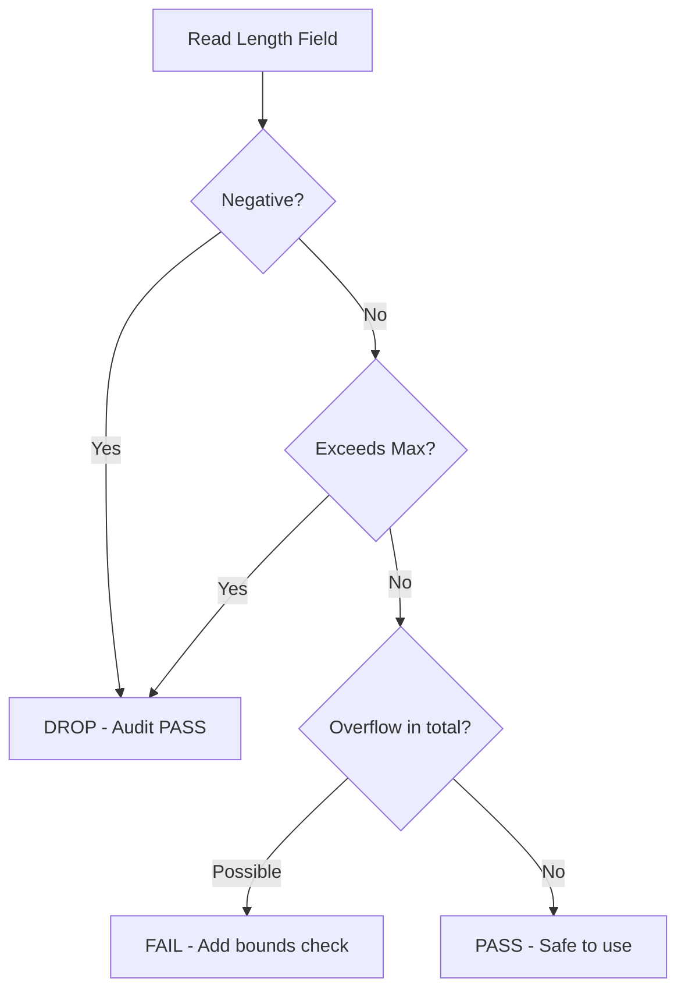

# Auditing the OnData Method in Cilium Network Security

Author: [nawazdhandala](https://github.com/nawazdhandala)

Tags: Cilium, Network Security, Audit, OnData, Code Review, Security

Description: A structured security audit guide for Cilium L7 parser OnData methods, covering memory safety, input validation completeness, state machine correctness, and compliance with proxylib contracts.

---

## Introduction

The OnData method is the most security-sensitive function in any Cilium L7 parser. It directly processes untrusted network data and makes policy enforcement decisions. A formal audit of this method should be conducted whenever the parser is created, significantly modified, or before any release that includes parser changes.

Unlike general code review, a security audit of OnData follows a specific checklist targeting classes of vulnerabilities known to affect protocol parsers: buffer overflows, integer overflows, state confusion, resource exhaustion, and policy bypass. Each check has a clear pass/fail criterion.

This guide provides a repeatable audit methodology for OnData methods in Cilium's proxylib framework, suitable for both self-review and formal security assessment.

## Prerequisites

- Access to the parser source code under audit
- Go 1.21+ with security analysis tools installed
- Understanding of the proxylib Parser interface and return value semantics
- Knowledge of the target protocol's specification
- Previous audit reports for comparison (if available)

## Audit Category 1: Memory Safety

Check every byte access in the OnData method and all functions it calls:

```bash
# Find all slice index operations in the parser
grep -n "\[.*\]" proxylib/myprotocol/myprotocolparser.go | grep -v "func\|type\|import\|//\|string"

# Find all slice range operations
grep -n "\[.*:.*\]" proxylib/myprotocol/myprotocolparser.go
```

For each access found, verify a bounds check exists above it:

```go
// AUDIT FINDING: FAIL — no bounds check before index access
data, _ := reader.PeekSlice(reader.Length())
command := data[4]  // Could panic if len(data) < 5

// AUDIT FINDING: PASS — bounds check precedes access
data, _ := reader.PeekSlice(reader.Length())
if len(data) < 5 {
    return proxylib.MORE, 5
}
command := data[4]  // Safe — len(data) >= 5 guaranteed
```

Create an audit matrix:

| Line | Access | Guard | Verdict |
|------|--------|-------|---------|
| 45 | `data[0:4]` | `if len(data) < 4` at line 42 | PASS |
| 52 | `body[0]` | `if len(body) < 1` at line 50 | PASS |
| 58 | `body[1:5]` | No guard | FAIL |

## Audit Category 2: Integer Safety

Examine all arithmetic operations on values derived from network input:

```bash
# Find arithmetic operations on parsed values
grep -n "<<\|>>\|+\|-\|\*" proxylib/myprotocol/myprotocolparser.go | grep -v "//\|import"
```

Check for overflow in length calculations:

```go
// AUDIT FINDING: FAIL — potential integer overflow
msgLen := int(data[0])<<24 | int(data[1])<<16 | int(data[2])<<8 | int(data[3])
totalLen := 4 + msgLen  // If msgLen is near MaxInt, totalLen overflows

// AUDIT FINDING: PASS — overflow prevented by range check
msgLen := int(data[0])<<24 | int(data[1])<<16 | int(data[2])<<8 | int(data[3])
if msgLen < 0 || msgLen > maxMessageSize {
    return proxylib.DROP, 0
}
totalLen := 4 + msgLen  // Safe — msgLen bounded by maxMessageSize
```



## Audit Category 3: Return Value Correctness

Every return path must satisfy the proxylib contract:

```go
// Document every return path in OnData
// Path 1: No data available
if dataLen == 0 {
    return proxylib.MORE, 1  // AUDIT: PASS — requests minimum 1 byte
}

// Path 2: Partial header
if dataLen < headerSize {
    return proxylib.MORE, headerSize  // AUDIT: PASS — requests header bytes
}

// Path 3: Invalid length
if msgLen <= 0 || msgLen > maxMessageSize {
    return proxylib.DROP, 0  // AUDIT: PASS — drops with 0 bytes
}

// Path 4: Partial body
if dataLen < totalLen {
    return proxylib.MORE, totalLen  // AUDIT: Check — is totalLen > dataLen?
}

// Path 5: Policy denied
if !allowed {
    return proxylib.DROP, 0  // AUDIT: PASS — drops with 0 bytes
}

// Path 6: Success
return proxylib.PASS, totalLen  // AUDIT: Check — is totalLen <= dataLen?
```

Contract rules to verify:

| OpType | Consumed (n) | Invariant |
|--------|-------------|-----------|
| PASS | n > 0 | n <= available data |
| DROP | n == 0 | Always |
| MORE | n > 0 | n > available data |
| ERROR | n == 0 | Always |

## Audit Category 4: State Machine Integrity

Trace all state transitions and verify correctness:

```bash
# Extract all state assignments
grep -n "\.state\s*=" proxylib/myprotocol/myprotocolparser.go
```

Verify these properties:

1. **No backward transitions from terminal states**: Error and Closed states must never transition to Init or Running
2. **All states handled in OnData**: The method must check and handle every possible state value
3. **State is modified only within OnData**: No external goroutine or callback should change parser state

```go
// AUDIT CHECK: Is every state value handled?
func (p *Parser) OnData(reply bool, reader *proxylib.Reader) (proxylib.OpType, int) {
    switch p.state {
    case stateInit:
        p.state = stateRunning
        // fall through to running logic
    case stateRunning:
        // main parsing logic
    case stateError:
        return proxylib.DROP, 0
    case stateClosed:
        return proxylib.DROP, 0
    default:
        // AUDIT FINDING: Is there a default case?
        // Without it, new states added later could fall through silently
        log.Error("Unknown parser state")
        return proxylib.DROP, 0
    }
    // ...
}
```

## Audit Category 5: Error Handling Completeness

Check that every error path is handled explicitly:

```bash
# Find all error returns from called functions
grep -n "err " proxylib/myprotocol/myprotocolparser.go | grep -v "//\|import"

# Find ignored errors (assigned to _)
grep -n "_, *_\|_ =" proxylib/myprotocol/myprotocolparser.go
```

```go
// AUDIT FINDING: FAIL — error ignored
data, _ := reader.PeekSlice(totalLen)

// AUDIT FINDING: PASS — error handled
data, err := reader.PeekSlice(totalLen)
if err != nil {
    log.WithError(err).Warn("Failed to read message data")
    return proxylib.DROP, 0
}
```

## Verification

Generate a formal audit report:

```bash
# Run all tests to confirm no regressions
go test ./proxylib/myprotocol/... -v -race -count=1

# Run security-focused linting
gosec ./proxylib/myprotocol/...

# Generate coverage to identify untested paths
go test ./proxylib/myprotocol/... -coverprofile=audit-coverage.out
go tool cover -func=audit-coverage.out

# Run the fuzzer as part of audit
go test ./proxylib/myprotocol/... -fuzz=FuzzOnData -fuzztime=2m
```

## Troubleshooting

**Problem: Audit finds too many issues to fix at once**
Prioritize by severity: memory safety issues first (panics, buffer overflows), then integer safety, then return value correctness, then state machine issues.

**Problem: Cannot determine if a bounds check is sufficient**
Trace the data flow backward from the access to its source. If the value comes from network input, it must be validated. If it comes from a constant or a previously validated value, document that relationship.

**Problem: Audit scope is unclear for helper functions**
Any function called from OnData that touches the Reader or parsed data is in scope. Utility functions that only operate on validated, bounded values may be audited at lower priority.

**Problem: Previous audit findings were not addressed**
Track audit findings in a structured format (issue tracker or spreadsheet) with clear ownership and deadlines. Re-audit only after all critical findings are resolved.

## Conclusion

Auditing the OnData method requires systematic examination across five categories: memory safety, integer safety, return value correctness, state machine integrity, and error handling completeness. Each category has specific checks that can be partially automated and must be partially reviewed by a human with protocol parsing expertise. Conducting this audit before the parser goes into production — and repeating it after significant changes — is essential for maintaining the security guarantees that Cilium's L7 policy enforcement depends on.
