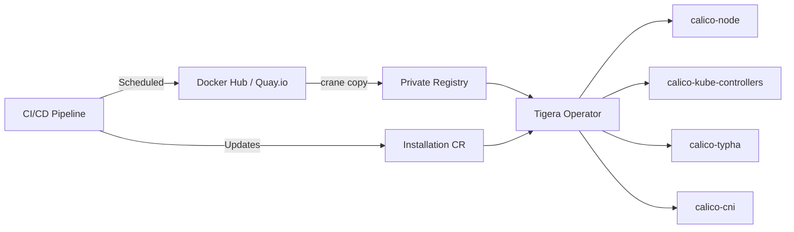

# Automating Calico Alternate Registry Configuration

Author: [nawazdhandala](https://github.com/nawazdhandala)

Tags: Calico, Container Registry, Automation, Kubernetes, DevOps

Description: Learn how to automate Calico alternate registry configuration for air-gapped environments, private registries, and enterprise mirror setups with scripts, Helm values, and CI/CD pipelines.

---

## Introduction

Many enterprise Kubernetes environments cannot pull container images from public registries due to security policies, air-gap requirements, or network restrictions. Calico components need to be configured to pull images from alternate (private) registries instead of the default Docker Hub or quay.io sources.

Manually configuring alternate registries across all Calico components is tedious and error-prone. Each Calico component -- calico-node, calico-kube-controllers, calico-typha, and the CNI plugin -- has its own image reference that must be updated consistently.

This guide covers how to automate Calico alternate registry configuration using Helm values, operator configuration, image mirroring scripts, and CI/CD pipelines.

## Prerequisites

- A running Kubernetes cluster
- Access to a private container registry
- Calico installed via the Tigera operator or Helm
- Docker or crane CLI for image mirroring
- kubectl access with admin privileges

## Mirroring Calico Images to Your Registry

Create a script to mirror all required Calico images:

```bash
#!/bin/bash
# mirror-calico-images.sh
# Mirrors Calico images from public registries to your private registry

set -euo pipefail

CALICO_VERSION="${CALICO_VERSION:-v3.27.0}"
PRIVATE_REGISTRY="${PRIVATE_REGISTRY:-registry.example.com/calico}"

# List of all Calico images to mirror
IMAGES=(
  "docker.io/calico/node:${CALICO_VERSION}"
  "docker.io/calico/cni:${CALICO_VERSION}"
  "docker.io/calico/kube-controllers:${CALICO_VERSION}"
  "docker.io/calico/typha:${CALICO_VERSION}"
  "docker.io/calico/pod2daemon-flexvol:${CALICO_VERSION}"
  "docker.io/calico/csi:${CALICO_VERSION}"
  "docker.io/calico/node-driver-registrar:${CALICO_VERSION}"
  "docker.io/calico/ctl:${CALICO_VERSION}"
)

for image in "${IMAGES[@]}"; do
  # Extract image name and tag
  image_name=$(echo "$image" | sed 's|.*/||')
  target="${PRIVATE_REGISTRY}/${image_name}"

  echo "Mirroring: $image -> $target"

  # Use crane for efficient registry-to-registry copy (no local Docker needed)
  crane copy "$image" "$target"
done

echo "All Calico images mirrored to ${PRIVATE_REGISTRY}"
```

## Configuring the Tigera Operator for Alternate Registry

The Tigera operator manages Calico component images through the Installation resource:

```yaml
# calico-installation-private-registry.yaml
apiVersion: operator.tigera.io/v1
kind: Installation
metadata:
  name: default
spec:
  # Configure the private registry for all Calico components
  registry: registry.example.com
  imagePath: calico
  variant: Calico
  calicoNetwork:
    bgp: Enabled
    ipPools:
      - blockSize: 26
        cidr: 192.168.0.0/16
        encapsulation: VXLANCrossSubnet
        natOutgoing: Enabled
        nodeSelector: all()
```

```bash
# Apply the installation resource
kubectl apply -f calico-installation-private-registry.yaml

# Verify images are being pulled from the private registry
kubectl get pods -n calico-system -o jsonpath='{range .items[*]}{.spec.containers[*].image}{"\n"}{end}'
```

## Automating with Helm Values

If installing Calico via Helm, configure the registry in values:

```yaml
# calico-helm-values.yaml
installation:
  enabled: true
  registry: registry.example.com
  imagePath: calico

# For image pull secrets (if registry requires authentication)
imagePullSecrets:
  - name: calico-registry-secret
```

```bash
# Create the image pull secret
kubectl create secret docker-registry calico-registry-secret \
  -n calico-system \
  --docker-server=registry.example.com \
  --docker-username=calico-pull \
  --docker-password="${REGISTRY_PASSWORD}"

# Install or upgrade Calico with Helm
helm upgrade --install calico projectcalico/tigera-operator \
  -f calico-helm-values.yaml \
  --namespace tigera-operator \
  --create-namespace
```

## CI/CD Pipeline for Image Synchronization

Automate image mirroring on new Calico releases:

```yaml
# .github/workflows/mirror-calico-images.yaml
name: Mirror Calico Images
on:
  schedule:
    - cron: '0 6 * * 1'  # Weekly on Monday at 6 AM
  workflow_dispatch:
    inputs:
      calico_version:
        description: 'Calico version to mirror'
        required: true
        default: 'v3.27.0'

jobs:
  mirror:
    runs-on: ubuntu-latest
    steps:
      - uses: actions/checkout@v4

      - name: Install crane
        run: |
          VERSION=$(curl -s "https://api.github.com/repos/google/go-containerregistry/releases/latest" | jq -r '.tag_name')
          curl -sL "https://github.com/google/go-containerregistry/releases/download/${VERSION}/go-containerregistry_Linux_x86_64.tar.gz" | tar -xzf - crane
          sudo mv crane /usr/local/bin/

      - name: Login to private registry
        run: crane auth login registry.example.com -u ${{ secrets.REGISTRY_USER }} -p ${{ secrets.REGISTRY_PASS }}

      - name: Mirror Calico images
        env:
          CALICO_VERSION: ${{ github.event.inputs.calico_version || 'v3.27.0' }}
          PRIVATE_REGISTRY: registry.example.com/calico
        run: bash mirror-calico-images.sh

      - name: Verify mirrored images
        run: |
          crane ls registry.example.com/calico/node | tail -5
```



## Verification

```bash
# Verify all Calico pods use the private registry
kubectl get pods -n calico-system -o jsonpath='{range .items[*]}{.metadata.name}{"\t"}{.spec.containers[*].image}{"\n"}{end}'

# Verify the Installation resource has the correct registry
kubectl get installation default -o jsonpath='{.spec.registry}'

# Check for image pull errors
kubectl get events -n calico-system --field-selector reason=Failed | grep -i pull

# Verify images exist in private registry
crane ls registry.example.com/calico/node
```

## Troubleshooting

- **ImagePullBackOff**: The image does not exist in the private registry or the pull secret is missing. Verify with `crane ls` and check that the `imagePullSecrets` are configured on the service account.
- **"unauthorized: authentication required"**: The image pull secret credentials are incorrect or expired. Recreate the secret with valid credentials.
- **Wrong image tags after upgrade**: The mirror script must be run before upgrading Calico. Add the mirroring step as a prerequisite in your upgrade pipeline.
- **Operator not using private registry**: Ensure the `registry` and `imagePath` fields in the Installation resource are set correctly. The operator overrides individual pod image references.

## Conclusion

Automating Calico alternate registry configuration ensures that air-gapped and enterprise environments can reliably deploy and upgrade Calico without depending on public registries. By combining image mirroring scripts, operator configuration, Helm values, and CI/CD pipelines, you create a repeatable process that keeps your private registry in sync with Calico releases and ensures all components pull from the correct source.
