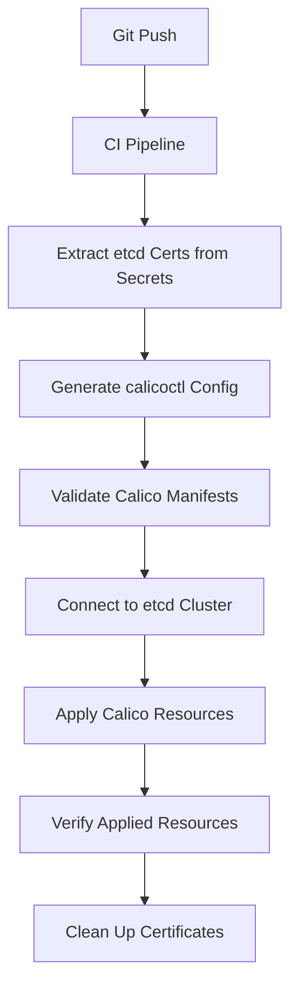

# Automating Calicoctl etcd Configuration

Author: [nawazdhandala](https://github.com/nawazdhandala)

Tags: Calico, etcd, Automation, Kubernetes, calicoctl

Description: Learn how to automate calicoctl etcd datastore configuration using scripts, configuration management tools, and CI/CD pipelines for consistent and repeatable deployments.

---

## Introduction

When Calico uses etcd as its datastore backend, calicoctl must be configured with the correct etcd endpoints, TLS certificates, and authentication parameters. Manually configuring these settings across multiple environments and team members is error-prone and does not scale.

Automating calicoctl etcd configuration ensures consistency across development, staging, and production environments. It eliminates the risk of misconfigured endpoints or expired certificates causing connectivity failures during critical operations.

This guide covers practical automation strategies for calicoctl etcd configuration, including scripted setup, environment variable management, configuration templating, and CI/CD integration.

## Prerequisites

- A Calico cluster using the etcd datastore backend
- calicoctl v3.27 or later
- Access to the etcd cluster endpoints and TLS certificates
- Bash shell environment
- Familiarity with etcd and TLS certificate management

## Understanding Calicoctl etcd Configuration

Calicoctl connects to etcd using a configuration file or environment variables:

```yaml
# /etc/calicoctl/calicoctl.cfg
apiVersion: projectcalico.org/v3
kind: CalicoAPIConfig
metadata:
spec:
  datastoreType: "etcdv3"
  etcdEndpoints: "https://etcd1:2379,https://etcd2:2379,https://etcd3:2379"
  etcdKeyFile: "/etc/calico/certs/key.pem"
  etcdCertFile: "/etc/calico/certs/cert.pem"
  etcdCACertFile: "/etc/calico/certs/ca.pem"
```

Equivalent environment variables:

```bash
export DATASTORE_TYPE=etcdv3
export ETCD_ENDPOINTS=https://etcd1:2379,https://etcd2:2379,https://etcd3:2379
export ETCD_KEY_FILE=/etc/calico/certs/key.pem
export ETCD_CERT_FILE=/etc/calico/certs/cert.pem
export ETCD_CA_CERT_FILE=/etc/calico/certs/ca.pem
```

## Automating Configuration with a Setup Script

Create a bootstrap script that detects the environment and configures calicoctl accordingly:

```bash
#!/bin/bash
# setup-calicoctl-etcd.sh
# Automated calicoctl etcd configuration setup

set -euo pipefail

# Configuration variables -- set these for your environment
ETCD_ENDPOINTS="${ETCD_ENDPOINTS:-https://127.0.0.1:2379}"
CERT_DIR="${CERT_DIR:-/etc/calico/certs}"
CONFIG_DIR="/etc/calicoctl"
CONFIG_FILE="${CONFIG_DIR}/calicoctl.cfg"

# Validate that certificate files exist
for cert_file in "${CERT_DIR}/key.pem" "${CERT_DIR}/cert.pem" "${CERT_DIR}/ca.pem"; do
    if [ ! -f "$cert_file" ]; then
        echo "ERROR: Certificate file not found: $cert_file"
        exit 1
    fi
done

# Validate certificate expiry
CERT_EXPIRY=$(openssl x509 -enddate -noout -in "${CERT_DIR}/cert.pem" | cut -d= -f2)
EXPIRY_EPOCH=$(date -d "$CERT_EXPIRY" +%s 2>/dev/null || date -j -f "%b %d %T %Y %Z" "$CERT_EXPIRY" +%s)
NOW_EPOCH=$(date +%s)
DAYS_REMAINING=$(( (EXPIRY_EPOCH - NOW_EPOCH) / 86400 ))

if [ "$DAYS_REMAINING" -lt 30 ]; then
    echo "WARNING: Certificate expires in $DAYS_REMAINING days"
fi

# Create configuration directory
sudo mkdir -p "$CONFIG_DIR"

# Generate the calicoctl configuration file
sudo tee "$CONFIG_FILE" > /dev/null <<EOF
apiVersion: projectcalico.org/v3
kind: CalicoAPIConfig
metadata:
spec:
  datastoreType: "etcdv3"
  etcdEndpoints: "${ETCD_ENDPOINTS}"
  etcdKeyFile: "${CERT_DIR}/key.pem"
  etcdCertFile: "${CERT_DIR}/cert.pem"
  etcdCACertFile: "${CERT_DIR}/ca.pem"
EOF

# Set restrictive permissions
sudo chmod 600 "$CONFIG_FILE"
sudo chmod 700 "$CONFIG_DIR"

# Verify the configuration works
echo "Testing calicoctl etcd connection..."
if calicoctl get nodes --config="$CONFIG_FILE" > /dev/null 2>&1; then
    echo "SUCCESS: calicoctl etcd configuration is valid"
else
    echo "ERROR: calicoctl could not connect to etcd"
    exit 1
fi

echo "Configuration written to: $CONFIG_FILE"
```

## Templating with Ansible

For teams managing multiple clusters, use Ansible to deploy consistent calicoctl configurations:

```yaml
# roles/calicoctl/tasks/main.yml
---
- name: Create calicoctl configuration directory
  file:
    path: /etc/calicoctl
    state: directory
    mode: "0700"
    owner: root
    group: root

- name: Copy etcd TLS certificates
  copy:
    src: "{{ item.src }}"
    dest: "/etc/calico/certs/{{ item.dest }}"
    mode: "0600"
    owner: root
    group: root
  loop:
    - { src: "certs/{{ env }}/etcd-key.pem", dest: "key.pem" }
    - { src: "certs/{{ env }}/etcd-cert.pem", dest: "cert.pem" }
    - { src: "certs/{{ env }}/etcd-ca.pem", dest: "ca.pem" }

- name: Generate calicoctl configuration
  template:
    src: calicoctl.cfg.j2
    dest: /etc/calicoctl/calicoctl.cfg
    mode: "0600"
    owner: root
    group: root

- name: Verify calicoctl connectivity
  command: calicoctl get nodes --config=/etc/calicoctl/calicoctl.cfg
  environment:
    DATASTORE_TYPE: etcdv3
  register: calico_check
  changed_when: false
```

```yaml
# roles/calicoctl/templates/calicoctl.cfg.j2
apiVersion: projectcalico.org/v3
kind: CalicoAPIConfig
metadata:
spec:
  datastoreType: "etcdv3"
  etcdEndpoints: "{{ etcd_endpoints | join(',') }}"
  etcdKeyFile: "/etc/calico/certs/key.pem"
  etcdCertFile: "/etc/calico/certs/cert.pem"
  etcdCACertFile: "/etc/calico/certs/ca.pem"
```

## CI/CD Integration

Integrate automated etcd configuration into your deployment pipeline:

```yaml
# .github/workflows/calico-etcd-deploy.yaml
name: Deploy Calico etcd Configuration
on:
  push:
    branches: [main]
    paths: ['calico-config/**']

jobs:
  deploy:
    runs-on: ubuntu-latest
    steps:
      - uses: actions/checkout@v4

      - name: Install calicoctl
        run: |
          curl -L https://github.com/projectcalico/calico/releases/download/v3.27.0/calicoctl-linux-amd64 -o calicoctl
          chmod +x calicoctl
          sudo mv calicoctl /usr/local/bin/

      - name: Configure etcd certificates
        run: |
          mkdir -p /tmp/calico-certs
          echo "${{ secrets.ETCD_CA_CERT }}" > /tmp/calico-certs/ca.pem
          echo "${{ secrets.ETCD_CLIENT_CERT }}" > /tmp/calico-certs/cert.pem
          echo "${{ secrets.ETCD_CLIENT_KEY }}" > /tmp/calico-certs/key.pem
          chmod 600 /tmp/calico-certs/*.pem

      - name: Apply Calico resources
        env:
          DATASTORE_TYPE: etcdv3
          ETCD_ENDPOINTS: ${{ secrets.ETCD_ENDPOINTS }}
          ETCD_KEY_FILE: /tmp/calico-certs/key.pem
          ETCD_CERT_FILE: /tmp/calico-certs/cert.pem
          ETCD_CA_CERT_FILE: /tmp/calico-certs/ca.pem
        run: |
          calicoctl apply -f calico-config/policies/

      - name: Clean up certificates
        if: always()
        run: rm -rf /tmp/calico-certs
```



## Verification

```bash
# Verify the automated configuration
calicoctl get nodes --config=/etc/calicoctl/calicoctl.cfg

# Check etcd connectivity with etcdctl for comparison
etcdctl --endpoints=${ETCD_ENDPOINTS} \
  --cert=/etc/calico/certs/cert.pem \
  --key=/etc/calico/certs/key.pem \
  --cacert=/etc/calico/certs/ca.pem \
  endpoint health

# Verify all expected resources exist
calicoctl get ippools -o yaml --config=/etc/calicoctl/calicoctl.cfg
calicoctl get globalnetworkpolicies --config=/etc/calicoctl/calicoctl.cfg
```

## Troubleshooting

- **"context deadline exceeded"**: etcd endpoints are unreachable. Verify network connectivity and that the etcd cluster is healthy with `etcdctl endpoint health`.
- **"certificate signed by unknown authority"**: The CA certificate does not match. Ensure `etcdCACertFile` points to the CA that signed the etcd server certificates.
- **"permission denied" on cert files**: The user running calicoctl does not have read permissions on the certificate files. Check ownership and permissions with `ls -la /etc/calico/certs/`.
- **"transport: authentication handshake failed"**: The client certificate is not authorized by etcd. Verify the certificate CN/SANs are in etcd's trusted client list.

## Conclusion

Automating calicoctl etcd configuration removes the manual overhead and inconsistency of hand-configured environments. Whether you use shell scripts for simple setups, Ansible for fleet management, or CI/CD pipelines for GitOps workflows, the key principles remain the same: validate certificates, template configurations, test connectivity, and secure credentials. This automation foundation enables reliable Calico network policy management across all your environments.
