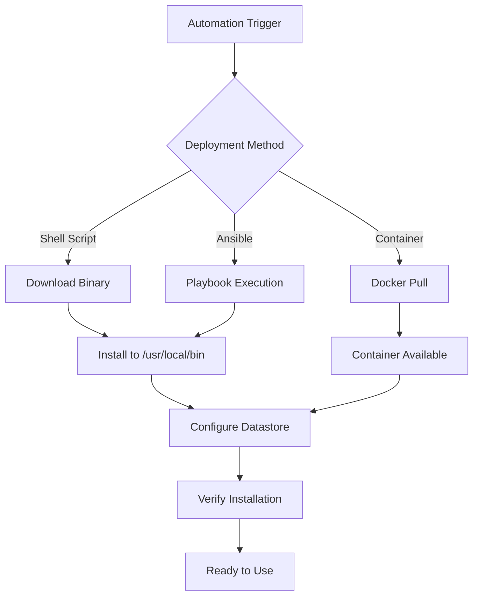

# How to Automate Calicoctl Installation

Author: [nawazdhandala](https://github.com/nawazdhandala)

Tags: Calico, calicoctl, Automation, Installation, DevOps

Description: A practical guide to automating calicoctl installation across environments using scripts, configuration management, and CI/CD pipelines, ensuring consistent and repeatable deployments.

---

## Introduction

Calicoctl is the command-line tool for managing Calico resources directly. Manually installing it on every machine that needs it leads to version inconsistencies, forgotten updates, and machines with outdated or missing tools. Automating calicoctl installation ensures every environment has the correct version and configuration.

This guide covers automating calicoctl installation using shell scripts, Ansible, and container-based approaches. We also cover configuring calicoctl to connect to your Calico datastore automatically after installation, so the tool is ready to use immediately.

Automation is especially important for calicoctl because version mismatches between calicoctl and the Calico cluster can cause unexpected behavior or API errors.

## Prerequisites

- Target systems running Linux (amd64 or arm64)
- Network access to download calicoctl binaries or a local artifact repository
- Configuration management tool (Ansible, Chef, Puppet) or CI/CD pipeline
- Calico datastore connection details (etcd or Kubernetes API)

## Automated Installation Script

Create a portable installation script that handles version management.

```bash
#!/bin/bash
# install-calicoctl.sh
# Automated calicoctl installation script
# Usage: ./install-calicoctl.sh [version]

set -euo pipefail

# Configuration
CALICO_VERSION="${1:-v3.27.0}"
INSTALL_DIR="/usr/local/bin"
ARCH=$(uname -m)

# Map architecture names
case ${ARCH} in
  x86_64) ARCH="amd64" ;;
  aarch64) ARCH="arm64" ;;
  *) echo "Unsupported architecture: ${ARCH}"; exit 1 ;;
esac

OS=$(uname -s | tr '[:upper:]' '[:lower:]')

echo "Installing calicoctl ${CALICO_VERSION} for ${OS}/${ARCH}..."

# Download the binary
DOWNLOAD_URL="https://github.com/projectcalico/calico/releases/download/${CALICO_VERSION}/calicoctl-${OS}-${ARCH}"
curl -fsSL -o /tmp/calicoctl "${DOWNLOAD_URL}"

# Verify the download
if [ ! -s /tmp/calicoctl ]; then
  echo "ERROR: Download failed or empty file"
  exit 1
fi

# Install the binary
sudo install -o root -g root -m 0755 /tmp/calicoctl "${INSTALL_DIR}/calicoctl"
rm -f /tmp/calicoctl

# Verify installation
echo "Installed: $(calicoctl version 2>/dev/null | head -1)"
echo "Location: $(which calicoctl)"
```

## Ansible Playbook for Installation

```yaml
# install-calicoctl.yaml
# Ansible playbook for automated calicoctl installation
---
- name: Install calicoctl
  hosts: calico_management
  become: true
  vars:
    calico_version: "v3.27.0"
    install_dir: "/usr/local/bin"

  tasks:
    - name: Determine system architecture
      set_fact:
        calico_arch: "{{ 'amd64' if ansible_architecture == 'x86_64' else 'arm64' }}"

    - name: Download calicoctl binary
      get_url:
        url: "https://github.com/projectcalico/calico/releases/download/{{ calico_version }}/calicoctl-linux-{{ calico_arch }}"
        dest: "{{ install_dir }}/calicoctl"
        mode: '0755'
        owner: root
        group: root
      notify: Verify calicoctl

    - name: Create calicoctl configuration directory
      file:
        path: /etc/calico
        state: directory
        mode: '0755'

    - name: Deploy calicoctl configuration
      template:
        src: calicoctl.cfg.j2
        dest: /etc/calico/calicoctl.cfg
        mode: '0644'

  handlers:
    - name: Verify calicoctl
      command: calicoctl version
      register: version_output
      changed_when: false
```

Create the configuration template:

```yaml
# templates/calicoctl.cfg.j2
# calicoctl configuration file
apiVersion: projectcalico.org/v3
kind: CalicoAPIConfig
metadata:
spec:
  datastoreType: "kubernetes"
  kubeconfig: "/root/.kube/config"
```



## Container-Based Installation

For environments that prefer containers, use calicoctl as a container.

```bash
#!/bin/bash
# install-calicoctl-container.sh
# Install calicoctl as a container alias

CALICO_VERSION="${1:-v3.27.0}"

# Pull the calicoctl container image
docker pull calico/ctl:${CALICO_VERSION}

# Create a shell alias for calicoctl
cat << 'EOF' | sudo tee /usr/local/bin/calicoctl
#!/bin/bash
# calicoctl wrapper using container
docker run --rm -i --net=host   -v /etc/calico:/etc/calico:ro   -v /root/.kube:/root/.kube:ro   calico/ctl:v3.27.0 "$@"
EOF

sudo chmod +x /usr/local/bin/calicoctl

# Verify
calicoctl version
```

## CI/CD Pipeline Integration

Add calicoctl installation to your CI/CD pipeline.

```yaml
# .gitlab-ci.yml example
# Install calicoctl in CI pipeline
stages:
  - setup
  - validate

install-calicoctl:
  stage: setup
  script:
    - CALICO_VERSION="v3.27.0"
    - curl -fsSL -o /usr/local/bin/calicoctl
        "https://github.com/projectcalico/calico/releases/download/${CALICO_VERSION}/calicoctl-linux-amd64"
    - chmod +x /usr/local/bin/calicoctl
    - calicoctl version

validate-calico-config:
  stage: validate
  script:
    # Validate Calico resource files
    - calicoctl apply --dry-run -f calico-policies/
```

## Verification

```bash
#!/bin/bash
# verify-calicoctl-install.sh
echo "=== Calicoctl Installation Verification ==="

echo "Binary location:"
which calicoctl

echo ""
echo "Version:"
calicoctl version

echo ""
echo "Configuration:"
if [ -f /etc/calico/calicoctl.cfg ]; then
  echo "Config file: /etc/calico/calicoctl.cfg"
  cat /etc/calico/calicoctl.cfg
else
  echo "No config file found (using defaults or environment variables)"
fi

echo ""
echo "Datastore connectivity:"
calicoctl get nodes -o name 2>/dev/null && echo "Connected" || echo "Cannot connect to datastore"
```

## Troubleshooting

- **Download fails**: Check network connectivity. If behind a proxy, configure curl proxy settings. Consider hosting the binary in an internal artifact repository.
- **Permission denied**: Ensure the binary has execute permissions. Verify the install directory is in the PATH.
- **Version mismatch**: Pin the calicoctl version to match your Calico cluster version. Include version checks in your automation.
- **Datastore connection fails after install**: Verify the calicoctl configuration file exists at `/etc/calico/calicoctl.cfg` and contains correct datastore connection details.

## Conclusion

Automating calicoctl installation ensures consistency across all environments and eliminates manual installation errors. Whether you use shell scripts, Ansible, or container-based approaches, the key is to pin versions, configure datastore connectivity automatically, and verify the installation as part of the automation. Include calicoctl installation in your infrastructure provisioning pipeline alongside other essential tools.
