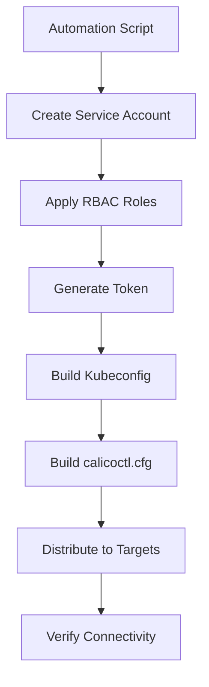

# How to Automate Calicoctl Kubernetes API Datastore Configuration

Author: [nawazdhandala](https://github.com/nawazdhandala)

Tags: Calico, calicoctl, Kubernetes, Datastore, Automation

Description: A guide to automating the configuration of calicoctl to use the Kubernetes API as its datastore, covering kubeconfig management, service account setup, and CI/CD integration.

---

## Introduction

When Calico uses the Kubernetes API as its datastore, calicoctl needs a valid kubeconfig to communicate with the cluster. Manually configuring this on every machine that needs calicoctl is error-prone and does not scale. Automating the configuration ensures consistent datastore connectivity across all management machines, CI/CD pipelines, and operator workstations.

This guide covers automating the calicoctl Kubernetes API datastore configuration, from creating dedicated service accounts with appropriate RBAC to distributing configurations through automation tools. The goal is zero-touch calicoctl configuration on any system that needs cluster access.

Automating datastore configuration is especially important in environments with multiple clusters, where operators need to switch between clusters and each needs a correct calicoctl configuration.

## Prerequisites

- A Kubernetes cluster with Calico using the Kubernetes API datastore
- `kubectl` with cluster-admin access for initial setup
- Configuration management tools (Ansible, scripts) for distribution
- Understanding of Kubernetes RBAC and service accounts

## Creating a Dedicated Service Account

Create a service account specifically for calicoctl with appropriate RBAC permissions.

```yaml
# calicoctl-sa.yaml
# Service account and RBAC for calicoctl
apiVersion: v1
kind: ServiceAccount
metadata:
  name: calicoctl
  namespace: kube-system
---
apiVersion: rbac.authorization.k8s.io/v1
kind: ClusterRole
metadata:
  name: calicoctl-role
rules:
  # Calico custom resources
  - apiGroups: ["projectcalico.org"]
    resources: ["*"]
    verbs: ["get", "list", "watch", "create", "update", "patch", "delete"]
  # Kubernetes resources that calicoctl needs
  - apiGroups: [""]
    resources: ["nodes", "namespaces", "pods"]
    verbs: ["get", "list", "watch"]
  # Networking resources
  - apiGroups: ["networking.k8s.io"]
    resources: ["networkpolicies"]
    verbs: ["get", "list", "watch"]
---
apiVersion: rbac.authorization.k8s.io/v1
kind: ClusterRoleBinding
metadata:
  name: calicoctl-binding
roleRef:
  apiGroup: rbac.authorization.k8s.io
  kind: ClusterRole
  name: calicoctl-role
subjects:
  - kind: ServiceAccount
    name: calicoctl
    namespace: kube-system
```

```bash
# Apply the service account and RBAC
kubectl apply -f calicoctl-sa.yaml

# Create a long-lived token (for Kubernetes 1.24+)
kubectl apply -f - << 'EOF'
apiVersion: v1
kind: Secret
metadata:
  name: calicoctl-token
  namespace: kube-system
  annotations:
    kubernetes.io/service-account.name: calicoctl
type: kubernetes.io/service-account-token
EOF
```

## Generating the Kubeconfig Automatically

```bash
#!/bin/bash
# generate-calicoctl-kubeconfig.sh
# Generate a kubeconfig for calicoctl from the service account

set -euo pipefail

SA_NAME="calicoctl"
NAMESPACE="kube-system"
SECRET_NAME="calicoctl-token"
OUTPUT_FILE="${1:-/tmp/calicoctl-kubeconfig}"

# Get the cluster API server
API_SERVER=$(kubectl config view --minify -o jsonpath='{.clusters[0].cluster.server}')

# Get the CA certificate
CA_CERT=$(kubectl get secret ${SECRET_NAME} -n ${NAMESPACE} -o jsonpath='{.data.ca\.crt}')

# Get the token
TOKEN=$(kubectl get secret ${SECRET_NAME} -n ${NAMESPACE} -o jsonpath='{.data.token}' | base64 --decode)

# Generate kubeconfig
cat > ${OUTPUT_FILE} << KUBECONFIG
apiVersion: v1
kind: Config
clusters:
  - name: calico-cluster
    cluster:
      server: ${API_SERVER}
      certificate-authority-data: ${CA_CERT}
contexts:
  - name: calicoctl
    context:
      cluster: calico-cluster
      user: calicoctl
current-context: calicoctl
users:
  - name: calicoctl
    user:
      token: ${TOKEN}
KUBECONFIG

echo "Kubeconfig generated: ${OUTPUT_FILE}"

# Generate the calicoctl configuration
CALICO_CFG_FILE="${OUTPUT_FILE%.kubeconfig}.cfg"
if [ "${CALICO_CFG_FILE}" = "${OUTPUT_FILE}.cfg" ]; then
  CALICO_CFG_FILE="${OUTPUT_FILE}-calico.cfg"
fi

cat > ${CALICO_CFG_FILE} << CALICOCFG
apiVersion: projectcalico.org/v3
kind: CalicoAPIConfig
metadata:
spec:
  datastoreType: "kubernetes"
  kubeconfig: "${OUTPUT_FILE}"
CALICOCFG

echo "Calico config generated: ${CALICO_CFG_FILE}"
```



## Ansible Automation

```yaml
# configure-calicoctl-datastore.yaml
# Ansible playbook to configure calicoctl Kubernetes datastore
---
- name: Configure calicoctl Kubernetes API datastore
  hosts: calico_management
  become: true
  vars:
    kubeconfig_src: "/tmp/calicoctl-kubeconfig"
    calico_config_dir: "/etc/calico"

  tasks:
    - name: Create Calico configuration directory
      file:
        path: "{{ calico_config_dir }}"
        state: directory
        mode: '0755'

    - name: Copy kubeconfig for calicoctl
      copy:
        src: "{{ kubeconfig_src }}"
        dest: "{{ calico_config_dir }}/kubeconfig"
        mode: '0600'
        owner: root

    - name: Create calicoctl configuration
      copy:
        content: |
          apiVersion: projectcalico.org/v3
          kind: CalicoAPIConfig
          metadata:
          spec:
            datastoreType: "kubernetes"
            kubeconfig: "{{ calico_config_dir }}/kubeconfig"
        dest: "{{ calico_config_dir }}/calicoctl.cfg"
        mode: '0644'

    - name: Verify calicoctl connectivity
      command: calicoctl get nodes -o name
      register: verify_result
      changed_when: false

    - name: Display verification result
      debug:
        msg: "calicoctl connected successfully. Nodes: {{ verify_result.stdout_lines | length }}"
```

## Multi-Cluster Configuration

For environments with multiple clusters, automate configuration switching.

```bash
#!/bin/bash
# setup-multi-cluster-calicoctl.sh
# Configure calicoctl for multiple Kubernetes clusters

CALICO_DIR="/etc/calico"
CLUSTERS=("prod-cluster" "staging-cluster" "dev-cluster")

for cluster in "${CLUSTERS[@]}"; do
  echo "Configuring calicoctl for ${cluster}..."

  # Generate cluster-specific config
  mkdir -p ${CALICO_DIR}/clusters/${cluster}

  cat > ${CALICO_DIR}/clusters/${cluster}/calicoctl.cfg << EOF
apiVersion: projectcalico.org/v3
kind: CalicoAPIConfig
metadata:
spec:
  datastoreType: "kubernetes"
  kubeconfig: "${CALICO_DIR}/clusters/${cluster}/kubeconfig"
EOF
done

# Create a cluster switching script
cat > /usr/local/bin/calicoctl-use << 'SCRIPT'
#!/bin/bash
CLUSTER="${1:?Usage: calicoctl-use <cluster-name>}"
CONFIG="/etc/calico/clusters/${CLUSTER}/calicoctl.cfg"
if [ -f "${CONFIG}" ]; then
  export CALICO_DATASTORE_TYPE=kubernetes
  export CALICO_KUBECONFIG="/etc/calico/clusters/${CLUSTER}/kubeconfig"
  echo "Switched to cluster: ${CLUSTER}"
  calicoctl get nodes -o name
else
  echo "Unknown cluster: ${CLUSTER}"
  echo "Available: $(ls /etc/calico/clusters/)"
fi
SCRIPT

chmod +x /usr/local/bin/calicoctl-use
```

## Verification

```bash
#!/bin/bash
# verify-datastore-config.sh
echo "=== Datastore Configuration Verification ==="

echo "Configuration file:"
cat /etc/calico/calicoctl.cfg

echo ""
echo "Kubeconfig exists:"
KUBECONFIG_PATH=$(grep kubeconfig /etc/calico/calicoctl.cfg | awk '{print $2}' | tr -d '"')
ls -la "${KUBECONFIG_PATH}" 2>/dev/null || echo "NOT FOUND"

echo ""
echo "Datastore connectivity:"
calicoctl get nodes -o wide 2>&1

echo ""
echo "API access test:"
calicoctl get ippools -o wide 2>&1
```

## Troubleshooting

- **Token expired**: Kubernetes service account tokens created via Secrets do not expire. If using bound tokens (Kubernetes 1.22+), they may expire. Use the Secret-based approach for long-lived tokens.
- **Permission denied on Calico resources**: Check the ClusterRole rules. Verify the apiGroup is `projectcalico.org` and all needed resource types are listed.
- **Kubeconfig works with kubectl but not calicoctl**: Verify the calicoctl.cfg points to the correct kubeconfig path. Calicoctl reads its own config file first, not the KUBECONFIG environment variable.
- **Multi-cluster switching not working**: Ensure environment variables are exported in the current shell. The switching script must be sourced, not executed, for environment changes to persist.

## Conclusion

Automating calicoctl Kubernetes API datastore configuration eliminates manual setup steps and ensures consistent connectivity across all management systems. By creating dedicated service accounts, generating kubeconfigs automatically, and distributing configurations through Ansible, you achieve zero-touch calicoctl setup. For multi-cluster environments, the cluster switching script provides a convenient way to manage calicoctl context.
