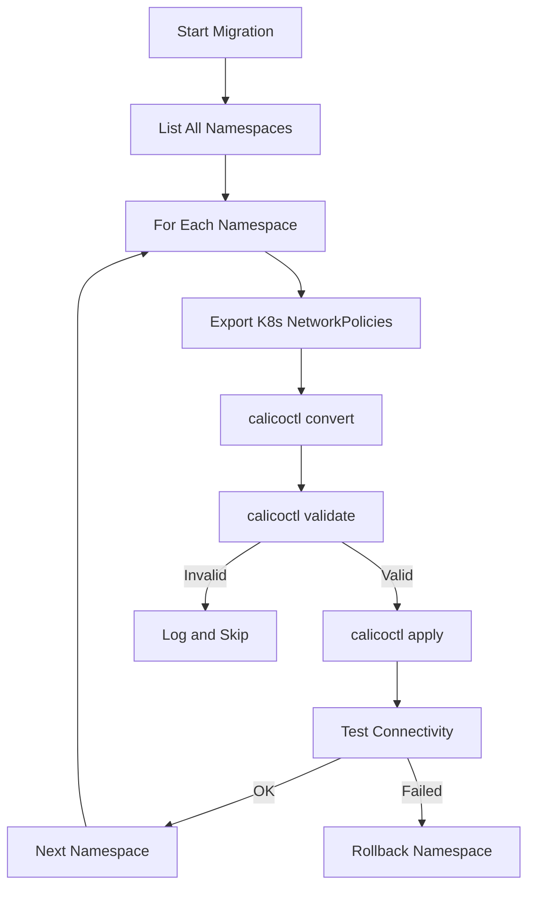

# How to Automate Cluster Changes with calicoctl convert

Author: [nawazdhandala](https://github.com/nawazdhandala)

Tags: Calico, Kubernetes, Automation, Migration, Calicoctl

Description: Learn how to automate the conversion of Kubernetes NetworkPolicies to Calico format using CI/CD pipelines, batch scripts, and migration workflows.

---

## Introduction

Migrating from Kubernetes NetworkPolicy to Calico NetworkPolicy across a large cluster involves converting dozens or hundreds of policies. Doing this manually is impractical and error-prone. Automating the conversion with `calicoctl convert` ensures consistency, enables repeatable migrations, and allows you to integrate the conversion into CI/CD pipelines.

This guide covers automation patterns for calicoctl convert, including batch conversion scripts, CI/CD pipeline integration, and automated migration workflows.

## Prerequisites

- calicoctl v3.27 or later
- kubectl access to the cluster
- CI/CD platform for automation
- Python 3 for scripting

## Automated Batch Conversion

Convert all Kubernetes NetworkPolicies from a cluster to Calico format:

```bash
#!/bin/bash
# auto-convert-all.sh
# Automatically converts all K8s NetworkPolicies to Calico format

set -euo pipefail

OUTPUT_DIR="${1:-./calico-policies}"
REPORT_FILE="${OUTPUT_DIR}/conversion-report.json"
mkdir -p "$OUTPUT_DIR"

TOTAL=0
SUCCESS=0
FAILED=0

echo "[]" > "$REPORT_FILE"

# Export and convert each policy
kubectl get networkpolicies --all-namespaces -o json | python3 -c "
import json, sys, subprocess, os

output_dir = '$OUTPUT_DIR'
data = json.load(sys.stdin)
report = []

for item in data['items']:
    ns = item['metadata']['namespace']
    name = item['metadata']['name']
    ns_dir = os.path.join(output_dir, ns)
    os.makedirs(ns_dir, exist_ok=True)

    # Write the K8s policy to a temp file
    k8s_file = f'/tmp/k8s-{ns}-{name}.yaml'
    import yaml
    with open(k8s_file, 'w') as f:
        yaml.dump(item, f, default_flow_style=False)

    # Convert
    try:
        result = subprocess.run(
            ['calicoctl', 'convert', '-f', k8s_file, '-o', 'yaml'],
            capture_output=True, text=True, check=True
        )
        calico_file = os.path.join(ns_dir, f'{name}.yaml')
        with open(calico_file, 'w') as f:
            f.write(result.stdout)
        report.append({'namespace': ns, 'name': name, 'status': 'success', 'file': calico_file})
        print(f'OK: {ns}/{name}')
    except subprocess.CalledProcessError as e:
        report.append({'namespace': ns, 'name': name, 'status': 'failed', 'error': e.stderr})
        print(f'FAIL: {ns}/{name} - {e.stderr.strip()}')

    os.remove(k8s_file)

with open('$REPORT_FILE', 'w') as f:
    json.dump(report, f, indent=2)

success = sum(1 for r in report if r['status'] == 'success')
failed = sum(1 for r in report if r['status'] == 'failed')
print(f'\\nTotal: {len(report)}, Success: {success}, Failed: {failed}')
"

echo "Report: $REPORT_FILE"
```

## CI/CD Pipeline for Migration

```yaml
# .github/workflows/convert-k8s-policies.yaml
name: Convert K8s NetworkPolicies
on:
  workflow_dispatch:
    inputs:
      namespace:
        description: 'Namespace to convert (or "all")'
        required: true
        default: 'all'

jobs:
  convert:
    runs-on: ubuntu-latest
    steps:
      - uses: actions/checkout@v4

      - name: Install tools
        run: |
          curl -L https://github.com/projectcalico/calico/releases/download/v3.27.0/calicoctl-linux-amd64 -o calicoctl
          chmod +x calicoctl && sudo mv calicoctl /usr/local/bin/

      - name: Export and convert policies
        run: |
          NS_FLAG=""
          if [ "${{ github.event.inputs.namespace }}" != "all" ]; then
            NS_FLAG="-n ${{ github.event.inputs.namespace }}"
          else
            NS_FLAG="--all-namespaces"
          fi

          mkdir -p converted-policies
          kubectl get networkpolicies $NS_FLAG -o yaml > /tmp/all-policies.yaml

          # Split and convert each policy
          python3 -c "
          import yaml, subprocess, os
          with open('/tmp/all-policies.yaml') as f:
              data = yaml.safe_load(f)
          for item in data.get('items', [data]):
              ns = item['metadata']['namespace']
              name = item['metadata']['name']
              os.makedirs(f'converted-policies/{ns}', exist_ok=True)
              with open(f'/tmp/temp-{name}.yaml', 'w') as f:
                  yaml.dump(item, f)
              result = subprocess.run(['calicoctl', 'convert', '-f', f'/tmp/temp-{name}.yaml', '-o', 'yaml'],
                  capture_output=True, text=True)
              if result.returncode == 0:
                  with open(f'converted-policies/{ns}/{name}.yaml', 'w') as f:
                      f.write(result.stdout)
          "

      - name: Validate converted policies
        run: |
          find converted-policies -name "*.yaml" | while read f; do
            calicoctl validate -f "$f" || echo "WARN: $f failed validation"
          done

      - name: Create PR with converted policies
        run: |
          git checkout -b convert-policies-$(date +%Y%m%d)
          git add converted-policies/
          git commit -m "Convert K8s NetworkPolicies to Calico format"
          git push origin HEAD
          gh pr create --title "Convert K8s NetworkPolicies to Calico format" \
            --body "Automated conversion of Kubernetes NetworkPolicies to Calico format."
```

## Staged Migration Workflow

```bash
#!/bin/bash
# staged-migration.sh
# Migrates policies namespace by namespace with validation

set -euo pipefail

export DATASTORE_TYPE=kubernetes
NAMESPACES="${@:-$(kubectl get ns -o jsonpath='{.items[*].metadata.name}')}"

for ns in $NAMESPACES; do
  POLICY_COUNT=$(kubectl get networkpolicies -n "$ns" --no-headers 2>/dev/null | wc -l | tr -d ' ')
  [ "$POLICY_COUNT" -eq 0 ] && continue

  echo "=== Migrating namespace: $ns ($POLICY_COUNT policies) ==="

  kubectl get networkpolicies -n "$ns" -o jsonpath='{range .items[*]}{.metadata.name}{"\n"}{end}' | while read policy; do
    echo "  Converting: $policy"

    # Export K8s policy
    kubectl get networkpolicy "$policy" -n "$ns" -o yaml > "/tmp/k8s-${policy}.yaml"

    # Convert to Calico
    calicoctl convert -f "/tmp/k8s-${policy}.yaml" -o yaml > "/tmp/calico-${policy}.yaml"

    # Validate
    if calicoctl validate -f "/tmp/calico-${policy}.yaml" > /dev/null 2>&1; then
      echo "    Validated OK"
      # Apply the Calico version
      calicoctl apply -f "/tmp/calico-${policy}.yaml"
      echo "    Applied Calico policy"
    else
      echo "    Validation FAILED - skipping"
    fi

    rm -f "/tmp/k8s-${policy}.yaml" "/tmp/calico-${policy}.yaml"
  done
done

echo "Migration complete."
```



## Verification

```bash
# Verify all converted policies are valid
find converted-policies -name "*.yaml" -exec calicoctl validate -f {} \;

# Count converted vs original
K8S_COUNT=$(kubectl get networkpolicies --all-namespaces --no-headers | wc -l)
CALICO_COUNT=$(find converted-policies -name "*.yaml" | wc -l)
echo "K8s policies: $K8S_COUNT, Converted: $CALICO_COUNT"
```

## Troubleshooting

- **Batch conversion skips some policies**: Check the conversion report for failed policies. Common causes are unusual selector combinations or empty rules.
- **Converted policies duplicate existing Calico policies**: Check for naming conflicts before applying. Use `calicoctl get networkpolicies -n <ns>` to see existing Calico policies.
- **CI pipeline times out**: Large clusters may need paginated kubectl queries. Use `--chunk-size` or process namespaces individually.
- **Migration breaks connectivity**: Always test in staging first. Use the staged migration approach and verify each namespace before proceeding.

## Conclusion

Automating Calico policy conversion with `calicoctl convert` enables reliable, repeatable migration from Kubernetes to Calico NetworkPolicy format. Whether using batch scripts for one-time migrations or CI/CD pipelines for ongoing conversion, the key is combining convert with validate and staged application. This approach minimizes risk while maximizing the benefits of Calico's advanced policy features.
