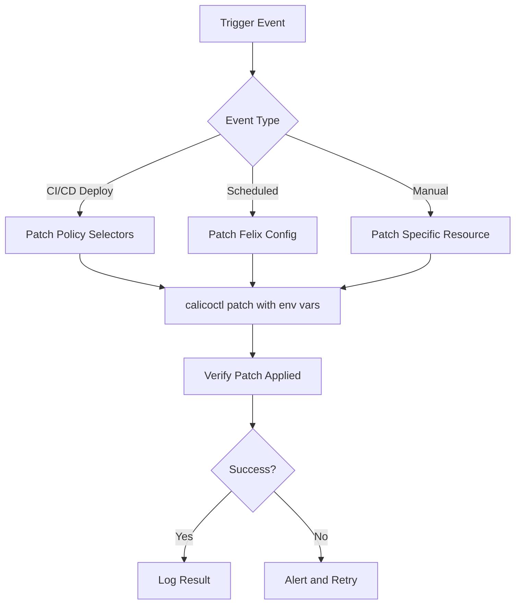

# How to Automate Cluster Changes with calicoctl patch

Author: [nawazdhandala](https://github.com/nawazdhandala)

Tags: Calico, Kubernetes, Automation, Calicoctl, CI/CD

Description: Learn how to automate Calico cluster changes using calicoctl patch in CI/CD pipelines, scripts, and GitOps workflows for consistent and repeatable network policy updates.

---

## Introduction

The `calicoctl patch` command is ideal for automation because it applies targeted changes to specific fields without requiring the full resource definition. This makes it perfect for CI/CD pipelines that need to update policy selectors, change Felix configuration parameters, or modify BGP settings based on environment variables or deployment events.

Unlike `calicoctl apply` which requires the complete resource, `calicoctl patch` operates on deltas. This reduces the risk of accidentally overwriting fields that were changed by other processes and simplifies the automation logic.

This guide covers practical patterns for automating Calico changes with `calicoctl patch`, including CI/CD integration, event-driven patching, and bulk operations.

## Prerequisites

- A running Kubernetes cluster with Calico installed
- calicoctl v3.27 or later
- CI/CD platform (GitHub Actions, GitLab CI, or Jenkins)
- kubectl access to the cluster
- Basic scripting skills

## Automated Felix Configuration Updates

Automate Felix configuration changes based on environment or time of day:

```bash
#!/bin/bash
# auto-felix-config.sh
# Automatically adjusts Felix configuration based on environment

set -euo pipefail

export DATASTORE_TYPE=kubernetes
ENVIRONMENT="${ENVIRONMENT:-production}"

case "$ENVIRONMENT" in
  production)
    calicoctl patch felixconfiguration default -p '{
      "spec": {
        "logSeverityScreen": "Warning",
        "reportingInterval": "300s",
        "ipipEnabled": true
      }
    }'
    ;;
  staging)
    calicoctl patch felixconfiguration default -p '{
      "spec": {
        "logSeverityScreen": "Info",
        "reportingInterval": "60s",
        "ipipEnabled": true
      }
    }'
    ;;
  development)
    calicoctl patch felixconfiguration default -p '{
      "spec": {
        "logSeverityScreen": "Debug",
        "reportingInterval": "30s",
        "ipipEnabled": false
      }
    }'
    ;;
esac

echo "Felix configuration patched for environment: $ENVIRONMENT"
```

## CI/CD Pipeline Integration

Use calicoctl patch in a GitHub Actions workflow for policy updates:

```yaml
# .github/workflows/patch-calico-policies.yaml
name: Patch Calico Policies
on:
  workflow_dispatch:
    inputs:
      policy_name:
        description: 'Policy to patch'
        required: true
      patch_json:
        description: 'JSON patch to apply'
        required: true
      environment:
        description: 'Target environment'
        required: true
        type: choice
        options:
          - staging
          - production

jobs:
  patch:
    runs-on: ubuntu-latest
    environment: ${{ github.event.inputs.environment }}
    steps:
      - name: Install calicoctl
        run: |
          curl -L https://github.com/projectcalico/calico/releases/download/v3.27.0/calicoctl-linux-amd64 -o calicoctl
          chmod +x calicoctl
          sudo mv calicoctl /usr/local/bin/

      - name: Configure kubectl
        uses: azure/setup-kubectl@v3

      - name: Backup current state
        env:
          DATASTORE_TYPE: kubernetes
        run: |
          calicoctl get globalnetworkpolicy ${{ github.event.inputs.policy_name }} -o yaml > /tmp/backup.yaml
          echo "Backup created"

      - name: Apply patch
        env:
          DATASTORE_TYPE: kubernetes
        run: |
          calicoctl patch globalnetworkpolicy ${{ github.event.inputs.policy_name }} \
            -p '${{ github.event.inputs.patch_json }}'

      - name: Verify patch
        env:
          DATASTORE_TYPE: kubernetes
        run: |
          calicoctl get globalnetworkpolicy ${{ github.event.inputs.policy_name }} -o yaml
```

## Bulk Patching Multiple Resources

Patch multiple policies based on label selectors or naming conventions:

```bash
#!/bin/bash
# bulk-patch.sh
# Patches multiple Calico resources matching a pattern

set -euo pipefail

export DATASTORE_TYPE=kubernetes
PATCH_JSON="${1:?Usage: $0 '<patch-json>' [name-pattern]}"
NAME_PATTERN="${2:-.*}"

echo "Patching GlobalNetworkPolicies matching: $NAME_PATTERN"

# Get all policy names and filter
calicoctl get globalnetworkpolicies -o json | \
  python3 -c "
import sys, json
policies = json.load(sys.stdin)['items']
for p in policies:
    name = p['metadata']['name']
    import re
    if re.match('$NAME_PATTERN', name):
        print(name)
" | while read -r policy_name; do
  echo "Patching: $policy_name"
  calicoctl patch globalnetworkpolicy "$policy_name" -p "$PATCH_JSON" || \
    echo "  WARNING: Failed to patch $policy_name"
done

echo "Bulk patch complete."
```

```bash
# Example usage: Update order on all policies starting with "team-"
./bulk-patch.sh '{"spec":{"order":500}}' '^team-.*'
```

## Event-Driven Patching

Trigger patches based on Kubernetes events or external signals:

```yaml
# calico-patch-cronjob.yaml
apiVersion: batch/v1
kind: CronJob
metadata:
  name: calico-maintenance-patch
  namespace: calico-system
spec:
  schedule: "0 2 * * 0"  # Every Sunday at 2 AM
  jobTemplate:
    spec:
      template:
        spec:
          serviceAccountName: calico-admin
          containers:
            - name: patcher
              image: calico/ctl:v3.27.0
              env:
                - name: DATASTORE_TYPE
                  value: "kubernetes"
              command:
                - /bin/sh
                - -c
                - |
                  # Weekly maintenance patches
                  echo "Running weekly Calico maintenance patches..."
                  # Reset Felix log level to Warning
                  calicoctl patch felixconfiguration default -p '{"spec":{"logSeverityScreen":"Warning"}}'
                  echo "Maintenance patches applied at $(date)"
          restartPolicy: OnFailure
```



## Verification

```bash
export DATASTORE_TYPE=kubernetes

# Verify the patch was applied
calicoctl get felixconfiguration default -o yaml | grep logSeverityScreen

# Verify bulk patches
calicoctl get globalnetworkpolicies -o json | python3 -c "
import sys, json
policies = json.load(sys.stdin)['items']
for p in policies:
    name = p['metadata']['name']
    order = p['spec'].get('order', 'unset')
    print(f'{name}: order={order}')
"

# Check CronJob execution
kubectl get jobs -n calico-system --sort-by=.metadata.creationTimestamp | tail -5
```

## Troubleshooting

- **Patch not taking effect in automation**: Ensure `DATASTORE_TYPE` is set in the automation environment. CI/CD runners do not inherit your local environment variables.
- **Bulk patch partially fails**: Some resources may have different schemas. Verify the patch JSON is compatible with all target resources before running bulk operations.
- **CronJob patch fails silently**: Check CronJob logs with `kubectl logs -n calico-system job/<job-name>`. Common issues include expired service account tokens.
- **Rate limiting on rapid patches**: If patching many resources quickly, add a small delay between operations to avoid API server throttling.

## Conclusion

Automating Calico changes with `calicoctl patch` enables consistent, repeatable network policy management. Whether you use CI/CD pipelines for deployment-triggered updates, CronJobs for scheduled maintenance, or scripts for bulk operations, the patch command's delta-based approach minimizes the risk of overwriting unrelated configuration. Combine these automation patterns with proper backup and verification steps to build a robust Calico change management workflow.
