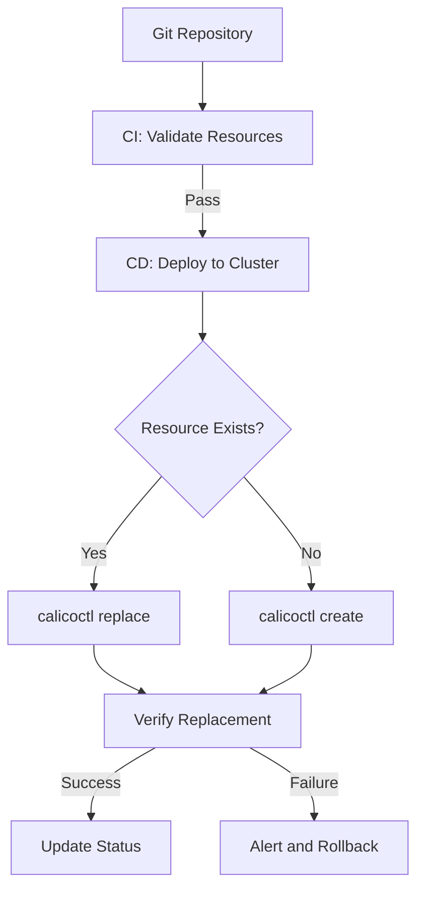

# How to Automate Cluster Changes with calicoctl replace

Author: [nawazdhandala](https://github.com/nawazdhandala)

Tags: Calico, Kubernetes, Automation, calicoctl, GitOps

Description: Learn how to automate Calico cluster changes using calicoctl replace in CI/CD pipelines and GitOps workflows for deterministic, full-resource updates.

---

## Introduction

The `calicoctl replace` command is well-suited for automation because it provides deterministic outcomes -- the resource state after replace exactly matches the provided definition, with no leftover fields from previous configurations. This makes it ideal for GitOps workflows where the desired state is stored in Git and applied to the cluster.

Unlike `apply` which may create new resources unexpectedly, `replace` fails if the resource does not exist, providing an additional safety check in automated pipelines. This fail-fast behavior helps catch configuration drift early.

This guide covers practical automation patterns for `calicoctl replace` including GitOps integration, templated replacements, and CI/CD pipeline design.

## Prerequisites

- A running Kubernetes cluster with Calico installed
- calicoctl v3.27 or later
- Git repository for storing Calico resource definitions
- CI/CD platform (GitHub Actions, GitLab CI, or similar)

## GitOps Workflow with calicoctl replace

Store complete Calico resource definitions in Git and use replace for updates:

```bash
# Repository structure
calico-resources/
  ├── policies/
  │   ├── global/
  │   │   ├── default-deny.yaml
  │   │   └── allow-dns.yaml
  │   └── namespaced/
  │       └── frontend-ingress.yaml
  ├── config/
  │   ├── felix.yaml
  │   └── bgp.yaml
  └── scripts/
      └── sync.sh
```

```bash
#!/bin/bash
# sync.sh
# Synchronizes Git-stored Calico resources to cluster using replace

set -euo pipefail

export DATASTORE_TYPE=kubernetes
RESOURCE_DIR="${1:-.}"

echo "Syncing Calico resources from: $RESOURCE_DIR"

find "$RESOURCE_DIR" -name "*.yaml" -not -path "*/scripts/*" | sort | while read -r file; do
  KIND=$(python3 -c "import yaml; print(yaml.safe_load(open('$file'))['kind'])")
  NAME=$(python3 -c "import yaml; print(yaml.safe_load(open('$file'))['metadata']['name'])")

  # Check if resource exists
  if calicoctl get "$KIND" "$NAME" > /dev/null 2>&1; then
    echo "Replacing: ${KIND}/${NAME} from ${file}"
    calicoctl replace -f "$file"
  else
    echo "Creating: ${KIND}/${NAME} from ${file}"
    calicoctl create -f "$file"
  fi
done

echo "Sync complete."
```

## CI/CD Pipeline for Automated Replace

```yaml
# .github/workflows/calico-replace-sync.yaml
name: Calico Resource Sync
on:
  push:
    branches: [main]
    paths: ['calico-resources/**']
  pull_request:
    branches: [main]
    paths: ['calico-resources/**']

jobs:
  validate:
    runs-on: ubuntu-latest
    steps:
      - uses: actions/checkout@v4
      - name: Install calicoctl
        run: |
          curl -L https://github.com/projectcalico/calico/releases/download/v3.27.0/calicoctl-linux-amd64 -o calicoctl
          chmod +x calicoctl && sudo mv calicoctl /usr/local/bin/

      - name: Validate all resources
        run: |
          find calico-resources -name "*.yaml" -not -path "*/scripts/*" | while read file; do
            echo "Validating: $file"
            calicoctl validate -f "$file"
          done

  deploy:
    needs: validate
    if: github.ref == 'refs/heads/main'
    runs-on: ubuntu-latest
    steps:
      - uses: actions/checkout@v4
      - name: Install calicoctl
        run: |
          curl -L https://github.com/projectcalico/calico/releases/download/v3.27.0/calicoctl-linux-amd64 -o calicoctl
          chmod +x calicoctl && sudo mv calicoctl /usr/local/bin/

      - name: Sync resources
        env:
          DATASTORE_TYPE: kubernetes
        run: bash calico-resources/scripts/sync.sh calico-resources
```

## Templated Replacements

Generate environment-specific resources from templates:

```bash
#!/bin/bash
# template-replace.sh
# Generates and replaces Calico resources from templates

set -euo pipefail

export DATASTORE_TYPE=kubernetes
ENVIRONMENT="${ENVIRONMENT:-staging}"
TEMPLATE_DIR="templates"
OUTPUT_DIR="/tmp/calico-generated"
mkdir -p "$OUTPUT_DIR"

# Generate from template
envsubst < "${TEMPLATE_DIR}/felix-config.yaml.tpl" > "${OUTPUT_DIR}/felix-config.yaml"
envsubst < "${TEMPLATE_DIR}/default-policy.yaml.tpl" > "${OUTPUT_DIR}/default-policy.yaml"

# Validate generated resources
for file in "${OUTPUT_DIR}"/*.yaml; do
  calicoctl validate -f "$file"
done

# Replace resources
for file in "${OUTPUT_DIR}"/*.yaml; do
  KIND=$(python3 -c "import yaml; print(yaml.safe_load(open('$file'))['kind'])")
  NAME=$(python3 -c "import yaml; print(yaml.safe_load(open('$file'))['metadata']['name'])")

  if calicoctl get "$KIND" "$NAME" > /dev/null 2>&1; then
    calicoctl replace -f "$file"
    echo "Replaced: ${KIND}/${NAME}"
  else
    calicoctl create -f "$file"
    echo "Created: ${KIND}/${NAME}"
  fi
done
```

Example template:

```yaml
# templates/felix-config.yaml.tpl
apiVersion: projectcalico.org/v3
kind: FelixConfiguration
metadata:
  name: default
spec:
  logSeverityScreen: ${FELIX_LOG_LEVEL:-Warning}
  reportingInterval: ${FELIX_REPORTING_INTERVAL:-300s}
  prometheusMetricsEnabled: true
  prometheusMetricsPort: 9091
```



## Verification

```bash
export DATASTORE_TYPE=kubernetes

# Verify all resources match Git state
find calico-resources -name "*.yaml" -not -path "*/scripts/*" | while read file; do
  KIND=$(python3 -c "import yaml; print(yaml.safe_load(open('$file'))['kind'])")
  NAME=$(python3 -c "import yaml; print(yaml.safe_load(open('$file'))['metadata']['name'])")
  echo "Checking ${KIND}/${NAME}..."
  calicoctl get "$KIND" "$NAME" -o yaml > /dev/null && echo "  OK" || echo "  MISSING"
done
```

## Troubleshooting

- **Replace fails with "resource does not exist" in pipeline**: Initial deployment requires `create`. Use the sync script pattern that checks existence before choosing create or replace.
- **Template substitution produces invalid YAML**: Validate generated files before replacing. Use `calicoctl validate` as a gate in the pipeline.
- **Concurrent pipeline runs cause conflicts**: Use pipeline concurrency controls to ensure only one sync runs at a time.
- **Drift detection shows differences**: Add a scheduled pipeline that compares cluster state with Git using `diff` to detect manual changes.

## Conclusion

Automating Calico changes with `calicoctl replace` provides deterministic, full-resource updates that ensure cluster state matches your Git repository exactly. By combining replace with create in a sync script, validating resources in CI, and using templates for environment-specific configurations, you build a robust GitOps workflow for Calico management. The replace command's strict existence requirement adds a safety layer that catches configuration drift and unexpected resource creation.
