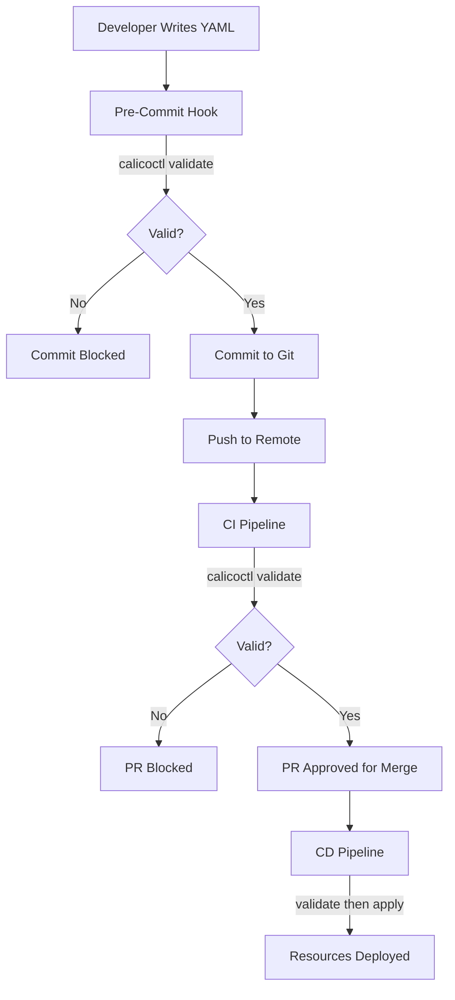

# How to Automate Cluster Changes with calicoctl validate

Author: [nawazdhandala](https://github.com/nawazdhandala)

Tags: Calico, Kubernetes, Automation, Validation, CI/CD

Description: Learn how to integrate calicoctl validate into automated workflows as a safety gate for CI/CD pipelines, pre-commit hooks, and GitOps processes.

---

## Introduction

The `calicoctl validate` command is a read-only operation that checks resource definitions for correctness without modifying the cluster. This makes it the perfect safety gate for automated workflows -- any change to Calico resources must pass validation before it can be applied.

By integrating `calicoctl validate` into CI/CD pipelines, pre-commit hooks, and deployment scripts, you create an automated quality barrier that prevents invalid configurations from ever reaching the cluster. This shifts error detection left, reducing the risk and cost of misconfigurations.

This guide covers practical patterns for using calicoctl validate in automated workflows.

## Prerequisites

- calicoctl v3.27 or later
- CI/CD platform (GitHub Actions, GitLab CI, or Jenkins)
- Git repository for Calico resources
- Basic scripting skills

## Pre-Commit Hook Integration

Validate Calico resources before they are committed to Git:

```bash
#!/bin/bash
# .git/hooks/pre-commit
# Validates Calico YAML files before committing

# Check if calicoctl is installed
if ! command -v calicoctl &> /dev/null; then
  echo "WARNING: calicoctl not found, skipping validation"
  exit 0
fi

# Get staged YAML files in calico directories
STAGED_FILES=$(git diff --cached --name-only --diff-filter=ACM | grep -E 'calico.*\.yaml$' || true)

if [ -z "$STAGED_FILES" ]; then
  exit 0
fi

ERRORS=0
for file in $STAGED_FILES; do
  echo "Validating: $file"
  if ! calicoctl validate -f "$file" 2>&1; then
    ERRORS=$((ERRORS + 1))
  fi
done

if [ "$ERRORS" -gt 0 ]; then
  echo ""
  echo "COMMIT BLOCKED: $ERRORS Calico resource(s) failed validation"
  exit 1
fi

echo "All Calico resources validated successfully"
```

```bash
# Install the pre-commit hook
cp pre-commit .git/hooks/pre-commit
chmod +x .git/hooks/pre-commit
```

## CI/CD Pipeline Validation Gate

```yaml
# .github/workflows/calico-validation-gate.yaml
name: Calico Validation Gate
on:
  pull_request:
    paths: ['calico-resources/**']

jobs:
  validate:
    runs-on: ubuntu-latest
    steps:
      - uses: actions/checkout@v4
        with:
          fetch-depth: 0

      - name: Install calicoctl
        run: |
          curl -L https://github.com/projectcalico/calico/releases/download/v3.27.0/calicoctl-linux-amd64 -o calicoctl
          chmod +x calicoctl && sudo mv calicoctl /usr/local/bin/

      - name: Validate changed Calico resources
        run: |
          # Only validate files changed in this PR
          CHANGED=$(git diff --name-only origin/main...HEAD -- 'calico-resources/**/*.yaml')
          if [ -z "$CHANGED" ]; then
            echo "No Calico resource changes detected"
            exit 0
          fi

          ERRORS=0
          for file in $CHANGED; do
            echo "Validating: $file"
            if calicoctl validate -f "$file"; then
              echo "  PASS"
            else
              echo "  FAIL"
              ERRORS=$((ERRORS + 1))
            fi
          done

          if [ "$ERRORS" -gt 0 ]; then
            echo "::error::$ERRORS files failed validation"
            exit 1
          fi

      - name: Comment validation results on PR
        if: always()
        uses: actions/github-script@v7
        with:
          script: |
            github.rest.issues.createComment({
              owner: context.repo.owner,
              repo: context.repo.repo,
              issue_number: context.issue.number,
              body: `Calico validation: ${process.env.ERRORS === '0' ? 'All resources valid' : 'Validation failures detected'}`
            })
```

## Automated Validation in Deployment Scripts

```bash
#!/bin/bash
# deploy-with-validation.sh
# Validates all resources before deploying any

set -euo pipefail

export DATASTORE_TYPE=kubernetes
RESOURCE_DIR="${1:?Usage: $0 <resource-directory>}"

echo "=== Phase 1: Validation ==="
ERRORS=0
FILES=()

while IFS= read -r -d '' file; do
  FILES+=("$file")
  if calicoctl validate -f "$file" > /dev/null 2>&1; then
    echo "VALID: $file"
  else
    echo "INVALID: $file"
    calicoctl validate -f "$file" 2>&1 | sed 's/^/  /'
    ERRORS=$((ERRORS + 1))
  fi
done < <(find "$RESOURCE_DIR" -name "*.yaml" -not -name "kustomization.yaml" -print0)

if [ "$ERRORS" -gt 0 ]; then
  echo ""
  echo "DEPLOYMENT BLOCKED: $ERRORS files failed validation"
  exit 1
fi

echo ""
echo "=== Phase 2: Deployment ==="
for file in "${FILES[@]}"; do
  echo "Applying: $file"
  calicoctl apply -f "$file"
done

echo "Deployment complete. All ${#FILES[@]} resources applied."
```

## Batch Validation with Report Generation

```bash
#!/bin/bash
# validate-report.sh
# Generates a validation report for all Calico resources

set -euo pipefail

RESOURCE_DIR="${1:-.}"
REPORT_FILE="${2:-/tmp/calico-validation-report.json}"

echo "[]" > "$REPORT_FILE"

find "$RESOURCE_DIR" -name "*.yaml" -not -name "kustomization.yaml" | sort | while read file; do
  KIND=$(python3 -c "import yaml; print(yaml.safe_load(open('$file')).get('kind','unknown'))" 2>/dev/null || echo "unknown")
  NAME=$(python3 -c "import yaml; print(yaml.safe_load(open('$file')).get('metadata',{}).get('name','unknown'))" 2>/dev/null || echo "unknown")

  if output=$(calicoctl validate -f "$file" 2>&1); then
    status="valid"
    error=""
  else
    status="invalid"
    error=$(echo "$output" | head -5)
  fi

  python3 -c "
import json
with open('$REPORT_FILE') as f:
    report = json.load(f)
report.append({
    'file': '$file',
    'kind': '$KIND',
    'name': '$NAME',
    'status': '$status',
    'error': '''$error'''
})
with open('$REPORT_FILE', 'w') as f:
    json.dump(report, f, indent=2)
"
done

echo "Report generated: $REPORT_FILE"
cat "$REPORT_FILE" | python3 -c "
import sys, json
report = json.load(sys.stdin)
valid = sum(1 for r in report if r['status'] == 'valid')
invalid = sum(1 for r in report if r['status'] == 'invalid')
print(f'Total: {len(report)}, Valid: {valid}, Invalid: {invalid}')
"
```



## Verification

```bash
# Test the pre-commit hook
echo "invalid yaml" > calico-resources/test-bad.yaml
git add calico-resources/test-bad.yaml
git commit -m "test" # Should be blocked by hook
rm calico-resources/test-bad.yaml

# Run the validation report
bash validate-report.sh calico-resources/
cat /tmp/calico-validation-report.json
```

## Troubleshooting

- **Pre-commit hook not running**: Verify the hook is executable: `chmod +x .git/hooks/pre-commit`. Also check that calicoctl is in the PATH.
- **CI validation passes but deploy fails**: Validate checks syntax, not cluster state. A resource might be valid YAML but conflict with existing resources.
- **Validation slow on many files**: Run validation in parallel: `find ... | xargs -P 4 -I{} calicoctl validate -f {}`.
- **False positives with new Calico features**: Update calicoctl to match the target cluster version for accurate validation.

## Conclusion

Integrating calicoctl validate into automated workflows creates a multi-layer safety net that catches invalid Calico configurations at every stage: before commit, during code review, and before deployment. This shift-left approach dramatically reduces the risk of misconfigured network policies reaching production. The validation command is fast, side-effect-free, and easy to integrate into any automation tool.
