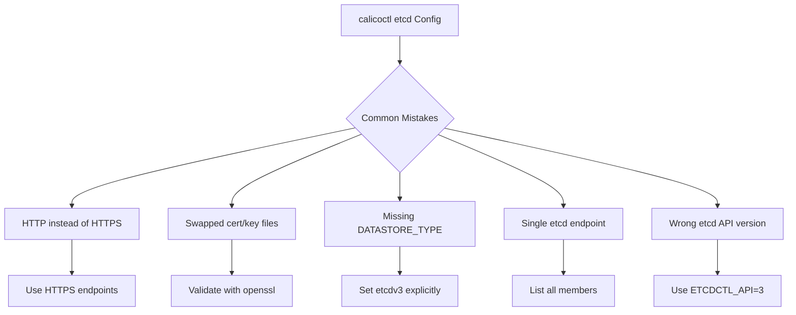

# Avoiding Common Mistakes with Calicoctl etcd Configuration

Author: [nawazdhandala](https://github.com/nawazdhandala)

Tags: Calico, etcd, Best Practices, Troubleshooting, calicoctl

Description: Identify and avoid the most common mistakes when configuring calicoctl with the etcd datastore, including TLS misconfigurations, endpoint errors, version mismatches, and data corruption pitfalls.

---

## Introduction

Configuring calicoctl to work with an etcd datastore introduces a set of challenges that differ significantly from the Kubernetes API datastore path. The etcd connection requires managing TLS certificates, endpoint URLs, and authentication parameters -- each of which has its own set of common failure modes.

Teams frequently encounter issues caused by mismatched certificate files, incorrect endpoint schemes, etcd API version confusion, and unsafe data operations. These mistakes range from minor inconveniences to potentially cluster-breaking misconfigurations.

This guide documents the most common mistakes teams make when configuring calicoctl with etcd and provides concrete prevention strategies for each.

## Prerequisites

- calicoctl v3.27 or later
- A Calico cluster using the etcd datastore
- etcdctl v3 for verification
- Access to etcd TLS certificates
- Basic understanding of etcd and TLS

## Mistake 1: Using HTTP Instead of HTTPS Endpoints

One of the most common and dangerous mistakes is configuring etcd endpoints without TLS:

```bash
# WRONG: Using unencrypted HTTP endpoints
export ETCD_ENDPOINTS=http://etcd1:2379,http://etcd2:2379
export DATASTORE_TYPE=etcdv3
calicoctl get nodes
# This may work but sends credentials in plaintext!

# CORRECT: Always use HTTPS
export ETCD_ENDPOINTS=https://etcd1:2379,https://etcd2:2379
export ETCD_KEY_FILE=/etc/calico/certs/key.pem
export ETCD_CERT_FILE=/etc/calico/certs/cert.pem
export ETCD_CA_CERT_FILE=/etc/calico/certs/ca.pem
export DATASTORE_TYPE=etcdv3
calicoctl get nodes
```

## Mistake 2: Swapping Certificate and Key Files

The most frequent TLS error is mixing up the cert, key, and CA file paths:

```bash
# WRONG: Cert and key files swapped
export ETCD_KEY_FILE=/etc/calico/certs/cert.pem   # This is the cert, not key!
export ETCD_CERT_FILE=/etc/calico/certs/key.pem   # This is the key, not cert!

# CORRECT: Verify which file is which
openssl x509 -in /etc/calico/certs/cert.pem -noout -subject
# Should show: subject= CN = calicoctl...

openssl rsa -in /etc/calico/certs/key.pem -noout -check
# Should show: RSA key ok

# CORRECT assignment
export ETCD_KEY_FILE=/etc/calico/certs/key.pem
export ETCD_CERT_FILE=/etc/calico/certs/cert.pem
export ETCD_CA_CERT_FILE=/etc/calico/certs/ca.pem
```

A quick validation script:

```bash
#!/bin/bash
# validate-cert-assignment.sh
# Verifies certificate files are assigned to the correct variables

KEY_FILE="${ETCD_KEY_FILE:-/etc/calico/certs/key.pem}"
CERT_FILE="${ETCD_CERT_FILE:-/etc/calico/certs/cert.pem}"
CA_FILE="${ETCD_CA_CERT_FILE:-/etc/calico/certs/ca.pem}"

# Check that CERT_FILE is actually a certificate
if openssl x509 -in "$CERT_FILE" -noout 2>/dev/null; then
    echo "OK: ETCD_CERT_FILE ($CERT_FILE) is a valid certificate"
else
    echo "FAIL: ETCD_CERT_FILE ($CERT_FILE) is NOT a valid certificate"
fi

# Check that KEY_FILE is actually a private key
if openssl rsa -in "$KEY_FILE" -noout 2>/dev/null || openssl ec -in "$KEY_FILE" -noout 2>/dev/null; then
    echo "OK: ETCD_KEY_FILE ($KEY_FILE) is a valid private key"
else
    echo "FAIL: ETCD_KEY_FILE ($KEY_FILE) is NOT a valid private key"
fi

# Check that CA_FILE is a CA certificate
if openssl x509 -in "$CA_FILE" -noout 2>/dev/null; then
    echo "OK: ETCD_CA_CERT_FILE ($CA_FILE) is a valid certificate"
else
    echo "FAIL: ETCD_CA_CERT_FILE ($CA_FILE) is NOT a valid certificate"
fi
```

## Mistake 3: Forgetting to Set DATASTORE_TYPE

Without `DATASTORE_TYPE=etcdv3`, calicoctl may default to the wrong backend:

```bash
# WRONG: Missing datastore type
export ETCD_ENDPOINTS=https://etcd1:2379
calicoctl get nodes
# Error: may try to use Kubernetes API or wrong etcd version

# CORRECT: Always set explicitly
export DATASTORE_TYPE=etcdv3

# Or use a configuration file that includes it
cat > /etc/calicoctl/calicoctl.cfg <<EOF
apiVersion: projectcalico.org/v3
kind: CalicoAPIConfig
metadata:
spec:
  datastoreType: "etcdv3"
  etcdEndpoints: "https://etcd1:2379"
  etcdKeyFile: "/etc/calico/certs/key.pem"
  etcdCertFile: "/etc/calico/certs/cert.pem"
  etcdCACertFile: "/etc/calico/certs/ca.pem"
EOF
```

## Mistake 4: Not Including All etcd Members in Endpoints

Listing only one etcd member means calicoctl fails if that member goes down:

```bash
# WRONG: Single endpoint (no high availability)
export ETCD_ENDPOINTS=https://etcd1:2379

# CORRECT: List all cluster members
export ETCD_ENDPOINTS=https://etcd1:2379,https://etcd2:2379,https://etcd3:2379

# Verify all members with etcdctl
etcdctl --endpoints=https://etcd1:2379 \
  --cert=/etc/calico/certs/cert.pem \
  --key=/etc/calico/certs/key.pem \
  --cacert=/etc/calico/certs/ca.pem \
  member list -w table
```

## Mistake 5: Running etcdctl v2 Commands Against v3 Data

Calico uses etcd v3 API. Using v2 commands shows empty results:

```bash
# WRONG: Using v2 API (shows nothing for Calico data)
ETCDCTL_API=2 etcdctl ls /calico
# Returns nothing or error

# CORRECT: Always use v3 API
ETCDCTL_API=3 etcdctl --endpoints=https://etcd1:2379 \
  --cert=/etc/calico/certs/cert.pem \
  --key=/etc/calico/certs/key.pem \
  --cacert=/etc/calico/certs/ca.pem \
  get /calico --prefix --keys-only | head -10
```



## Mistake 6: Modifying etcd Data Directly

Never modify Calico's etcd keys directly with etcdctl:

```bash
# WRONG: Direct etcd manipulation (can corrupt Calico state)
etcdctl put /calico/resources/v3/projectcalico.org/ippools/default-pool '{"malformed": "data"}'

# CORRECT: Always use calicoctl for data operations
export DATASTORE_TYPE=etcdv3
calicoctl apply -f - <<EOF
apiVersion: projectcalico.org/v3
kind: IPPool
metadata:
  name: default-pool
spec:
  cidr: 192.168.0.0/16
  ipipMode: Always
  natOutgoing: true
  nodeSelector: all()
EOF
```

## Verification

```bash
# Run a comprehensive pre-flight check
export DATASTORE_TYPE=etcdv3

echo "1. Checking DATASTORE_TYPE..."
echo "   Value: $DATASTORE_TYPE"

echo "2. Checking ETCD_ENDPOINTS..."
echo "   Value: $ETCD_ENDPOINTS"

echo "3. Validating certificates..."
openssl verify -CAfile "$ETCD_CA_CERT_FILE" "$ETCD_CERT_FILE"

echo "4. Testing connectivity..."
calicoctl get nodes -o wide

echo "5. Verifying version..."
calicoctl version
```

## Troubleshooting

- **"transport: authentication handshake failed"**: Certificates are swapped or the CA does not match. Run the validation script to check file assignments.
- **"context deadline exceeded" on single endpoint**: Add all etcd members to the endpoints list and verify each member is healthy.
- **Empty results from etcdctl**: Ensure you are using the v3 API with `ETCDCTL_API=3` or using etcdctl v3.x binary.
- **"invalid header field value"**: The configuration file has trailing whitespace or invisible characters in the endpoint URLs. Re-create the file with clean values.

## Conclusion

Most calicoctl etcd configuration mistakes stem from TLS certificate mismanagement, missing environment variables, and unsafe direct data manipulation. By using configuration files instead of environment variables, validating certificates before deployment, listing all etcd members for high availability, and always using calicoctl for data operations, you can avoid the most common pitfalls and maintain a reliable Calico management workflow.
