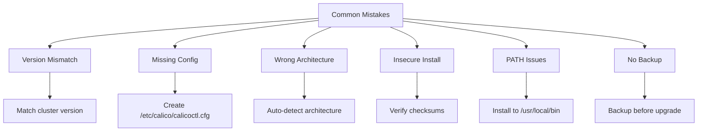

# How to Avoid Common Mistakes with Calicoctl Installation

Author: [nawazdhandala](https://github.com/nawazdhandala)

Tags: Calico, calicoctl, Best Practices, Installation, Common Mistakes

Description: A guide to avoiding the most common calicoctl installation mistakes, covering version management, configuration pitfalls, security considerations, and operational antipatterns.

---

## Introduction

Calicoctl installation seems straightforward, but several common mistakes lead to broken installations, security issues, or operational problems. These mistakes are repeated across organizations because they are not obvious during initial installation and only surface when calicoctl is needed for troubleshooting or policy management.

This guide documents the most common calicoctl installation mistakes and how to avoid them. Each mistake includes the symptom it causes, why it happens, and the correct approach. Learn from the mistakes of others rather than discovering them during an incident.

These mistakes apply across all Calico versions and deployment methods. Whether you install calicoctl manually, through automation, or via containers, these pitfalls are waiting.

## Prerequisites

- Basic familiarity with calicoctl installation process
- Understanding of your Calico cluster configuration
- Access to systems where calicoctl is or will be installed

## Mistake 1: Version Mismatch with Cluster

The most common mistake is running a calicoctl version that does not match the Calico cluster version.

```bash
# WRONG: Installing latest calicoctl without checking cluster version
curl -fsSL -o /usr/local/bin/calicoctl \
  https://github.com/projectcalico/calico/releases/latest/download/calicoctl-linux-amd64

# RIGHT: Install the version matching your cluster
CLUSTER_VERSION=$(kubectl get deployment calico-kube-controllers -n kube-system \
  -o jsonpath='{.spec.template.spec.containers[0].image}' | grep -oP 'v[0-9.]+')
echo "Cluster version: ${CLUSTER_VERSION}"

curl -fsSL -o /usr/local/bin/calicoctl \
  "https://github.com/projectcalico/calico/releases/download/${CLUSTER_VERSION}/calicoctl-linux-amd64"
chmod +x /usr/local/bin/calicoctl

# Verify versions match
calicoctl version
```

**Symptom**: API errors, missing fields, or "resource not found" errors when managing Calico resources.

## Mistake 2: Missing or Incorrect Configuration

Installing the binary without configuring the datastore connection.

```bash
# WRONG: Install binary and assume it will auto-detect the datastore
sudo install calicoctl /usr/local/bin/
# Then: calicoctl get nodes -> "connection refused"

# RIGHT: Always create the configuration file
sudo mkdir -p /etc/calico

# For Kubernetes datastore:
cat << 'EOF' | sudo tee /etc/calico/calicoctl.cfg
apiVersion: projectcalico.org/v3
kind: CalicoAPIConfig
metadata:
spec:
  datastoreType: "kubernetes"
  kubeconfig: "/root/.kube/config"
EOF

# Verify connection
calicoctl get nodes
```

**Symptom**: "connection refused" or "no configuration found" errors.

## Mistake 3: Wrong Architecture Binary

Downloading the amd64 binary for an arm64 system (or vice versa).

```bash
# WRONG: Hardcoding amd64 without checking
curl -fsSL -o /usr/local/bin/calicoctl \
  "https://github.com/projectcalico/calico/releases/download/v3.27.0/calicoctl-linux-amd64"

# RIGHT: Detect architecture automatically
ARCH=$(uname -m | sed 's/x86_64/amd64/;s/aarch64/arm64/')
echo "Detected architecture: ${ARCH}"

curl -fsSL -o /usr/local/bin/calicoctl \
  "https://github.com/projectcalico/calico/releases/download/v3.27.0/calicoctl-linux-${ARCH}"
chmod +x /usr/local/bin/calicoctl
```

**Symptom**: "exec format error" when trying to run calicoctl.

## Mistake 4: Insecure Installation

Downloading and running binaries without verification.

```bash
# WRONG: Download and run without any verification
curl -fsSL -o /usr/local/bin/calicoctl <some-url>
chmod +x /usr/local/bin/calicoctl

# RIGHT: Verify the download using checksums
CALICO_VERSION="v3.27.0"
ARCH="amd64"

# Download binary and checksum
curl -fsSL -o /tmp/calicoctl \
  "https://github.com/projectcalico/calico/releases/download/${CALICO_VERSION}/calicoctl-linux-${ARCH}"
curl -fsSL -o /tmp/calicoctl.sha256 \
  "https://github.com/projectcalico/calico/releases/download/${CALICO_VERSION}/SHA256SUMS"

# Verify checksum
cd /tmp
grep "calicoctl-linux-${ARCH}" calicoctl.sha256 | sha256sum -c -

# Only install if verification passes
sudo install -o root -g root -m 0755 /tmp/calicoctl /usr/local/bin/calicoctl
```

**Symptom**: No immediate symptom, but running unverified binaries is a security risk.

## Mistake 5: Installing as Non-Root Without Proper PATH

```bash
# WRONG: Installing to a directory not in the user's PATH
cp calicoctl ~/bin/calicoctl
# Then: "command not found" from scripts or other users

# RIGHT: Install to a standard system path
sudo install -o root -g root -m 0755 calicoctl /usr/local/bin/calicoctl
# Accessible to all users, in standard PATH
```

**Symptom**: "command not found" for some users or in some contexts (scripts, cron).



## Mistake 6: Not Backing Up Before Upgrade

```bash
# WRONG: Overwriting the binary without backup
curl -fsSL -o /usr/local/bin/calicoctl <new-version-url>
# If new version is broken, no way to roll back

# RIGHT: Backup before upgrade
CURRENT_VERSION=$(calicoctl version 2>/dev/null | grep "Client Version" | awk '{print $NF}')
sudo cp /usr/local/bin/calicoctl "/usr/local/bin/calicoctl.backup-${CURRENT_VERSION}"

# Install new version
curl -fsSL -o /usr/local/bin/calicoctl <new-version-url>
chmod +x /usr/local/bin/calicoctl

# If something goes wrong, roll back:
# sudo cp "/usr/local/bin/calicoctl.backup-${CURRENT_VERSION}" /usr/local/bin/calicoctl
```

**Symptom**: Unable to roll back when a new version has issues.

## Verification

```bash
#!/bin/bash
# verify-no-mistakes.sh
# Check for common installation mistakes

echo "=== Installation Quality Check ==="

# Check 1: Version match
echo -n "Version match: "
CTL_V=$(calicoctl version 2>/dev/null | grep "Client" | awk '{print $NF}')
CLU_V=$(calicoctl version 2>/dev/null | grep "Cluster" | awk '{print $NF}')
[ "${CTL_V%.*}" = "${CLU_V%.*}" ] && echo "PASS" || echo "WARNING (${CTL_V} vs ${CLU_V})"

# Check 2: Configuration exists
echo -n "Configuration: "
[ -f /etc/calico/calicoctl.cfg ] && echo "PASS" || echo "MISSING"

# Check 3: Correct architecture
echo -n "Architecture: "
EXPECTED=$(uname -m | sed 's/x86_64/x86-64/;s/aarch64/aarch64/')
file /usr/local/bin/calicoctl | grep -q "${EXPECTED}" && echo "PASS" || echo "MISMATCH"

# Check 4: Proper permissions
echo -n "Permissions: "
PERMS=$(stat -c '%a' /usr/local/bin/calicoctl 2>/dev/null || stat -f '%Lp' /usr/local/bin/calicoctl)
[ "${PERMS}" = "755" ] && echo "PASS (755)" || echo "CHECK (${PERMS})"

# Check 5: Backup exists
echo -n "Backup available: "
ls /usr/local/bin/calicoctl.backup-* > /dev/null 2>&1 && echo "PASS" || echo "NO BACKUP"
```

## Troubleshooting

- **Already made a mistake**: Use the verification script above to identify which mistake applies, then follow the "RIGHT" approach to fix it.
- **Multiple versions on different systems**: Standardize using configuration management (Ansible, Puppet) to enforce a single version across all systems.
- **Team members installing their own versions**: Lock down `/usr/local/bin` to root-only writes and manage calicoctl through your standard tool provisioning process.

## Conclusion

Avoiding common calicoctl installation mistakes saves time during critical moments. By matching versions, configuring the datastore connection, detecting architecture automatically, verifying downloads, using standard paths, and backing up before upgrades, you ensure a reliable calicoctl installation. Run the verification script after every installation to confirm no mistakes were made.
