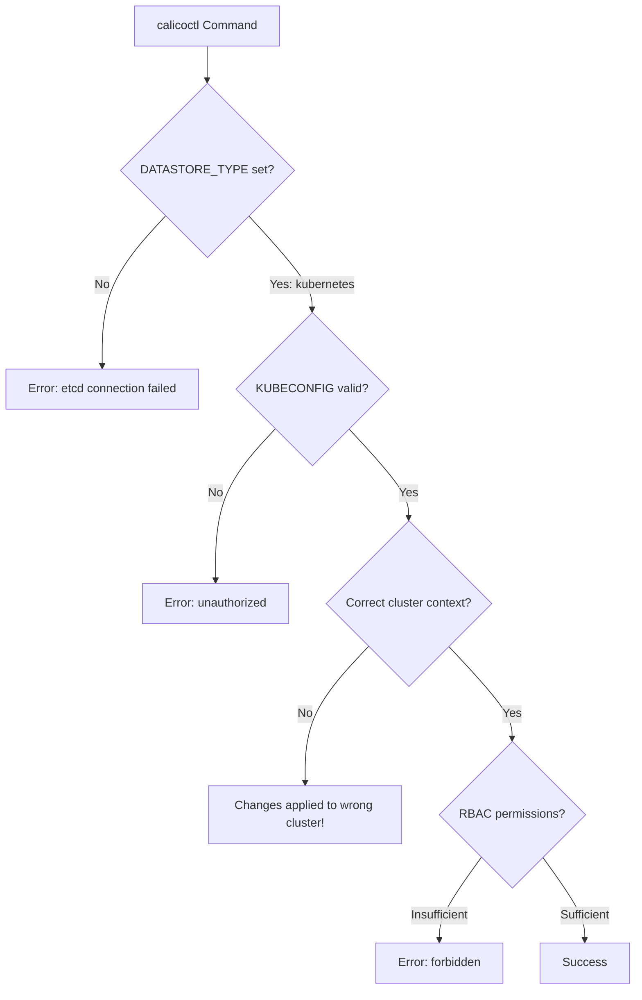

# Avoiding Common Mistakes with Calicoctl Kubernetes API Datastore Configuration

Author: [nawazdhandala](https://github.com/nawazdhandala)

Tags: Calico, Kubernetes, Troubleshooting, Best Practices, Calicoctl

Description: Identify and avoid the most common pitfalls when configuring calicoctl with the Kubernetes API datastore, including authentication errors, version mismatches, and RBAC misconfigurations.

---

## Introduction

Configuring calicoctl to use the Kubernetes API datastore is straightforward in concept but full of subtle pitfalls in practice. Many teams encounter issues that stem from version mismatches, incorrect environment variables, RBAC permission gaps, or misunderstanding how calicoctl interacts with the Kubernetes API.

These mistakes often manifest as cryptic error messages, silent policy failures, or inconsistent behavior between environments. Understanding the common failure modes helps you avoid hours of debugging and prevents potentially disruptive network policy misconfigurations in production.

This guide catalogs the most frequent mistakes teams make when configuring calicoctl with the Kubernetes API datastore and provides concrete solutions for each one.

## Prerequisites

- A running Kubernetes cluster with Calico installed
- calicoctl v3.27 or later
- kubectl access to the cluster
- Basic understanding of Kubernetes RBAC and Calico resources

## Mistake 1: Wrong or Missing DATASTORE_TYPE

The most common mistake is forgetting to set the `DATASTORE_TYPE` environment variable, which defaults to `etcdv3` in some calicoctl versions:

```bash
# WRONG: Missing datastore type (may default to etcd)
calicoctl get nodes
# Error: connection to etcd failed

# CORRECT: Explicitly set the datastore type
export DATASTORE_TYPE=kubernetes
calicoctl get nodes
```

You can also set it in a configuration file to avoid this issue entirely:

```yaml
# /etc/calicoctl/calicoctl.cfg
apiVersion: projectcalico.org/v3
kind: CalicoAPIConfig
metadata:
spec:
  datastoreType: "kubernetes"
  kubeconfig: "/home/user/.kube/config"
```

```bash
# Use the config file
calicoctl get nodes --config=/etc/calicoctl/calicoctl.cfg
```

## Mistake 2: Calicoctl and Calico Version Mismatch

Using a calicoctl version that does not match the Calico version running in the cluster causes subtle and hard-to-debug issues:

```bash
# Check the Calico version running in the cluster
kubectl get pods -n calico-system -o jsonpath='{.items[0].spec.containers[0].image}'
# Example output: docker.io/calico/node:v3.27.0

# Check calicoctl version
calicoctl version
# Client Version: v3.27.0
# Cluster Version: v3.27.0

# If versions don't match, download the correct version
CALICO_VERSION="v3.27.0"
curl -L "https://github.com/projectcalico/calico/releases/download/${CALICO_VERSION}/calicoctl-linux-amd64" -o calicoctl
chmod +x calicoctl
sudo mv calicoctl /usr/local/bin/
```

## Mistake 3: Insufficient RBAC Permissions

Calicoctl needs access to Calico custom resources, which are not included in standard Kubernetes roles:

```bash
# This will fail with a generic "forbidden" error
calicoctl get globalnetworkpolicies
# Error: resource type 'globalnetworkpolicies' is not permitted

# Check what permissions the current user has for Calico resources
kubectl auth can-i list globalnetworkpolicies.projectcalico.org --all-namespaces
```

Create the proper RBAC role:

```yaml
# calico-admin-role.yaml
apiVersion: rbac.authorization.k8s.io/v1
kind: ClusterRole
metadata:
  name: calico-admin
rules:
  - apiGroups: ["projectcalico.org"]
    resources: ["*"]
    verbs: ["*"]
  - apiGroups: ["crd.projectcalico.org"]
    resources: ["*"]
    verbs: ["*"]
  - apiGroups: [""]
    resources: ["namespaces", "nodes"]
    verbs: ["get", "list", "watch"]
```

```bash
# Apply the role and bind it
kubectl apply -f calico-admin-role.yaml
kubectl create clusterrolebinding calico-admin-binding \
  --clusterrole=calico-admin \
  --user=$(kubectl config current-context)
```

## Mistake 4: Using kubectl Instead of Calicoctl for Calico Resources

While Calico resources are stored as CRDs in the Kubernetes API, some resources have different field names and behaviors when accessed via kubectl versus calicoctl:

```bash
# WRONG: Using kubectl to apply a Calico GlobalNetworkPolicy
# kubectl does not validate Calico-specific fields properly
kubectl apply -f policy.yaml

# CORRECT: Use calicoctl for Calico resources
calicoctl apply -f policy.yaml
```

The key differences:

```yaml
# calicoctl format (correct for calicoctl apply)
apiVersion: projectcalico.org/v3
kind: GlobalNetworkPolicy
metadata:
  name: allow-http
spec:
  selector: app == "web"
  ingress:
    - action: Allow
      protocol: TCP
      destination:
        ports:
          - 80
```

```bash
# Verify with calicoctl, not kubectl
calicoctl get globalnetworkpolicies allow-http -o yaml
```

## Mistake 5: Incorrect Kubeconfig Context

When working with multiple clusters, applying Calico changes to the wrong cluster is a common and dangerous mistake:

```bash
# ALWAYS verify the current context before running calicoctl
kubectl config current-context
kubectl cluster-info

# Use explicit kubeconfig for safety
export KUBECONFIG=/path/to/production-kubeconfig
export DATASTORE_TYPE=kubernetes

# Double check by listing nodes
calicoctl get nodes -o wide
```



## Mistake 6: Forgetting Namespace Scope for NetworkPolicies

Calico has both namespaced `NetworkPolicy` and cluster-scoped `GlobalNetworkPolicy`. Confusing these causes policies to not apply where expected:

```bash
# List only policies in a specific namespace
calicoctl get networkpolicies -n production

# List global policies (cluster-wide)
calicoctl get globalnetworkpolicies

# List all policies across all namespaces
calicoctl get networkpolicies --all-namespaces
```

## Mistake 7: Not Validating Before Applying

Always validate Calico resources before applying them:

```bash
# Validate a policy file before applying
calicoctl validate -f policy.yaml

# If validation passes, then apply
calicoctl apply -f policy.yaml
```

## Verification

Run these checks to verify your configuration is correct:

```bash
export DATASTORE_TYPE=kubernetes

# Verify connectivity
calicoctl get clusterinformation default -o yaml

# Verify version match
calicoctl version

# Verify RBAC permissions
kubectl auth can-i list globalnetworkpolicies.projectcalico.org

# Verify current context
kubectl config current-context

# List all resources to confirm access
calicoctl get nodes -o wide
calicoctl get ippools -o wide
calicoctl get globalnetworkpolicies
```

## Troubleshooting

- **"connection refused"**: The kubeconfig points to an unreachable API server. Verify the server URL with `kubectl cluster-info` and check network connectivity.
- **"the server could not find the requested resource"**: Calico CRDs are not installed. Verify with `kubectl get crd | grep calico`. Reinstall Calico if CRDs are missing.
- **"no kind is registered for the type"**: The calicoctl version does not support the resource kind. Upgrade calicoctl to match the cluster Calico version.
- **Policies not taking effect**: Check the selector syntax. Calico uses its own label selector syntax (e.g., `app == "web"` not `app: web`). Validate with `calicoctl get globalnetworkpolicies <name> -o yaml`.

## Conclusion

Most calicoctl Kubernetes API datastore issues stem from a handful of common mistakes: missing environment variables, version mismatches, insufficient RBAC permissions, and wrong cluster contexts. By establishing a checklist of pre-flight validations -- checking the datastore type, verifying the cluster context, confirming version compatibility, and validating resources before applying -- you can avoid the majority of these pitfalls and maintain a reliable Calico configuration workflow.
