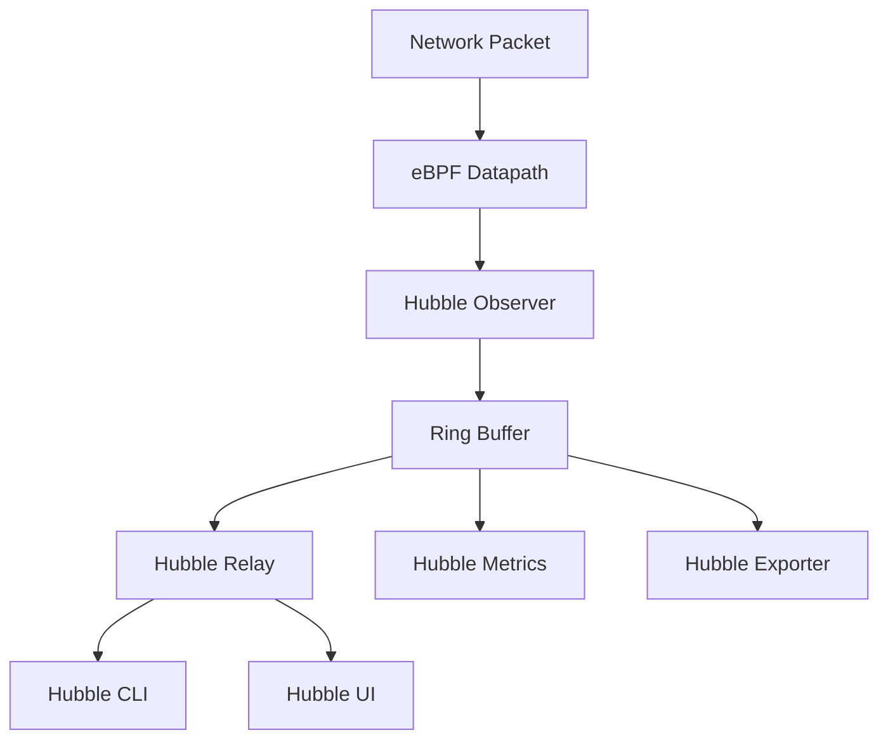

# How to Use Basic Configuration in Cilium Hubble

Author: [nawazdhandala](https://github.com/nawazdhandala)

Tags: Cilium, Hubble, Configuration, Observability, Kubernetes

Description: A comprehensive guide to the basic configuration options for Cilium Hubble, covering enabling Hubble, configuring relay, setting up the UI, and adjusting core settings for flow observation.

---

## Introduction

Hubble is Cilium's observability layer, providing deep visibility into network flows, DNS queries, and service dependencies across your Kubernetes cluster. While Hubble offers advanced features like L7 protocol inspection and flow export, getting the basic configuration right is essential before moving to advanced setups.

The basic configuration covers three core components: the Hubble observer that runs inside each Cilium agent, the Hubble relay that aggregates flows from all agents, and the Hubble UI that provides a visual service map. Each component has configuration knobs that affect performance, data retention, and accessibility.

This guide walks you through the fundamental Hubble configuration options, explaining what each setting does and how to choose the right values for your cluster size and observability requirements.

## Prerequisites

- Kubernetes cluster v1.24 or later
- Cilium installed via Helm (1.14+)
- Helm 3 for configuration management
- kubectl access to the cluster

## Enabling Hubble Core Components

Start with a complete basic configuration that enables all three Hubble components:

```yaml
# hubble-basic-config.yaml
hubble:
  enabled: true

  # Event buffer capacity per Cilium agent
  # Default is 4096; increase for high-traffic clusters
  eventBufferCapacity: "4096"

  # Metrics configuration
  metrics:
    enabled:
      - dns
      - drop
      - tcp
      - flow
      - icmp
    serviceMonitor:
      enabled: true

  # Relay configuration
  relay:
    enabled: true
    replicas: 1  # Increase for HA in production
    resources:
      requests:
        cpu: 100m
        memory: 128Mi
      limits:
        memory: 512Mi

  # UI configuration
  ui:
    enabled: true
    replicas: 1
    resources:
      requests:
        cpu: 50m
        memory: 64Mi
```

```bash
helm upgrade cilium cilium/cilium -n kube-system \
  --reuse-values \
  --values hubble-basic-config.yaml

# Wait for all components to be ready
kubectl -n kube-system rollout status daemonset/cilium
kubectl -n kube-system rollout status deployment/hubble-relay
kubectl -n kube-system rollout status deployment/hubble-ui
```

## Configuring the Hubble Observer

The Hubble observer runs in each Cilium agent pod and captures network flows into a ring buffer:

```bash
# Verify Hubble is enabled in the running config
kubectl -n kube-system exec ds/cilium -- cilium status | grep Hubble

# Check the current event buffer capacity
kubectl -n kube-system exec ds/cilium -- cilium status --verbose | grep -i "buffer\|capacity"
```



Key observer settings:

```yaml
# Observer tuning options
hubble:
  # Socket path for the gRPC server
  socketPath: /var/run/cilium/hubble.sock

  # Listen address for the Hubble server
  listenAddress: ":4244"

  # Event buffer capacity (number of flows to keep in memory)
  # Larger = more history, more memory usage
  # Formula: ~100 bytes per flow * capacity
  eventBufferCapacity: "4096"

  # Preferred datapath for flow events
  # Options: "any", "veth", "netkit"
  preferIpv6: false
```

## Configuring Hubble Relay

The relay aggregates flows from all Cilium agents and serves them to the CLI and UI:

```yaml
# Relay-specific configuration
hubble:
  relay:
    enabled: true
    replicas: 1

    # Dial timeout when connecting to Cilium agents
    dialTimeout: 5s

    # Retry timeout for failed connections
    retryTimeout: 5s

    # Buffer size for the relay server
    sortBufferLenMax: 100
    sortBufferDrainTimeout: 1s

    # TLS configuration (recommended for production)
    tls:
      server:
        enabled: false  # Set to true for production
```

```bash
# Verify relay is connected to all agents
kubectl -n kube-system exec deploy/hubble-relay -- hubble-relay status

# Check relay logs for connection issues
kubectl -n kube-system logs deploy/hubble-relay --tail=20

# Test the relay connection
cilium hubble port-forward &
hubble status
```

## Configuring Hubble Metrics

Hubble metrics feed into Prometheus for long-term monitoring:

```yaml
# Metrics configuration with common options
hubble:
  metrics:
    enabled:
      # DNS query and response metrics
      - dns

      # Packet drop metrics with reason labels
      - drop

      # TCP connection metrics (SYN, FIN, RST flags)
      - tcp

      # General flow metrics
      - flow

      # ICMP message metrics
      - icmp

    # Enable Prometheus ServiceMonitor
    serviceMonitor:
      enabled: true
      labels:
        release: prometheus
```

Verify metrics are flowing:

```bash
# Port-forward to check metrics directly
kubectl -n kube-system port-forward ds/cilium 9965:9965 &

# Check available metrics
curl -s http://localhost:9965/metrics | grep "^hubble_" | head -20

# Count unique metric names
curl -s http://localhost:9965/metrics | grep "^hubble_" | cut -d'{' -f1 | sort -u
```

## Verification

Confirm the basic configuration is working end to end:

```bash
# 1. Hubble observer is running
kubectl -n kube-system exec ds/cilium -- cilium status | grep "Hubble"
# Should show "Hubble: Ok"

# 2. Relay is connected
cilium hubble port-forward &
hubble status
# Should show "Healthcheck (via localhost:4245): Ok"

# 3. Flows are visible
hubble observe --last 10
# Should show recent network flows with pod names

# 4. UI is accessible
kubectl -n kube-system port-forward svc/hubble-ui 12000:80 &
curl -s -o /dev/null -w '%{http_code}' http://localhost:12000
# Should return 200

# 5. Metrics are being collected
curl -s http://localhost:9965/metrics | grep hubble_flows_processed_total | head -3
```

## Troubleshooting

- **Hubble shows as "Disabled"**: Verify `hubble.enabled=true` in Helm values. Run `helm get values cilium -n kube-system | grep hubble` to check.

- **Relay cannot connect to agents**: Check that port 4244 is accessible between the relay pod and Cilium agent pods. Verify with `kubectl -n kube-system logs deploy/hubble-relay`.

- **No flows visible**: Generate traffic with `kubectl run curl --image=curlimages/curl --rm -it -- curl http://kubernetes.default`. If still no flows, check that the Hubble socket exists: `kubectl -n kube-system exec ds/cilium -- ls /var/run/cilium/hubble.sock`.

- **UI shows empty map**: The UI needs active flows. Navigate to a namespace with running workloads and wait a few seconds for the service map to populate.

- **Metrics endpoint returns empty**: Ensure the metric types are enabled in the `hubble.metrics.enabled` list. Each metric type must be explicitly listed.

## Conclusion

Getting the basic Hubble configuration right establishes the foundation for all Cilium observability. Enable the observer on each agent, deploy the relay for aggregation, and set up the UI for visual exploration. Adjust the event buffer capacity based on your cluster size and traffic volume, and enable the specific metric types that align with your monitoring needs. With these basics in place, you can progressively add advanced features like L7 inspection, flow export, and dynamic configuration.
