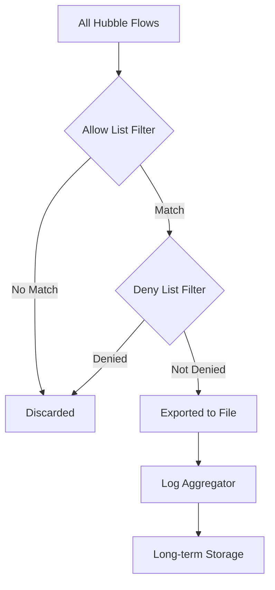

# How to Use Cilium Hubble Exporter Configuration

Author: [nawazdhandala](https://github.com/nawazdhandala)

Tags: Cilium, Hubble, Exporter, Configuration, Observability

Description: Learn how to configure the Cilium Hubble exporter to send flow data to external systems, including setting up export targets, configuring filters, and tuning output formats.

---

## Introduction

The Hubble exporter in Cilium allows you to send network flow data to external destinations for long-term storage, analysis, or integration with third-party observability platforms. While Hubble's built-in relay and UI are excellent for real-time inspection, the exporter enables you to persist flow data beyond the in-memory ring buffer.

The exporter supports multiple output formats and destinations, including file-based export for log aggregation systems, and can be configured with filters to control which flows are exported. This is critical for high-traffic clusters where exporting every flow would be prohibitively expensive.

This guide walks you through configuring the Hubble exporter from scratch, including Helm values, filter configuration, and integration with common log pipelines.

## Prerequisites

- Kubernetes cluster with Cilium 1.15+ installed
- Hubble enabled in your Cilium deployment
- Helm 3 for configuration management
- A log aggregation system (Fluentd, Fluent Bit, or similar) for consuming exported data
- kubectl access to the cluster

## Enabling the Hubble Exporter

The Hubble exporter runs as part of the Cilium agent. Enable it through Helm values:

```yaml
# cilium-exporter-values.yaml
hubble:
  enabled: true
  export:
    static:
      enabled: true
      filePath: /var/run/cilium/hubble/events.log
      # Maximum file size before rotation (in MB)
      fileMaxSizeMb: 10
      # Maximum number of backup files to keep
      fileMaxBackups: 5
      # Field mask to control which fields are exported
      fieldMask:
        - time
        - source.namespace
        - source.pod_name
        - destination.namespace
        - destination.pod_name
        - destination.port
        - verdict
        - drop_reason
        - l4.TCP
        - l4.UDP
        - Type
```

```bash
helm upgrade cilium cilium/cilium -n kube-system \
  --reuse-values \
  --values cilium-exporter-values.yaml

# Wait for the rollout
kubectl -n kube-system rollout status daemonset/cilium
```

Verify the exporter is running:

```bash
# Check that the export file is being written
kubectl -n kube-system exec ds/cilium -- ls -la /var/run/cilium/hubble/events.log

# View the latest exported flows
kubectl -n kube-system exec ds/cilium -- tail -5 /var/run/cilium/hubble/events.log
```

## Configuring Export Filters

Filter exported flows to reduce volume and focus on relevant data:

```yaml
# cilium-exporter-filtered.yaml
hubble:
  enabled: true
  export:
    static:
      enabled: true
      filePath: /var/run/cilium/hubble/events.log
      fileMaxSizeMb: 10
      fileMaxBackups: 5
      allowList:
        # Only export flows from production namespace
        - '{"source_pod":["production/"]}'
        # Export all dropped packets
        - '{"verdict":["DROPPED"]}'
      denyList:
        # Exclude health checks
        - '{"destination_pod":["kube-system/"]}'
```

```bash
helm upgrade cilium cilium/cilium -n kube-system \
  --reuse-values \
  --values cilium-exporter-filtered.yaml
```



## Integrating with Log Aggregation Systems

The file-based exporter writes JSON-line formatted flow data that can be consumed by standard log collectors:

```yaml
# fluent-bit-config.yaml - DaemonSet config for collecting Hubble exports
apiVersion: v1
kind: ConfigMap
metadata:
  name: fluent-bit-hubble-config
  namespace: kube-system
data:
  fluent-bit.conf: |
    [SERVICE]
        Flush         5
        Log_Level     info

    [INPUT]
        Name          tail
        Path          /var/run/cilium/hubble/events.log
        Tag           hubble.*
        Parser        json
        Refresh_Interval 5
        Rotate_Wait   30

    [OUTPUT]
        Name          es
        Match         hubble.*
        Host          elasticsearch.logging.svc
        Port          9200
        Index         hubble-flows
        Type          _doc
```

To mount the Hubble export directory into a Fluent Bit sidecar or DaemonSet:

```yaml
# fluent-bit-daemonset-volumes.yaml (relevant volume section)
volumes:
  - name: hubble-export
    hostPath:
      path: /var/run/cilium/hubble
      type: DirectoryOrCreate
volumeMounts:
  - name: hubble-export
    mountPath: /var/run/cilium/hubble
    readOnly: true
```

## Monitoring Exporter Health

Track the exporter's performance with Cilium metrics:

```bash
# Check exporter-related metrics
kubectl -n kube-system exec ds/cilium -- \
  wget -qO- http://localhost:9962/metrics 2>/dev/null | grep hubble_export

# Key metrics:
# hubble_export_events_total - total events exported
# hubble_export_events_lost_total - events lost due to backpressure
# hubble_export_file_rotations_total - file rotation count

# PromQL alert for lost events
# rate(hubble_export_events_lost_total[5m]) > 0
```

## Verification

Confirm the exporter is working correctly:

```bash
# 1. Verify export file exists and is being written
kubectl -n kube-system exec ds/cilium -- stat /var/run/cilium/hubble/events.log

# 2. Check that flows are in proper JSON format
kubectl -n kube-system exec ds/cilium -- head -1 /var/run/cilium/hubble/events.log | python3 -m json.tool

# 3. Verify filters are applied (check that denied flows are not present)
kubectl -n kube-system exec ds/cilium -- cat /var/run/cilium/hubble/events.log | python3 -c "
import json, sys
count = 0
kube_system_count = 0
for line in sys.stdin:
    flow = json.loads(line)
    count += 1
    dst = flow.get('flow',{}).get('destination',{})
    if dst.get('namespace') == 'kube-system':
        kube_system_count += 1
print(f'Total flows: {count}, kube-system flows: {kube_system_count}')
"

# 4. Verify field mask is reducing data size
kubectl -n kube-system exec ds/cilium -- head -1 /var/run/cilium/hubble/events.log | python3 -c "
import json, sys
flow = json.load(sys.stdin)
print(f'Exported fields: {list(flow.get(\"flow\",{}).keys())}')
"
```

## Troubleshooting

- **Export file not created**: Verify that the `hubble.export.static.enabled` is set to `true` in Helm values. Check Cilium agent logs for export-related errors.

- **File growing too large**: Adjust `fileMaxSizeMb` and `fileMaxBackups`. Also consider adding more restrictive filters to reduce flow volume.

- **Exported data is incomplete**: The field mask may be too restrictive. Add the missing fields to the `fieldMask` list in your Helm values.

- **Log aggregator not picking up data**: Ensure the volume mount paths are correct and that the log collector has read access to the Hubble export directory.

- **High event loss**: The `hubble_export_events_lost_total` metric indicates backpressure. Increase the export buffer or reduce the flow rate with filters.

## Conclusion

The Cilium Hubble exporter bridges the gap between real-time flow inspection and long-term flow analytics. By configuring filters, field masks, and integration with log aggregation systems, you can build a scalable pipeline for network flow data. Start with broad exports and progressively tighten filters as you understand which flows are most valuable for your operations and security teams.
